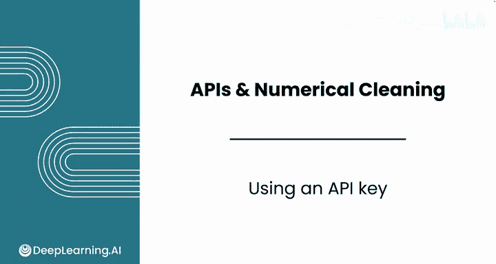
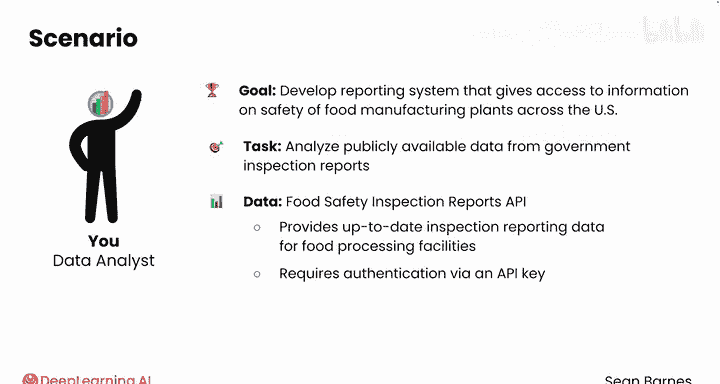
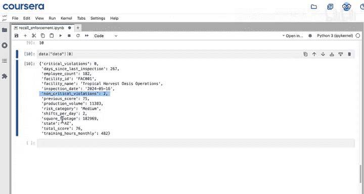
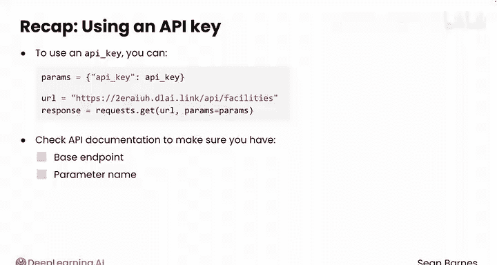

#  032：API密钥使用 🔑

在本节课中，我们将学习如何使用API密钥进行身份验证，以访问需要认证的API数据。我们将通过一个食品安全检查报告的API实例，演示如何获取、加载并使用API密钥来成功获取数据。

---

## 概述

在之前的课程中，我们了解到许多API需要一个密钥来进行身份验证。没有这个密钥，你将无法访问感兴趣的数据。在接下来的课程中，我们将继续使用公开数据，以提高透明度和食品安全性。我们启动了一个新项目，旨在开发一个报告系统，为消费者提供美国各地食品制造工厂安全性的最新信息。我们的计划是分析政府检查报告中的公开数据，以支持这个报告系统。我们已经找到并注册了一个食品安全检查报告API，该API提供食品加工设施的最新检查报告数据。该提供商要求通过API密钥进行身份验证才能访问。你将在接下来的阅读材料中学习如何获取API密钥。我们设置了一个新的笔记本，准备开始使用食品安全API。请记住，你可以使用实践实验室项目来跟随演示。

## 导入请求模块

首先，我们需要导入`requests`模块，这是Python中用于发送HTTP请求的常用库。

```python
import requests
```





## 设置API基础端点

以下是我们将要使用的基础端点。请注意，此API中的数据是为了在结构上模拟另一个公共检查报告API而生成的。这个API只有一个密钥，我们稍后会看到。我们将使用由deeplearning.ai提供的这个API，以避免注册密钥的麻烦。

```python
base_endpoint = "https://api.deeplearning.ai/food-safety/inspections"
```

## 尝试无密钥请求

使用GET请求来检索检查数据。首先尝试在没有密钥的情况下发送请求。注意，`params`字典是空的。

```python
response = requests.get(base_endpoint, params={})
print(response.json())
```

你没有得到预期的数据，而是收到一个错误，提示“未经授权：无效或缺少API密钥”。这个错误意味着你需要验证你的访问权限。

## 加载并使用API密钥

你需要用以下四行代码来完成身份验证。这段代码的细节我们将在下一个视频中详细探讨。现在，请相信这段代码会加载你的API密钥并将其保存到变量`api_key`中。这一步遵循行业标准的安全实践。

```python
import os
from dotenv import load_dotenv

load_dotenv()
api_key = os.getenv("API_KEY")
```

如果你查看`api_key`，它是一个由字母和数字组成的长字符串。请注意，你绝不应该与任何人分享你的API密钥。这里仅用于演示目的，以便你能看到它的样子。

一旦你有了API密钥，你可以通过将其作为参数添加到请求中来使用它。API密钥参数的名称取决于具体的API，你应该查阅其文档。对于这个API，参数名是`api_key`。

```python
params = {"api_key": api_key}
response = requests.get(base_endpoint, params=params)
data = response.json()
```

当你发送这个请求时，服务器将检查你是否有权限访问数据。如果一切正常，服务器将返回你请求的数据。

## 解析返回的数据

从数据中可以看到，这个API包含美国不同设施的检查列表。在底部，有一些元数据显示，默认限制是每次10份报告，没有偏移量。`offset`参数的功能与`skip`相同，看起来总共有15000份检查报告可用。

检查这些数据的键，这次你有三个选项：`data`、`metadata`和`success`。`data`的长度是10，这与限制相符。这个API用于包含结果的键有不同的名称，在这个例子中是`data`，而不是`results`。

以下是每个检查包含的信息示例：



*   `facility_id` 和 `facility_name`: 唯一标识每个设施。
*   `critical_violations`: 关键违规数量。
*   `noncritical_violations`: 非关键违规数量。
*   `days_since_last_inspection`: 自上次检查以来的天数。
*   `inspection_date`: 检查日期。
*   以及其他与每个设施特征相关的功能。

## 总结



本节课中，我们一起学习了如何使用API密钥进行身份验证。我们看到，要使用API密钥，通常可以将其作为参数添加到`params`字典中，并随请求一起发送。你需要查阅API文档，以确保你使用了正确的基础端点和参数名称。你已经成功发出了一个经过身份验证的请求并收到了返回的数据。接下来，我们将更详细地分解加载API密钥的代码，以便你能确切了解它是如何工作的。请跟随我进入下一个视频。