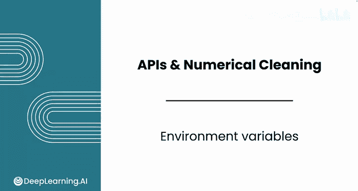
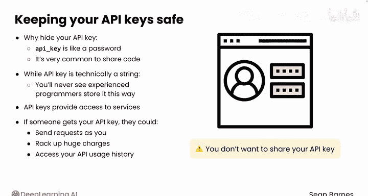
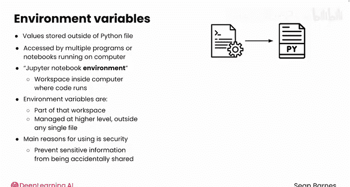
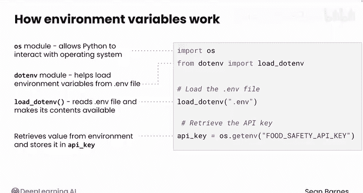

#  033：环境变量 🔑

在本节课中，我们将学习如何安全地管理API密钥。我们将探讨为什么不能将密钥直接硬编码在代码中，并介绍使用环境变量和`.env`文件来保护敏感信息的行业标准做法。



---

你已经成功发送了经过身份验证的请求并收到了数据。

但看起来你像是凭空加载了你的API密钥。


让我们退一步，分解一下你所看到的代码是如何安全加载API密钥的。

第一个问题：为什么要费心隐藏你的API密钥？

简短的回答是：你的API密钥就像密码。

你不希望直接将这个密码存储在代码中，因为分享代码是很常见的行为。这就像把你的电子邮件密码存储在一个与所有同事共享的谷歌文档里。

在编程中，通常有多种方法来完成同一项任务，你经常会遇到在简单性和安全性之间的权衡。虽然API密钥在技术上是一个字符串，但你几乎永远不会看到有经验的程序员以这种方式存储他们的API密钥。

像密码一样，API密钥代表你提供对服务的访问权限。如果其他人拿到了你的API密钥，他们可以以你的名义发送请求，在你的账户上产生巨额费用，或者访问可能包含敏感信息的API使用历史记录。

本质上，如果有人拥有你的API密钥，他们就可以登录你的账户。如果你不小心将密钥上传到公共地方，它可能会被窃取。

当你在一家公司担任数据分析师时，你经常需要分享你的代码，但你不想分享你的API密钥。你现在学习最佳实践，是为了避免未来的安全问题。





你可以使用环境变量。环境变量是存储在你的Python文件外部的值，你的代码可以在需要时访问它们。

与你目前一直在使用的变量不同（那些变量只存在于你正在运行的程序内部），环境变量可以被你计算机上运行的多个程序或笔记本访问。

在本课程和上一门课程中，你听到过“Jupyter notebook环境”这个术语。这里的“环境”指的是你计算机中代码运行的工作空间。环境变量是该工作空间的一部分，它们在更高的层级上被管理，独立于任何单个文件。

使用环境变量的主要原因是安全性。它们可以防止像API密钥这样的敏感信息被意外分享。

因此，与其将这些值直接输入到你的代码中，不如将它们存储在代码外部，并在需要时加载。

`.env`文件是你存储实际秘密API密钥的地方。它是一个纯文本文件，看起来像一堆字符串变量，每个变量独占一行，就像这样：

```
FOOD_SAFETY_API_KEY=your_actual_key_here
```

你甚至可以添加多个密钥。只需确保这个文件永远不会被分享或上传到公共网络。



现在，如果你的电脑里只有一个`.env`文件躺着，它对你没什么用。你需要让你的Python文件能够访问那些信息。

让我们看看你之前使用的代码，并逐行分解它。


```python
import os
from dotenv import load_dotenv

load_dotenv()
API_KEY = os.getenv(‘FOOD_SAFETY_API_KEY’)
```

以下是每行代码的作用：

*   `os`模块允许Python与操作系统交互，包括读取环境变量。你有时会看到`os`被用于在文件夹间导航或与文件交互。
*   `dotenv`模块帮助从`.env`文件加载环境变量，这个文件是你之前创建并添加了API密钥的。
*   `load_dotenv()`函数读取`.env`文件，并将其内容作为环境变量提供。
*   `API_KEY = os.getenv(‘FOOD_SAFETY_API_KEY’)`从环境中检索`FOOD_SAFETY_API_KEY`的值，并将其存储在`API_KEY`变量中。



关于API密钥的出色工作！你已经学会了一项行业标准的安全措施，作为数据分析师，你会经常用到它。

在下一课中，你将着手清理你检索到的数值数据。我们下节课见。

---


**本节课总结**

在本节课中，我们一起学习了：
1.  **API密钥的重要性**：它类似于密码，需要被保护，以防止未经授权的使用和潜在的安全风险。
2.  **环境变量的概念**：它们是存储在程序外部的键值对，可以被多个程序访问，用于将配置信息与代码分离。
3.  **`.env`文件的作用**：一个本地存储敏感信息（如API密钥）的纯文本文件，必须避免将其提交到版本控制系统或公开分享。
4.  **安全加载API密钥的代码实践**：通过结合使用`os`和`python-dotenv`库，从`.env`文件安全地将密钥加载到Python环境中。

通过采用这种方法，你可以在分享代码的同时，确保你的凭证安全无虞。