#  034：数据缩放 📏

在本节课中，我们将学习数据缩放的概念及其在数据分析中的应用。我们将通过一个食品安全报告的案例，了解如何通过缩放技术，使不同规模设施的数据能够进行公平比较。

---

上一节课我们介绍了如何使用环境变量安全地加载API密钥以获取数据。现在数据已经就绪，是时候为分析做准备了。

简单回顾一下，你在这个项目中的角色是帮助提高透明度和食品安全。你的目标是开发一个报告系统，为消费者提供关于食品制造商的最新信息。看看你从所选API获取的数据。

乍一看，你可能会想直接公布违规次数，以帮助消费者比较不同设施。违规次数是指一个设施在检查期间存在的安全问题数量。然而，设施规模差异很大。大型设施自然有更多可能出现违规的空间。因此，简单的计数并不能反映全貌。

例如，如果要比较一个在1000平方英尺内有一次违规的设施，与一个在30000平方英尺内有两次违规的设施，你认为哪个情况更糟？

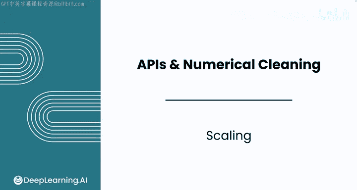

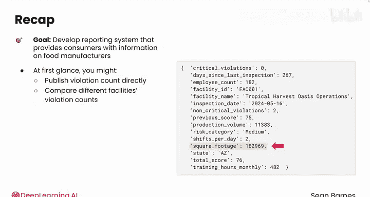

为了公平地比较它们，你需要缩放你的数据。


缩放是一种将数值调整到一致度量标准的技术，以便在不同背景下进行公平比较。在本例中，根据设施规模计算违规率，可以为你提供更准确的风险度量。


让我们看看如何在Python中缩放数据。

在Notebook的这个阶段，你已经使用API密钥从API请求了数据。你收到的响应是JSON格式，数据包含每个设施的信息，包括其规模、产量以及其他对分析有价值的信息。

首先，你需要修改这个请求以获取所有检查报告。你可以添加一个新的查询参数 `limit` 并将其设置为1000。1000是该API任何单次请求允许的最大结果数。你可以先预处理这些行来验证你的方法，然后稍后通过分页进行扩展。执行GET请求。

为了将这些数据转换为数据框，使用 `pd.DataFrame()` 并传入设施列表，即 `data[‘data’]`。

以下是具体步骤：

1.  首先导入pandas。
2.  然后创建你的数据框。

```python
import pandas as pd
df = pd.DataFrame(data['data'])
```

查看 `df.info()`。你有15个特征和1000行数据。没有缺失值，并且许多特征目前存储为整数，这很好。

你也可以尝试 `df.describe()` 来更好地了解那些数值特征。概括来说，关键违规的平均值为1.4次，自上次检查以来的平均天数为182天，设施规模的平均值为161,000平方英尺。

假设你想计算每10万平方英尺的违规次数，以创建一个缩放度量。数据集包含关键和非关键违规的详细信息。为了更全面地了解每个设施的问题，你可以将关键和非关键违规次数相加，得到总违规次数。

将此列添加到你的数据框中，它会出现在末尾。

```python
df['total_violations'] = df['critical_violations'] + df['noncritical_violations']
```

因此，如果你查看第一个设施，它在182,000平方英尺内有2次违规，而第三个设施在116,000平方英尺内有4次违规。

为了缩放这些数据，将总违规次数除以该值，得到每平方英尺的违规次数。将其保存为数据框中的一个新列。

```python
df['violations_per_sqft'] = df['total_violations'] / df['facility_size']
```

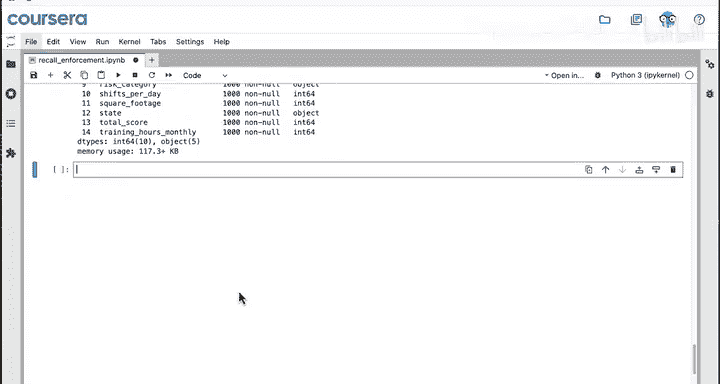

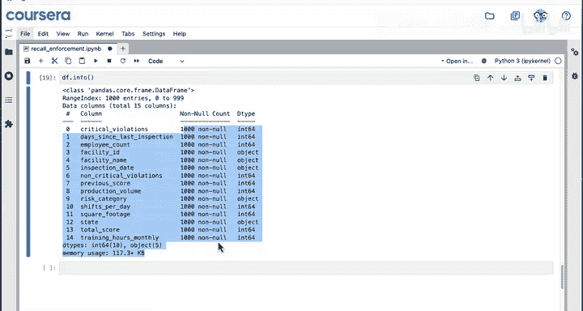

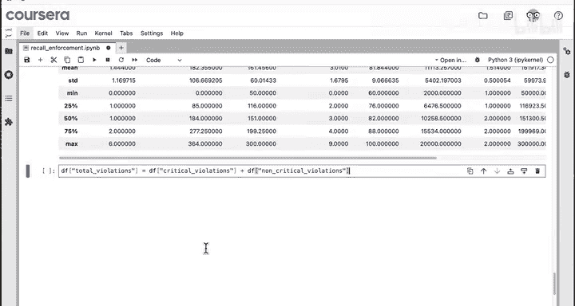

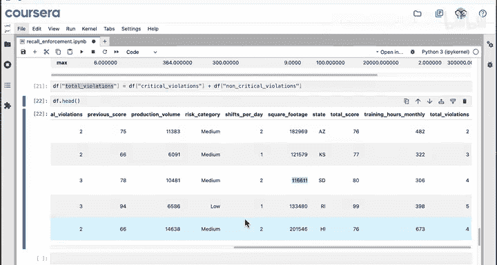

如果你再次查看 `df.head()`，会发现缩放后的违规值非常小。这是因为大多数设施规模相当大，而违规次数很少。为了使这个度量更容易解释，你可以乘以100,000，将此特征转换为每10万平方英尺的违规次数。

```python
df['violations_per_100k_sqft'] = df['violations_per_sqft'] * 100000
```


然后你可以描述此列以查看摘要统计信息。例如，平均值约为每10万平方英尺3.2次违规。


现在，如果你再次查看前几行，第一个设施的缩放违规计数为1.09，而设施3为3.43。这是一个更公平的比较，也是对消费者来说更好的报告指标。

因此，第一个设施的缩放违规计数远低于平均值，而第三个设施则更接近平均值。

最后，为了提高可读性，你可以使用 `round` 方法四舍五入到2位小数。

```python
df['violations_per_100k_sqft'] = df['violations_per_100k_sqft'].round(2)
```

唯一需要的参数是你想要四舍五入到的小数位数。查看结果以确认四舍五入是否正确。

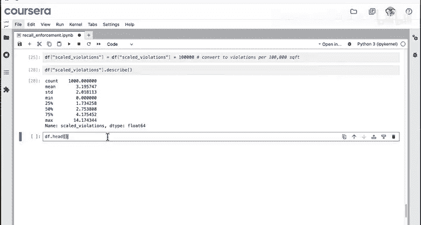

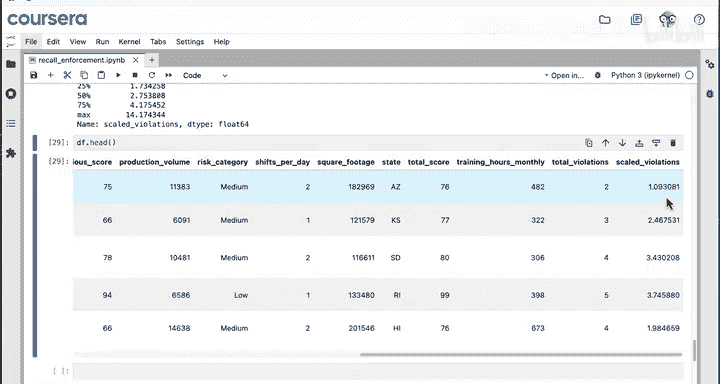

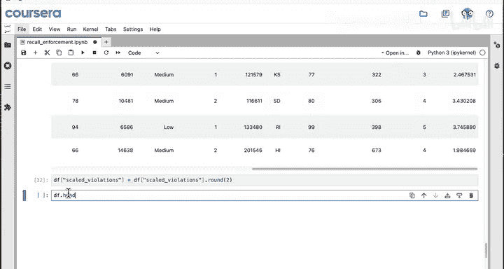

现在，你可以查看设施规模与缩放违规次数的散点图，以真正识别异常值。


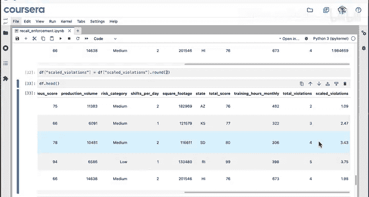


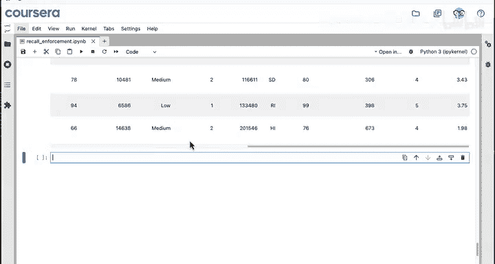

注意，较大的设施通常每10万平方英尺的违规次数较少，而较小的设施仅因几次违规就会受到很大影响。

---


在本视频中，你计算了每10万平方英尺的违规次数，以便在不同设施之间进行比较。你通过将违规次数除以平方英尺，然后乘以100,000来缩放违规计数，从而得到每10万平方英尺的违规次数。

你还看到了如何对Series使用 `round` 方法，其中小数位数是唯一的参数。

缩放有助于将原始数字转化为有意义的比较。

接下来，你将探索一种将数值数据分组到有意义类别中的技术。希望你能继续学习。

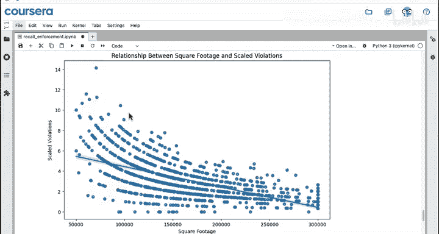

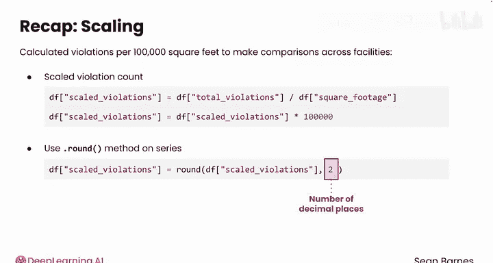

---

**总结**


本节课我们一起学习了数据缩放。我们了解到，直接比较不同规模设施的原始违规次数是不公平的。通过将违规次数除以设施面积，并转换为每单位面积（如每10万平方英尺）的违规率，我们得到了一个更公平、更有意义的比较指标。这个过程就是数据缩放，它是数据预处理中使不同量级数据具有可比性的关键步骤。我们还实践了使用Pandas进行列计算、数据转换和四舍五入操作。