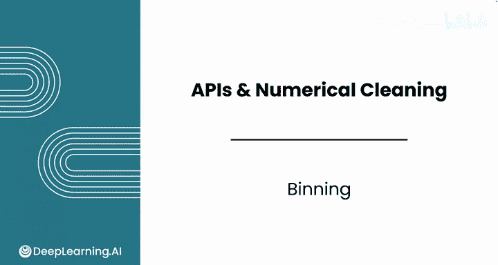
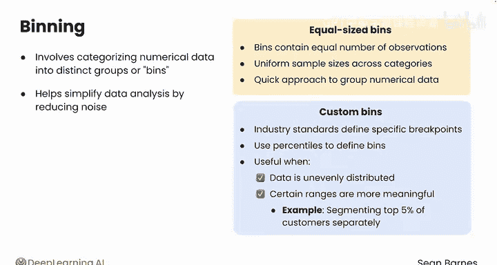
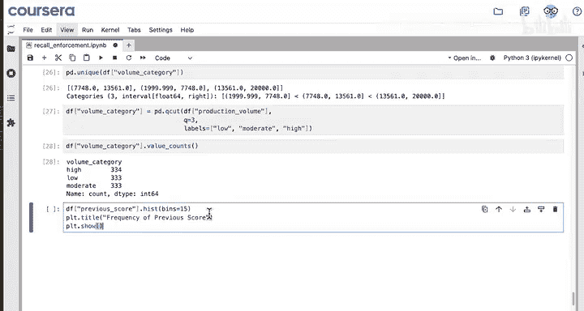
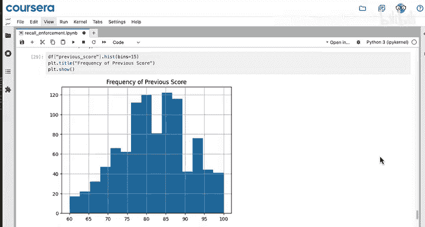
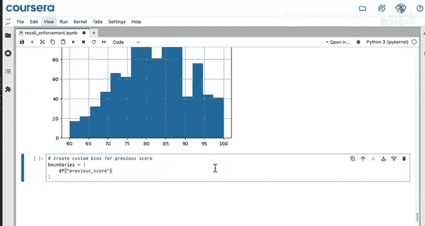
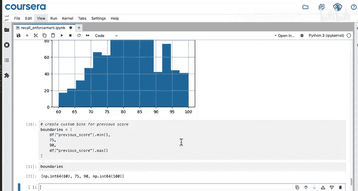
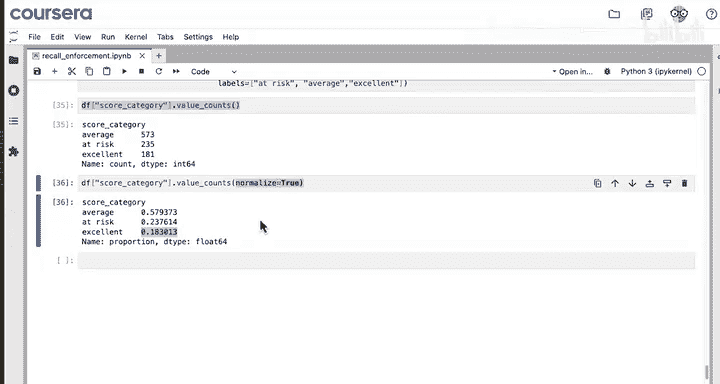
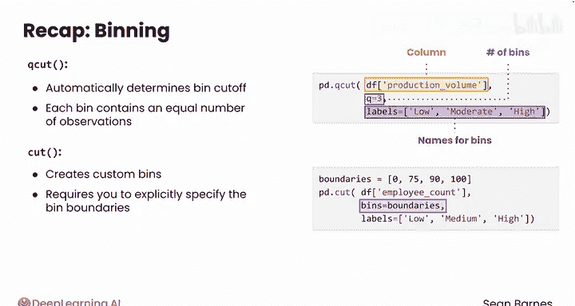

#  035：分箱处理 📊

在本节课中，我们将要学习一种名为“分箱”的数据预处理技术。分箱可以将连续的数值数据分组到不同的类别或“箱子”中，从而简化数据分析，并使其更易于解释。

上一节我们介绍了数据缩放，它通过将数值调整到共同尺度来确保公平比较。本节中我们来看看另一种提升数据可解释性的方法：将数值数据分组到有意义的类别中。

## 什么是分箱？

分箱是指将数值数据归类到不同的组或“箱子”中。这个过程有助于通过减少数据噪声来简化数据分析。

分箱主要有两种通用方法：
1.  使用等频分箱。
2.  使用自定义分箱。





## 等频分箱

等频分箱，也称为分位数分箱，是指将数据划分到包含**相等数量观测值**的箱子中。这种方法能确保各个类别间的样本量均匀，是一种快速简便的数值数据分组方法。

以下是使用Pandas库进行等频分箱的示例代码：

```python
import pandas as pd

# 假设 df 是包含‘production_volume’列的DataFrame
# 使用 qcut 函数进行三等频分箱，并指定标签
df['volume_category'] = pd.qcut(df['production_volume'], q=3, labels=['低', '中', '高'])

# 查看各箱子的计数
print(df['volume_category'].value_counts())
```

## 自定义分箱

另一种选择是创建自定义分箱。例如，行业标准可能定义了特定的分界点，或者你可能希望使用百分位数来定义箱子。当数据分布不均匀（特别是高度偏斜）或某些范围更具实际意义时，自定义分箱尤其有用。例如，你可能希望对数据的特定部分（如排名前5%的客户）进行更精细的划分。



以下是如何使用自定义边界进行分箱的示例：







```python
# 定义自定义分箱的边界
# 例如，将分数分为‘有风险’、‘平均’、‘优秀’三类
boundaries = [60, 75, 90, 100]  # 需要 n+1 个边界来定义 n 个箱子
labels = ['有风险', '平均', '优秀']

# 使用 cut 函数进行自定义分箱
df['score_category'] = pd.cut(df['previous_score'], bins=boundaries, labels=labels)

# 查看各箱子的计数和比例
print(df['score_category'].value_counts())
print(df['score_category'].value_counts(normalize=True))  # 显示比例
```

## 如何选择分箱方法？

*   **`qcut` 函数**：自动确定分箱切点，使得每个箱子包含大致相等的观测值数量。你需要指定要分箱的数据列、箱子的数量（`q`）以及可选的箱子标签（`labels`）。
*   **`cut` 函数**：创建自定义分箱。这种方法要求你通过向 `bins` 参数提供一个列表来明确指定箱子的边界。





本节课中我们一起学习了两种将数值数据分组的方法：等频分箱和自定义分箱，并了解了它们各自的适用场景。你已经看到，分箱如何将复杂的数值转化为直观的类别，从而提升数据的可读性和分析效率。

在下一个视频中，你将学习如何使用归一化来进一步提升数据的可解释性。