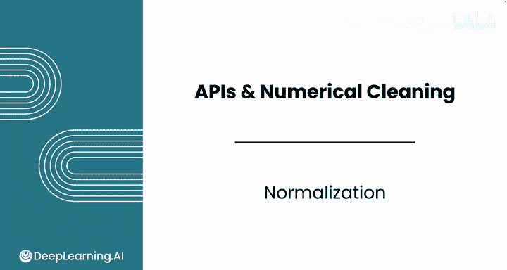
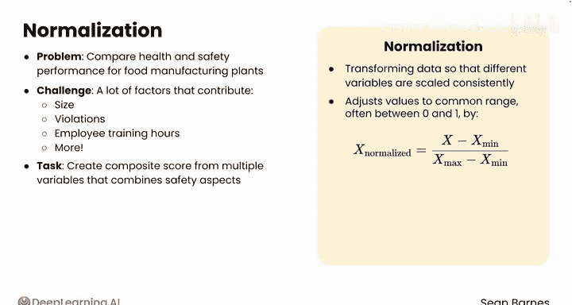
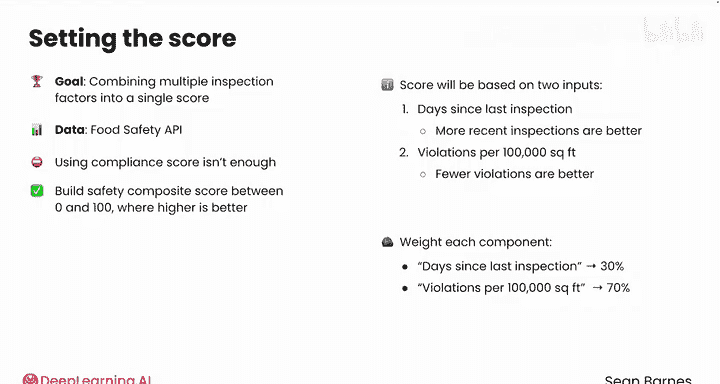
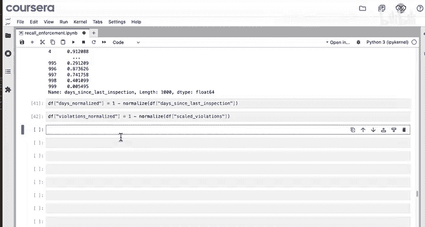
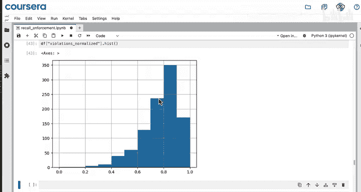
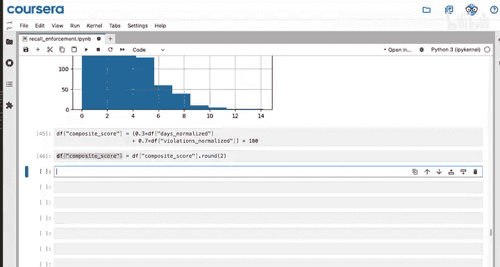
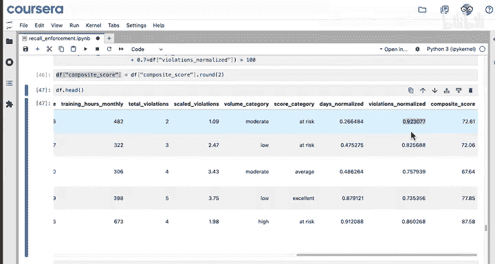
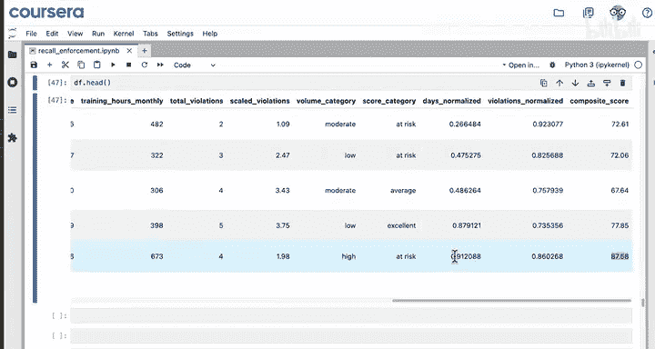
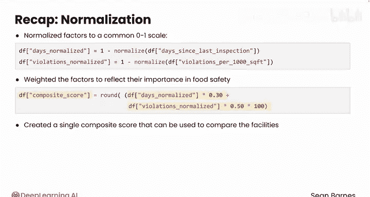

#  036：数据归一化 📊

在本节课中，我们将学习如何通过数据归一化，将不同尺度的变量转换到统一范围，从而创建更具解释性的复合评分。归一化是数据预处理的关键步骤，能确保在构建综合指标时，各个变量具有可比性。

## 概述

上一节我们介绍了数值数据分类的两种分箱方法。本节中，我们将探讨如何通过归一化处理，使数据对利益相关者更具意义。

假设我们需要比较食品制造工厂的健康与安全绩效。影响安全的因素很多，例如设施规模、违规次数、员工培训时长等。我们可以从多个变量中创建一个复合评分，将所有安全方面综合为一个数字。这个评分对消费者来说将更易于理解。

在创建评分之前，需要先应用归一化。归一化是转换数据的过程，目的是让不同变量按一致的比例缩放。

## 什么是归一化？

归一化通过调整数值使其适应一个共同的范围（通常是0到1之间）来工作。其方法是减去最小值并除以范围（最大值减最小值）。这种方法称为**最小-最大归一化**，当然也存在其他选项。

**Z-score标准化**是另一种常见的归一化方法，我们之前已经见过。

归一化确保没有任何单一变量仅因其数值尺度较大而主导结果。例如，如果你想将员工数量和占地面积纳入评分，一个特征的数值通常在几百，而另一个通常在几十万。在这种情况下，占地面积会对评分产生不成比例的影响。

归一化允许你在相同的尺度上比较不同的变量，从而更容易评估相对价值。

## 构建安全复合评分

我们的目标是创建一个结合了多个检查因素的复合评分。为此，我们可以访问食品安全检查API。该API包含一个总分，但我们不知道它是如何构建的。为了提高透明度，我们将创建自己的评分。

我们将构建一个安全复合评分，它是一个介于0到100之间的单一数字，**数值越高表示越好**。该评分将基于两个特定输入：
1.  **自上次检查以来的天数**：检查越近越好。
2.  **每10万平方英尺的违规次数**：违规越少越好。

你需要将每一项归一化，使其处于0到1的尺度上。最后，你需要为每个组成部分分配权重，即它应占评分的多少比例。
*   “自上次检查以来的天数”将贡献 **30%**。
*   “每10万平方英尺的违规次数”将贡献 **70%**。

在当前的代码笔记本中，我们已经建立了一个包含每个设施信息的数据框，其中包括创建了按比例缩放的违规列（即每10万平方英尺的违规次数）。

## 实施归一化与计算评分

以下是实施步骤：

首先，你需要对两个输入进行最小-最大归一化，使它们处于0到1的共同尺度上。让我们导入一个辅助函数来完成这个计算。

这个 `normalize` 函数接收数据的一列，并返回该列的归一化结果。它计算 `(每个值 - 最小值) / 范围`，其中范围是最大值减最小值。这种转换确保该序列中的最小值变为0，最大值变为1，其他所有值介于两者之间。

查看“自上次检查以来的天数”归一化后的输出。它是一个序列，长度与原始列相同，但尺度在0到1之间。例如，设施999的天数几乎是最高的。

在将此保存到新列之前，你需要用1减去它。这是因为在复合评分中，对于“自上次检查以来的天数”这个指标，**数值越高实际上越差**。距离上次检查的时间越长，对评分的负面影响应该越大。这样处理后，拥有最近检查记录的设施将获得更高的分数。将结果保存到新列 `days_normalized`。

现在对违规次数进行同样的操作。这个指标也需要反转，因为违规越少越好。比较归一化后的违规次数与按比例缩放的违规次数的直方图，两者的分布完全相同，只是方向翻转了。

## 计算加权复合评分

两个因素都归一化到0到1的共同尺度后，你可以通过计算加权平均值来计算复合安全评分。
*   “自上次检查以来的天数”贡献 **30%**。
*   “每10万平方英尺的违规次数”贡献 **70%**。

最后，将结果乘以100，使你的评分范围在0到100之间，并进行四舍五入，以便获得更易于解释的整数而不是浮点数。将结果保存为数据框的新列。

## 结果示例

让我们查看一些例子。
*   对于“Tropical Harst Oasis Operations”设施，距离上次检查已有267天，每10万平方英尺有1.09次违规。他们的归一化天数得分对他们帮助不大，只有0.26（因为267天内可能发生很多变化），但他们在归一化违规次数上得分较高（违规次数相对较少）。他们的复合评分约为73，所以还不错，但不算优秀。
*   另一方面，“Har Harst Pantry House”的得分为87，高出15分。他们在“自上次检查以来的天数”上得分很好，因为距离上次检查只有大约一个月。

## 总结

本节课中，我们一起学习了数据归一化的核心概念与应用。我们使用辅助函数进行最小-最大归一化，将不同因素转换到0到1的共同尺度；根据各因素在食品安全中的重要性为其分配权重；并最终创建了一个可用于比较不同设施的单一复合评分。

你刚刚创建了一个评分系统，让消费者能够快速评估不同设施的食品安全风险。在数值数据中，一个常见的情况是存在异常值，即不寻常的数值。请跟随我进入下一个视频，学习如何识别它们。