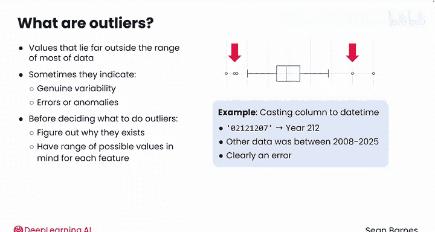
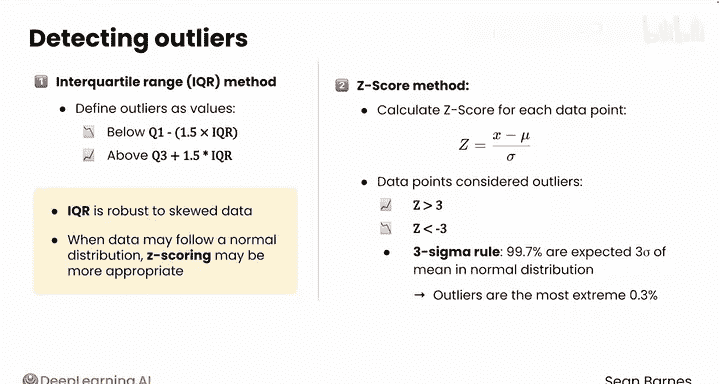

#  037：异常值识别 🎯

在本节课中，我们将学习什么是数据中的异常值，以及如何识别它们。理解异常值对于确保数据分析的准确性和可靠性至关重要。

## 什么是异常值？

异常值是数据集中的不寻常数值。它们可能难以定义和处理。

顾名思义，异常值是指那些远离数据主体范围的数值。在数据分析的应用统计学中，异常值通常表现为箱线图“须”之外的独立数据点。理解异常值具有挑战性，有时它们代表真实的变异性，有时则是错误或异常。在决定如何处理异常值之前，区分这两种情况可能很困难，因此，弄清楚它们存在的原因非常重要。

你应该对每个特征的可能数值范围有一个预期。例如，在之前的一个视频中，你遇到了使用pandas将一列数据转换为日期时间格式的问题。检查有问题的数值后，你发现该日期代表212年，而所有其他数据都在2008年至2025年之间。这显然是一个错误，而非真实的变异性。

## 如何识别异常值？

你有几种识别异常值的方法。以下是两种常用方法：

*   **四分位距法**：此方法用于识别箱线图中的异常值。它将异常值定义为低于**第一四分位数 - 1.5倍IQR** 或高于**第三四分位数 + 1.5倍IQR** 的数值。公式表示为：
    `Outlier < Q1 - 1.5 * IQR` 或 `Outlier > Q3 + 1.5 * IQR`
*   **Z分数法**：这种方法对正态分布的数据效果很好。在此方法中，你通过**减去均值并除以标准差**来计算每个数据点的Z分数。通常，Z分数大于3或小于-3的数据点被视为异常值。

你对此有直觉吗？回想一下“3西格玛法则”，在正态分布中，99.7%的数据点预期落在均值的三倍标准差范围内。因此，这里的异常值被定义为最极端的0.3%的数值。与中位数类似，IQR法对偏斜数据更具鲁棒性。当你怀疑数据可能遵循正态分布时，Z分数法可能更合适。

## 总结

本节课我们一起学习了异常值的概念及其重要性。我们介绍了两种主要的识别方法：基于数据分布的**四分位距法**和适用于正态分布的**Z分数法**。理解这些方法是正确处理数据异常的关键第一步。

现在你已经熟悉了识别异常值的步骤，请跟随我进入下一个视频，学习如何处理这些异常值。