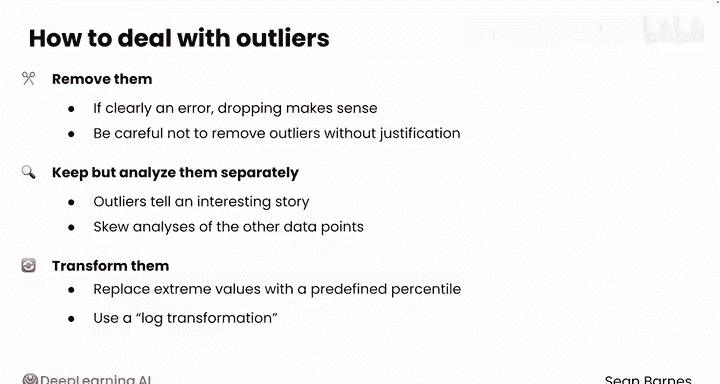
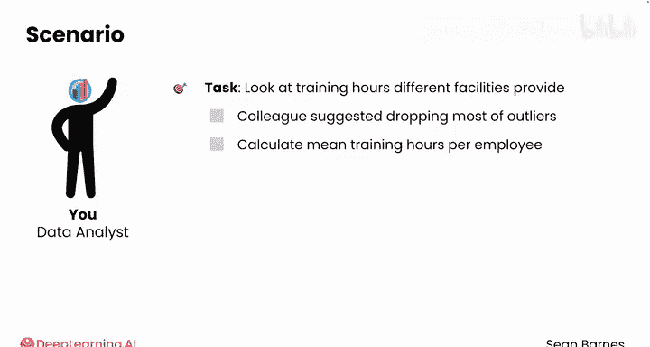
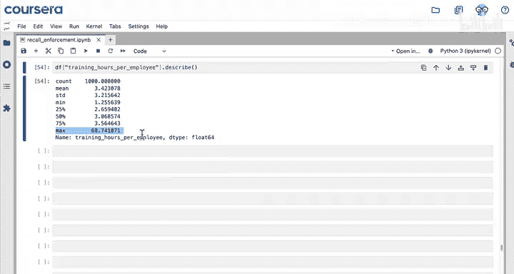
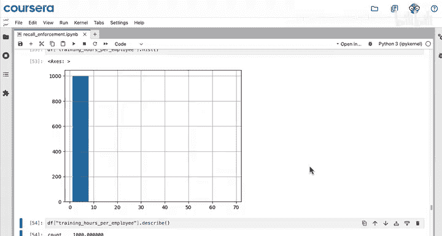
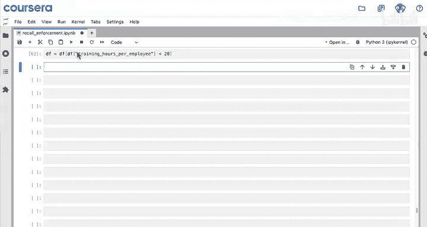
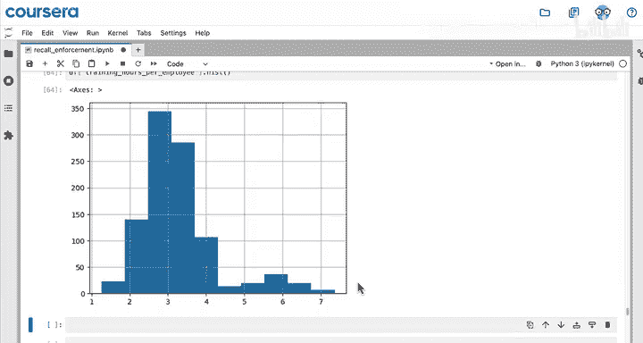
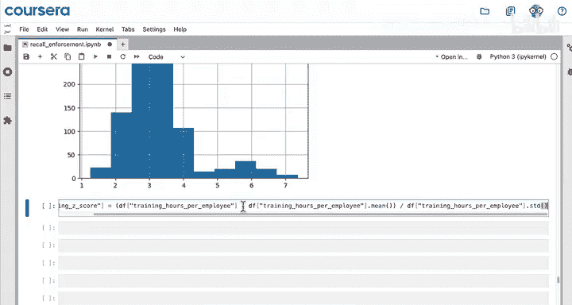
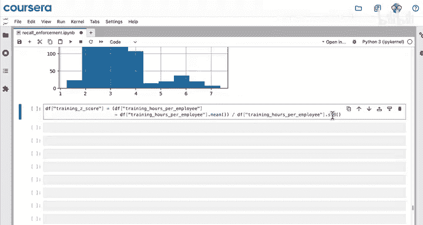
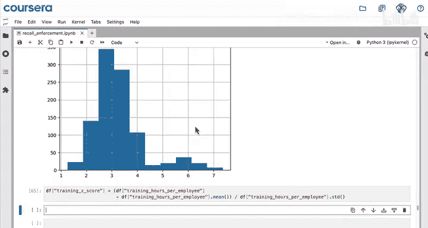
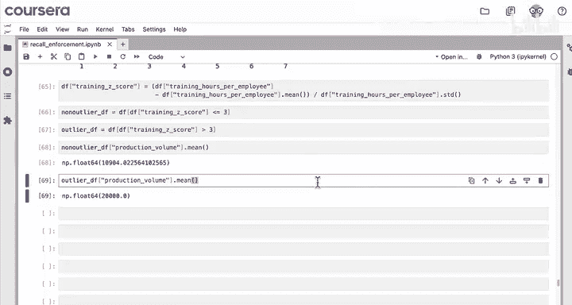

#  038：异常值处理 🎯

在本节课中，我们将学习如何识别和处理数据集中的异常值。异常值是指那些与数据集中其他观测值显著不同的数据点，它们可能由测量误差、数据录入错误或真实的极端情况引起。正确处理异常值对于确保数据分析的准确性和可靠性至关重要。

## 概述

识别出异常值后，工作并未结束。一旦确定了数据中的哪些值是异常值，就需要选择合适的方法来处理它们。处理异常值有三种主要选项，这些选项与处理缺失值的方法有相似之处。

## 处理异常值的三种方法

以下是处理异常值的三种主要策略：

1.  **删除异常值**：如果异常值明显是错误，删除它们是合理的做法。但需要注意，不应在没有正当理由的情况下随意删除异常值。
2.  **保留并单独分析**：有时异常值本身可能包含有价值的信息，但若与其他数据点一起分析会扭曲整体结果。此时，可以将异常值保留下来，但进行单独分析。
3.  **转换异常值**：可以使用预定义的百分位数替换极端值，或使用对数变换等方法。这些处理过程相对高级，超出了本课程的范围。你可以利用大型语言模型进一步探索这些概念。

## 实战演练：分析员工培训时长

假设你被要求查看不同工厂提供的培训时长数据。你的同事担心数据中存在异常值，并建议删除其中大部分。你的目标是计算每位员工的平均培训时长。






让我们通过代码来具体分析。在当前的笔记本中，我们已经建立了一个包含各工厂信息的数据框，其中包括创建了标准化违规数列和综合评分列。

在进行任何操作之前，让我们先标准化“月度培训时长”这一列。因为各工厂的员工数量不同，我们需要创建一个新列，用月度培训总时长除以员工数量。

```python
# 创建人均月度培训时长列
df[‘training_hours_per_employee’] = df[‘training_hours_monthly’] / df[‘employee_count’]
```

前三个工厂的人均培训时长约为2.6小时，接着是约3小时，然后是约3.3小时，这些数据看起来相当一致。

下一步是查看该特征的直方图，以判断数据是否服从正态分布。这将帮助你决定应该使用**四分位距法**还是**Z分数法**来识别异常值。

这个直方图看起来有些奇怪。让我们查看`describe`函数的输出，以了解更多关于数据分布的信息。

```python
# 查看数据描述性统计
df[‘training_hours_per_employee’].describe()
```

观察这些统计数据时，最引人注目的是最大值68。这很可能是一个异常值，这也是为什么直方图中只有一个高大的条形。除此之外，可以看到均值和中位数相对接近，因此数据分布看起来仍然可能是对称的。所以，使用Z分数法来识别异常值是合理的。



## 使用Z分数识别异常值



创建一个新列用于存储Z分数。Z分数的计算公式是：每个值减去均值，然后除以标准差。

首先，让我们使用箱线图可视化人均培训时长的分布。

```python
# 绘制箱线图
import seaborn as sns
sns.boxplot(x=df[‘training_hours_per_employee’])
```

从可视化结果中，可以看到有三个数据点明显超出了其余数据的范围。这些是明确的候选过滤点。每月人均40小时或更多的培训时长看起来非常极端，因此这些很可能是错误数据。

接下来的步骤是过滤掉这些极端值。根据你的直觉，可以得出结论：在给定的月份中，每位员工接受超过20小时的培训是不现实的。请记住，你可能希望将来将分析扩展到完整的数据集，因此需要给自己留出一些空间，以排除可能观察到的其他异常值。

## 分析过滤后的数据

现在你已经移除了那些极端的异常值，绘制剩余数据的分布直方图可能会很有用。

```python
# 绘制过滤后的直方图
filtered_df = df[df[‘training_hours_per_employee’] <= 20]
sns.histplot(x=filtered_df[‘training_hours_per_employee’])
```

根据这个可视化结果，看起来这里有两组数据：一个较大的数据簇集中在每月人均约3小时培训时长附近，还有一个较小的数据簇，其人均月度培训时长稍高一些。

让我们使用Z分数法来探索是否能系统地将这两个簇分开。

## 计算Z分数并分割数据

要计算Z分数，你需要从每个培训时长值中减去均值，然后除以标准差。从直方图来看，低端似乎没有异常值，因此你可以通过只过滤出Z分数大于3的数据点来分割数据。







让我们在数据中创建两个部分：第一部分包含Z分数小于或等于3的数据点；异常值部分则包含Z分数大于3的数据点。





```python
# 计算Z分数
mean_val = filtered_df[‘training_hours_per_employee’].mean()
std_val = filtered_df[‘training_hours_per_employee’].std()
filtered_df[‘z_score’] = (filtered_df[‘training_hours_per_employee’] - mean_val) / std_val

# 分割数据
non_outliers = filtered_df[filtered_df[‘z_score’] <= 3]
outliers = filtered_df[filtered_df[‘z_score’] > 3]
```

## 比较两个数据簇

现在让我们分析这两个数据段，以理解这两个簇之间的差异。我们来看看这两个部分（异常值和非异常值）的产量数据。

```python
# 比较平均产量
mean_prod_non_outliers = non_outliers[‘production_volume’].mean()
mean_prod_outliers = outliers[‘production_volume’].mean()
print(f“非异常值工厂平均产量： {mean_prod_non_outliers:.0f} 单位”)
print(f“异常值工厂平均产量： {mean_prod_outliers:.0f} 单位”)
```

看起来，非异常值工厂的平均产量略低于11000单位，而异常值群体的平均产量约为20000单位。这表明，人均月度培训时长较高的工厂，其平均产量也显著更高。

这个结果可能会促使你进一步深入研究这些生产工厂之间的差异。一个可能的结论是，投资于更高的员工月度培训可能会带来更高的平均产量。但另一个可能的结论是，导致高产量的可能不是培训时长本身，而是这些工厂包含了需要更多培训的专业员工。

你可以通过推断统计进一步深化这个分析，但至此，你已经学会了如何处理异常值：既包括删除错误的异常值，也包括分离出合理的异常值进行分析。



## 总结

本节课中，我们一起学习了异常值处理的完整流程。我们首先了解了处理异常值的三种策略：删除、保留并单独分析、转换。接着，我们通过一个分析员工培训时长的实战案例，演示了如何利用Z分数法识别异常值，并通过可视化（箱线图、直方图）和数据分割来深入理解数据。最后，我们比较了不同数据簇的特征，并探讨了数据背后可能的故事。你已经掌握了处理新数据中异常值的关键技能，为进行高质量的数据分析打下了坚实基础。