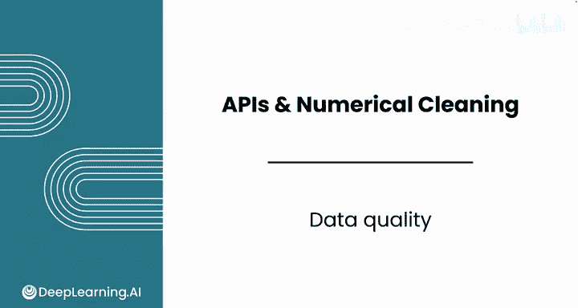
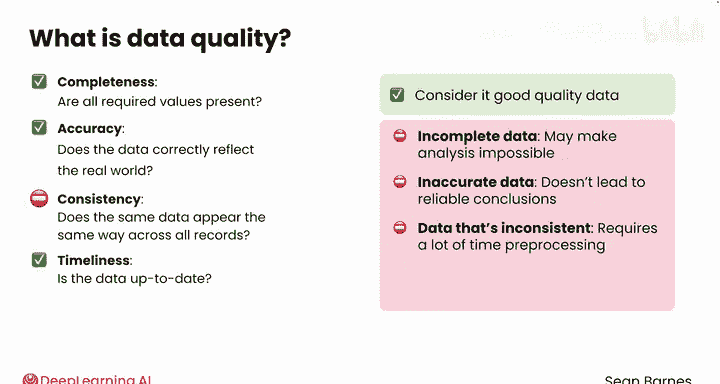
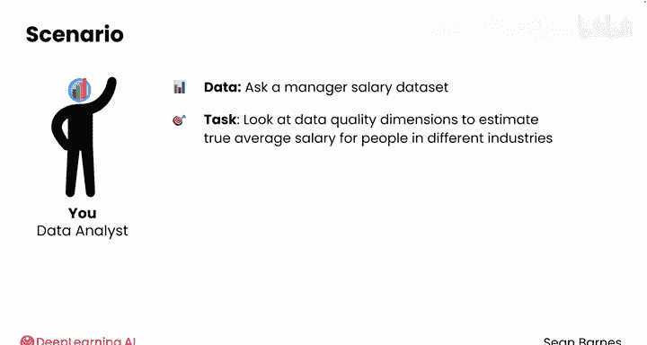
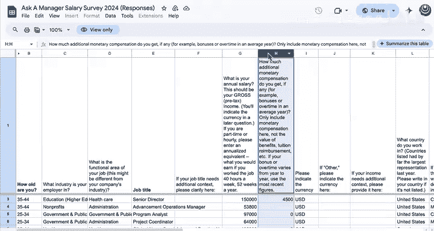
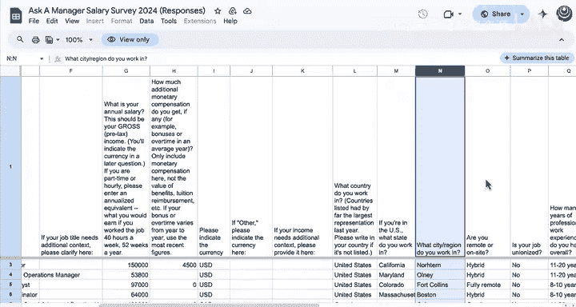
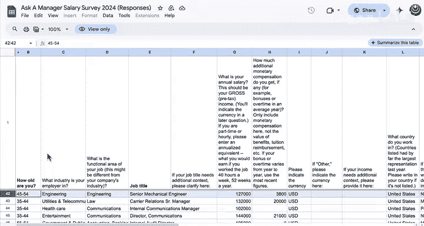

#  039：数据质量评估 📊

在本节课中，我们将学习数据质量的核心概念及其四个关键维度。理解数据质量是数据分析的基础，低质量的数据可能导致错误结论或增加分析难度。

## 概述

作为数据分析师，理解数据质量至关重要。低质量数据可能带来后续问题，甚至导致错误结论。数据质量参差不齐，在职业生涯中，你将同时处理高质量和低质量的数据。有时，低质量数据集是唯一可用的数据，但你仍可能从中提取有价值的见解。

数据质量可以分解为四个关键维度。

## 数据质量的四个维度

以下是评估数据质量的四个核心方面：

1.  **完整性**：所有必需的值是否都存在？
2.  **准确性**：数据是否正确反映了现实世界？
3.  **一致性**：相同的数据在所有记录中是否以相同的方式呈现？
4.  **及时性**：数据是否是最新的？

如果你的数据**完整、准确、一致且及时**，那么你可以认为它是高质量的数据。

## 数据质量问题的影响

每个维度都会在你的分析中引发不同的问题。

例如，不完整的数据可能使分析无法进行，而不准确的数据虽然允许你进行分析，但无法得出可靠的结论。不一致的数据需要花费大量时间进行预处理，而不及时的数据则可能使你的结论缺乏普遍性。

请注意，这些维度与你的业务问题相关。例如，什么算作“及时”，可能取决于你试图回答的具体问题。

## 案例分析：“Ask a Manager”薪资数据集

在本课程中，你已经多次遇到“Ask a Manager”薪资数据集。它之所以引人注目，正是因为其混乱的特性。让我们从“估算不同行业真实平均薪资”的角度，来审视这个数据集的数据质量维度。

以下是2019年的调查回复。

首先从**及时性**维度来看，如果你试图找出当前各行业的真实平均薪资，那么这份数据缺失了疫情时期和几年的通胀影响。从及时性角度看，这可能不是最有用的数据。

从**完整性**来看，大多数行似乎都已填写，但有必要确定有多少缺失的行业和薪资数据，因为你的分析需要这些信息。

至于**准确性**，这些数据都是自我报告的。你无法验证这些人是否说了实话。

从**一致性**的角度看，这份数据的质量确实很差。正如你所见，例如在第245行，有人在金融科技行业工作，职位是企业社会责任经理。

他们的薪资看起来是170万美元，但他们将货币单位填在了“其他货币”类别中。你需要单独分析这些条目，而识别它们可能具有挑战性，因为这是一个纯文本字段。

你之前也见过这些薪资不一致的情况。这个人写了“90K”而不是“90000”。这个人写了“42000-ish”，而这个人则包含了他们的健康保险津贴。因此，你需要进行大量的文本处理，可能需要使用一些正则表达式来尝试移除所有文本和符号，并处理缩写形式。

这个数据集有趣之处在于，这项调查仍然存在，并且调查的所有者实际上已经更新了他们的问题，解决了许多你刚刚发现的问题。

## 数据质量的改进：2024年数据

以下是2024年的数据。每一行仍然是一个调查回复，但请注意问题的变化。

例如，现在他们区分了“雇主所在行业”和“你的工作职能领域”。例如，这个人的职能领域是教育，但他们在医疗保健行业工作。这可能是一个大学的学生健康服务主任。

他们还区分了总收入与额外薪酬，并分别列出了国家、州和地区。

因此，**一致性**得到了极大改善。关于**完整性**，看起来大多数字段都是必填的。薪资字段似乎都是数字。所以这是质量高得多的数据，不仅更新，而且更完整、更一致。

然而，这份数据在**准确性**维度上仍然存在问题。你仍然不知道这些人是否真的报告了他们的真实薪资。这可能是一份有偏见的调查，只在某些社区或高收入人群中流传。

## 开始分析前的自问

这些都是你在开始处理数据之前应该检查的数据质量维度。问自己一些尖锐的问题：

*   这份数据真的比没有数据好吗？
*   这份数据真的能帮助回答我试图解决的业务问题，还是会制造更多困惑？

## 总结

我们已经了解了为什么数据质量检查是数据分析中最重要的方面之一。在开始预处理之前，你应该始终进行质量检查。

本节课到此结束，你也即将完成本模块的学习。完成练习实验和练习作业后，你将完成本课程的评分项目。在评分实验中，你将使用人口普查数据为非营利组织识别弱势群体。

完成后，我们将在下一个模块再见，该模块将全部关于数据库。