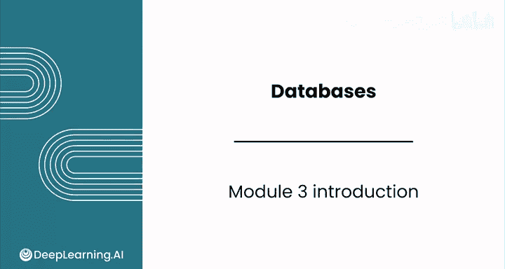
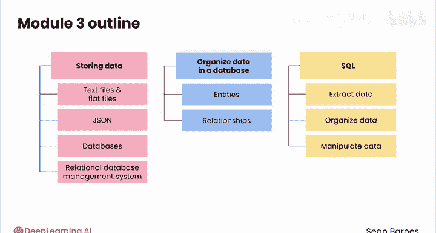

#  040：模块3 简介 🗄️

在本模块中，我们将学习在数据库中处理数据的基础知识。数据库在商业中无处不在，它们能帮助高效地管理大量数据。通过本模块的学习，你将掌握从数据库中检索、限制和排序数据的方法，并理解其工作原理与优势。

***

## 第一课：数据存储系统概览

上一节我们介绍了本模块的整体目标，本节中我们来看看数据存储的各种形式。数据可以存储在多种系统中，选择合适的数据存储系统会直接影响分析师的工作效率。

以下是常见的数据存储选项：
*   **文本文件**：如 `.txt` 文件。
*   **平面文件**：如 `.csv` 文件。
*   **结构化格式**：如 **JSON** 格式。
*   **数据库**：用于管理大规模数据集。

此外，你将了解到数据库是由一种称为**关系型数据库管理系统**的软件进行管理的。

***

## 第二课：数据库中的数据组织

了解了数据存储在哪里之后，本节我们将探讨如何有效地在数据库中组织数据。关键在于对现实世界中的实体及其关系进行建模。

你将学习数据库如何表示这些实体和关系，这是构建高效、可查询数据库的基础。

***

## 第三课：SQL 入门与实践

在掌握了数据组织方式后，本节我们将开始学习 **SQL**。SQL 是一种专门为访问和操作数据库数据而设计的编程语言，是当今分析师最重要的技能之一。

通过动手实践，你将学习提取、组织和操作数据的技巧。这些技术将为你在本课程最后一个模块中进行更高级的预处理和分析打下坚实的基础。

以下是本课将涉及的核心操作：
*   **提取数据**：使用 `SELECT` 语句。
*   **组织数据**：使用 `ORDER BY` 进行排序。
*   **限制数据**：使用 `LIMIT` 子句。

***

## 总结

本节课中，我们一起学习了数据库模块的核心内容。我们从数据存储系统开始，探讨了如何有效地在数据库中组织数据，并最终入门了用于数据操作的 SQL 语言。掌握这些知识将使你能够自信地从数据库中检索、限制和排序数据。

让我们在下一个视频中，从数据存储系统开始正式学习。