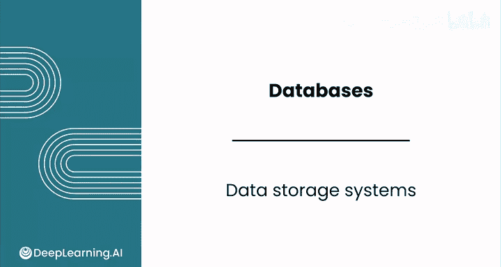
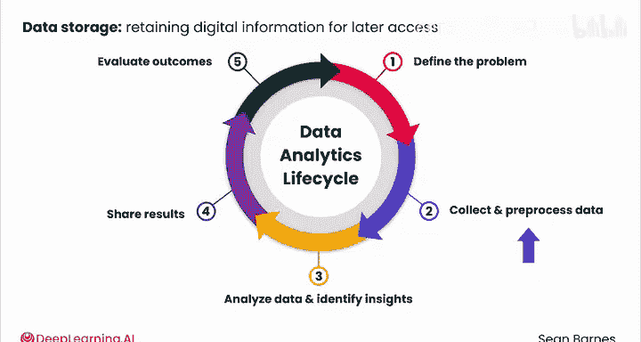
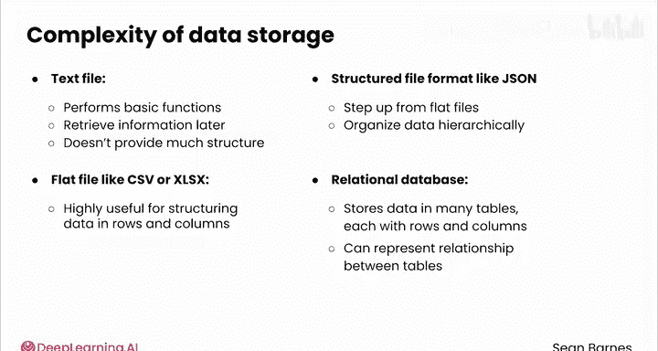
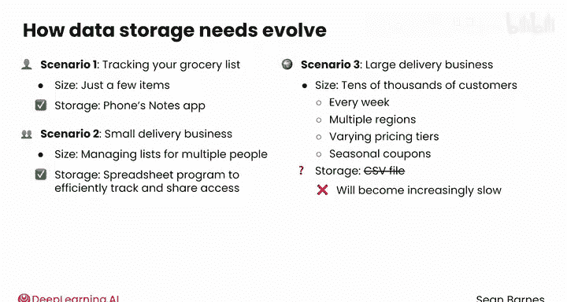
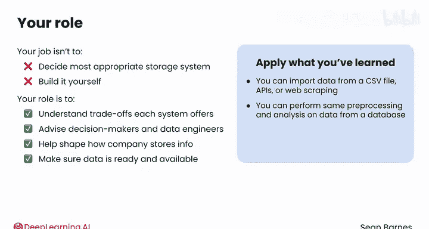

#  041：40_数据存储系统 📂

## 概述

在本节课中，我们将要学习数据存储系统。数据可以以多种方式存储，具体取决于其结构、复杂性以及业务需求。我们已经了解了多种数据输入方法，包括平面文件、网络爬取和API。现在，我们将深入探讨数据存储的细节，了解不同的存储方式及其对数据分析的影响。

---

## 数据存储的重要性

数据存储指的是为了后续访问和数据分析而保留数字信息。在你之前学习的数据分析生命周期中，第一步是定义问题，第二步是收集和预处理数据，第三步是分析数据并识别洞察，第四步是分享结果，第五步是评估结果。

在开始分析数据或分享结果之前，你的数据需要在第二步中被存储起来。数据存储的位置和方式直接影响你从中获取洞察的难易程度。

事实上，数据存储是一个相当复杂的问题。正如你在课程早期所学，有一个专门的职位——数据工程师——负责收集和存储数据。

---

## 数据存储方式的演进

根据复杂度的递增顺序，数据可以存储在文本文件、平面文件（如CSV或Excel）、结构化文件格式（如JSON）或关系型数据库中。

*   **文本文件**：通过允许你稍后检索信息来实现数据存储的基本功能，但它不提供太多结构。
*   **CSV文件**：对于以行和列的形式结构化数据非常有用。
*   **JSON文件**：正如你在上一个模块中所见，它比平面文件更进一步，因为它可以分层组织数据。
*   **关系型数据库**：这是最终的数据存储机制。它将数据存储在多个表中，每个表都有行和列，并且可以表示这些表之间的关系。

在接下来的视频中，你将更深入地了解数据库。

---

## 存储需求随业务增长而变化

数据存储需求通常会随着公司的发展而演变。

思考一下你如何管理自己的购物清单。如果只有几件物品，你可能会在手机的备忘录应用中草草记下。但假设你开始经营自己的杂货配送业务。如果你需要为多人管理购物清单，你就需要开始以结构化的方式组织它们，以防止遗漏物品，并能够分析这些清单。

你可以使用像Google Sheets这样的电子表格程序，它可以让你高效地跟踪许多客户的数据，并与你的团队共享访问权限。

但是，假设你现在每周要为成千上万的客户管理杂货配送，这些客户遍布多个地区，有不同的定价层级和季节性折扣。起初，导出一个CSV文件然后加载到Python笔记本中进行分析可能可行，但随着数据增长，这会变得越来越慢。此外，它不会动态更新。为了保持分析的时效性，你必须不断下载数据。如果多个团队成员在处理同一个文件，很容易创建冲突的版本，并意外覆盖他人的工作。

适用于少数客户的解决方案将不再适用。此时，你的公司可能会开始使用数据库。

---

## 分析师在数据存储中的角色

作为分析师，你的工作通常不是决定最合适的存储系统或自己构建它。相反，你的角色是理解每个系统提供的权衡，以便你能更好地为选择系统的决策者和构建它的数据工程师提供建议。

你应该将自己视为数据生态系统中的积极参与者，而不是被动的消费者。事实上，你可以帮助塑造公司存储信息的方式，并确保在你需要时，所需的数据已准备就绪且可用。

请记住，所有这些数据存储步骤都发生在你将数据加载到Python笔记本进行分析之前。你已经了解了如何从CSV文件、API或通过网络爬取导入数据。你可以使用已经学到的技术，对来自数据库的数据执行相同类型的预处理和分析，尽管处理不同来源的数据可能会面临不同的挑战。

---

## 总结

本节课中，我们一起学习了数据存储系统的基础知识。我们了解到，数据存储是数据分析生命周期中至关重要的一步，存储方式的选择直接影响后续分析的效率和效果。我们探讨了从简单的文本文件到复杂的关系型数据库等多种存储方式，并理解了存储需求如何随着业务规模的增长而演变。最后，我们明确了数据分析师在数据存储生态系统中的角色——不是被动地接受现有系统，而是主动理解不同存储方案的优劣，为团队决策提供支持，并确保所需数据的可用性。你已经具备了处理这些数据所需的分析技能。

你看到数据库比文本文件、平面文件甚至JSON数据更强大、更灵活，但它们到底是什么，又是如何工作的呢？请跟随我进入下一个视频了解更多。😊