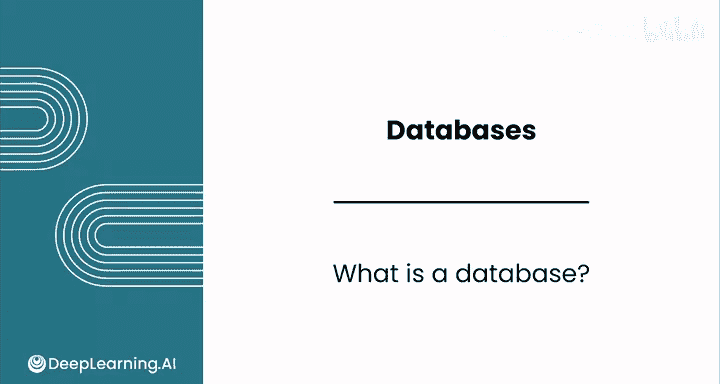
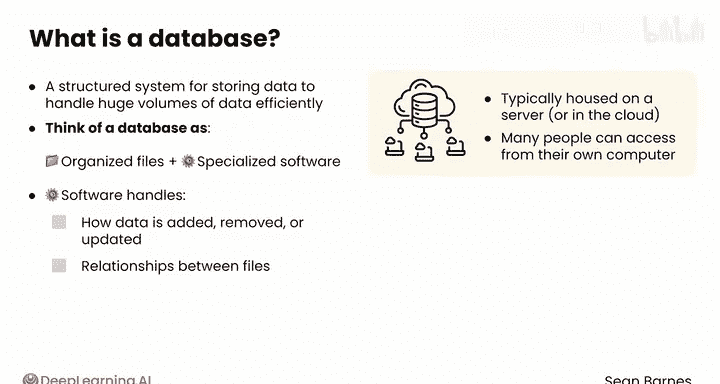
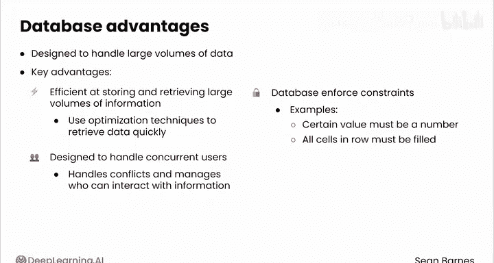
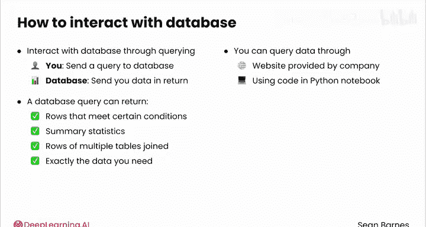
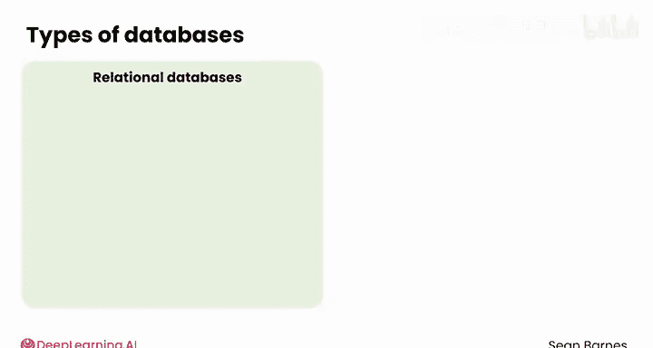
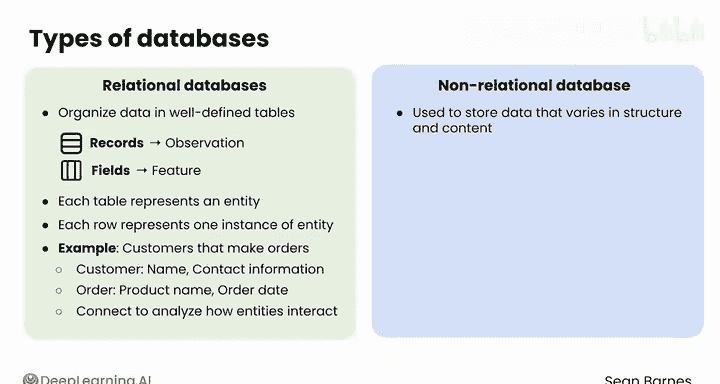

#  042：数据库概念 📚

在本节课中，我们将要学习数据库的核心概念。我们将了解数据库是什么、它们如何工作，以及它们相比其他数据存储方式（如电子表格）的优势。

---

## 什么是数据库？💾

数据库在数据分析中无处不在。让我们来看看它们是什么以及它们如何工作。

数据库的核心是一个用于存储数据的结构化系统，它被设计为能够高效地处理海量数据。你可以将数据库想象成一个本质上由一系列有组织的文件组成的集合，并附有一个专门的软件。该软件处理数据如何从文件中添加、删除或更新，并管理所有文件之间的关系。

数据库通常托管在服务器或云端，以便许多人可以从自己的计算机访问它们。但就像任何其他文件集合一样，只要你有足够的空间，你也可以在自己的计算机上存储数据库。

---

## 数据库的优势 🚀

上一节我们介绍了数据库的基本定义，本节中我们来看看数据库相比电子表格和CSV文件有哪些关键优势。数据库专为处理大量数据而设计，因此具有几个关键优势。

以下是数据库的主要优势：

1.  **高效性**：数据库在存储和检索大量信息方面极其高效。这里的“高效”意味着快速。它们使用优化技术，允许你快速检索数据。
2.  **并发性**：数据库被设计为可以处理多个并发用户。数据库的软件部分明确处理潜在的冲突，并动态管理谁可以与存储的信息进行交互。
3.  **数据完整性**：数据库通常强制执行约束。约束是关于数据应如何存储的规则。例如，一个约束可能强制要求某个值必须是数字，或者一行的所有单元格都必须填充值，而不是缺失。这些约束维护了数据的完整性。
4.  **关系建模**：数据库可以建立关系模型。它们可以连接不同表中的相关信息，而这在电子表格中很难做到。你在之前的课程中简要接触过这个想法，当时你看到了如何使用电子表格函数 `XLOOKUP` 从另一个相关的表中抓取数据。

---

## 如何与数据库交互？🔍

了解了数据库的优势后，我们来看看如何与数据库进行交互。

你将通过一个称为“查询”的过程与数据库交互。你会向数据库发送一个查询，然后它会返回数据给你。这类似于你在网络抓取或使用API时已经习惯的请求-响应周期。

一个数据库查询可以返回满足特定条件的行，可以返回汇总统计信息，甚至可以返回连接在一起的多个表的行。查询实际上可以变得相当复杂，允许你精确地请求所需的数据。你将在本模块的第三课中编写你的第一个查询。

你可以通过公司提供的网站查询数据库，也可以使用像Python笔记本中的代码来查询。在本课程中，你将看到这两种方法。

---

## 数据库的类型：关系型 vs. 非关系型 🗂️

上一节我们介绍了如何查询数据库，本节中我们来看看数据库的两种主要类型。

数据库可以大致分为两种主要类型：关系型和非关系型。

*   **关系型数据库**将数据组织成定义良好的表格，类似于具有行和列的电子表格，行和列分别代表记录和字段。这里的“记录”是观测值的另一个术语，“字段”是特征的另一个术语。每个表代表一个“实体”，这是对你所观测对象（如客户、订单、产品、鬣蜥）的一个花哨术语。每一行代表一个实体（例如，一只鬣蜥）。例如，一个企业有下订单的客户。客户和订单是两个不同的实体。关于每个实体的数据被分开收集和存储，因为客户详细信息（例如，姓名、联系方式等）与订单详细信息（例如，产品名称、订单日期）不同。但数据库可以连接这两个概念，以便你可以分析这些实体如何交互（例如，跟踪哪些客户下了哪些订单）。关系型数据库是最常见的数据库类型。
*   **非关系型数据库**通常用于存储结构和内容多变的数据，因为它们不使用具有固定列的表格。虽然它们牺牲了关系型数据库的一些严格一致性，但它们通常为具有灵活结构的高容量数据提供更好的性能。

---

## 总结 📝

本节课中我们一起学习了数据库的基础知识。我们了解到数据库是用于高效存储和管理大量数据的结构化系统。我们探讨了数据库相比电子表格的四大优势：高效性、并发性、数据完整性和关系建模能力。我们还学习了通过“查询”与数据库交互，并区分了关系型和非关系型数据库的主要特点。在接下来的视频中，我们将深入了解数据库背后的软件——数据库管理系统。