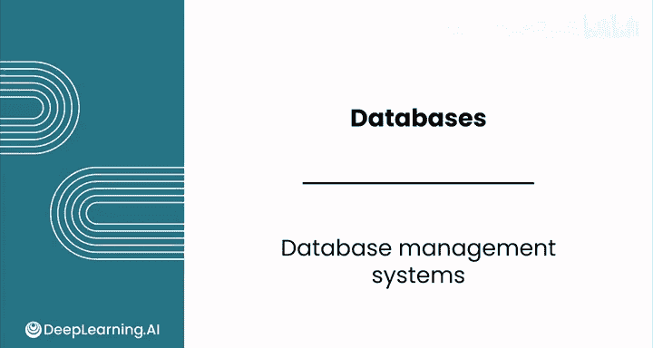
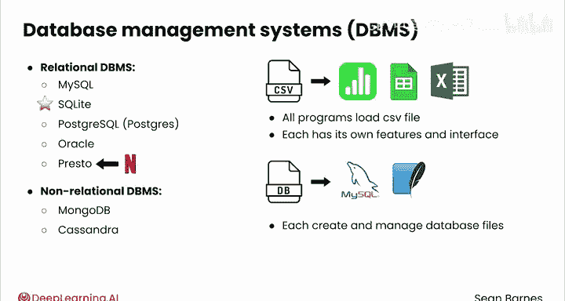
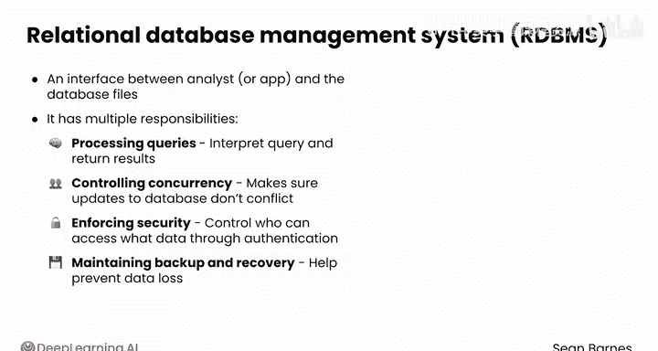
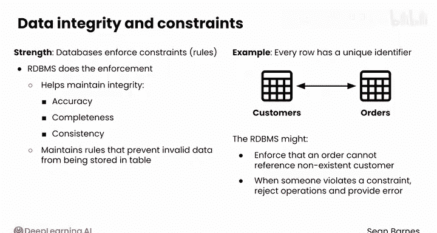

#  043：数据库管理系统 🗄️

在本节课中，我们将学习数据库管理系统（DBMS）的核心概念，了解它是什么、有哪些常见的类型，以及它在数据管理中的关键职责。

## 概述

上一节我们介绍了数据库是文件和用于管理这些文件的软件的集合。本节中，我们来看看这个软件组件——数据库管理系统。

## 什么是数据库管理系统？

数据库管理系统是管理数据库文件的软件组件。

一些常见的关系型数据库管理系统包括 **MySQL**、**SQLite**、**PostgreSQL**（有时缩写为 Postgres）、**Oracle** 和 **Presto**。您可能还会遇到非关系型数据库管理系统，如 **MongoDB** 和 **Cassandra**。

一个有趣的例子是，Netflix 就使用了 Presto。本课程将使用 **SQLite**。

有时很难理解这些应用程序之间的区别。可以做一个类比：想象一下 CSV 文件与 Numbers、Google Sheets 或 Excel 这类程序之间的关系。

CSV 文件就像数据库存储的文件集合。所有这些程序都可以加载 CSV 文件，尽管每个程序都有自己的功能和界面。

MySQL、SQLite 等数据库管理系统类似于 Numbers、Google Sheets 和 Excel。它们各自创建和管理数据库文件，您在不同的公司很可能会遇到不同的系统。

## 关系型数据库管理系统的职责

关系型数据库管理系统，也称为 **RDBMS**，是作为数据分析师或您使用的任何应用程序与数据库文件之间的接口。

它承担着多项职责。

以下是其主要职责列表：

*   **处理查询**：当您需要从数据库获取数据时，您会编写一个查询并将其发送给 RDBMS。RDBMS 会解释该查询并返回结果。
*   **控制并发**：它管理多个用户同时与数据库交互的情况，确保同时进行的更新不会相互冲突。
*   **负责安全**：通常通过身份验证来控制谁可以访问哪些数据。
*   **维护备份与恢复机制**：这有助于防止数据丢失。

您之前了解到，数据库的一个优势在于它们能强制执行关于所存储数据的约束或规则。RDBMS 就是实际执行这些规则的引擎，这有助于维护数据完整性。

您可以将数据完整性理解为类似于数据质量，其关键维度包括准确性、完整性和一致性。

## 数据完整性与约束

RDBMS 维护着防止无效数据被存入表的规则。

例如，它可能强制执行这样的约束：表中的每一行都必须有一个唯一的标识符，比如客户 ID。

约束也可以相当复杂。例如，您的数据库可能建模了客户和订单之间的关系，而 RDBMS 可能强制执行这样的约束：订单不能引用一个不存在的客户。

当有人试图将违反约束的数据放入数据库时，RDBMS 将拒绝该操作并提供错误消息。

与通常为可选功能的电子表格数据验证相比，这种强制执行要严格得多。

## 总结

本节课中我们一起学习了数据库管理系统的核心概念。您现在已经掌握了在数据库中存储数据背后的基本原理。完成练习作业后，请跟随我进入下一课，学习数据库的组织结构。