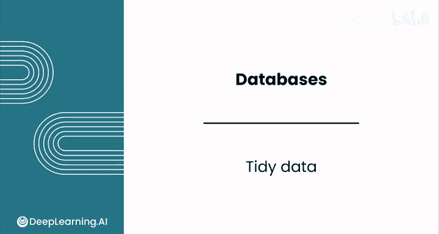
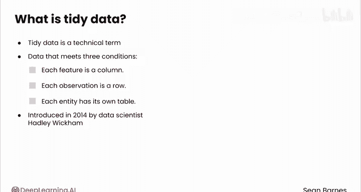
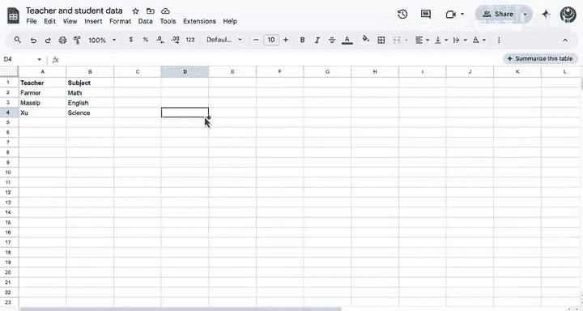
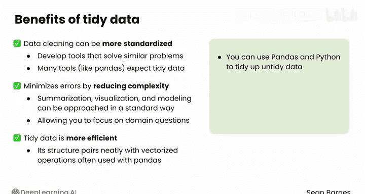

#  044：整洁数据原则 📊

在本节课中，我们将学习“整洁数据”这一核心概念。我们将了解整洁数据的定义、其三条基本原则，以及遵循这些原则如何使数据预处理和分析变得更加高效和可靠。

---

## 什么是整洁数据？

上一节我们介绍了数据处理中可能遇到的混乱情况。本节中，我们来看看如何定义和组织“整洁”的数据。

观察左侧关于教师和学生的数据，其中包含不同学生的成绩、出勤率、教师信息以及底部的汇总信息。想象一下，如果你尝试使用 `pd.read_csv()` 将这个数据读入Python进行分析，将会非常困难。

分析之所以困难，主要有两个关键原因：
1.  并非每一行都对应一个单一的观察结果。例如，某一行同时包含了学生和教师的信息。
2.  并非每一列都只包含一个特征。例如，C列不仅混合了数学和英语两种分数，还包含了文本说明和汇总数据。

这种将多个实体（如学生和教师）混合在同一个表格中，且行列结构不规范的数据，就是**不整洁的数据**。

---

## 整洁数据的三原则

“整洁数据”虽然听起来像日常用语，但实际上是一个技术术语。它指的是符合以下三个条件的数据：
1.  **每个特征构成一列**。每一列应只代表一个变量或属性。
2.  **每个观察构成一行**。每一行应只代表一个独立的观察样本。
3.  **每种类型的实体拥有自己的表**。例如，学生和教师的信息应分别存放在不同的数据表中。

这个概念由数据科学家Hadley Wickham于2014年正式提出。他在一篇著名的论文开篇写道：“人们常说，数据分析80%的时间都花在清理和准备数据上。”他的目标正是通过这三条规则，来定义如何维护易于分析的数据结构。

以下是遵循整洁原则重新组织后的教师和学生数据：

*   **学生表**：每个实体（学生）独占一表。每一行是一个观察（一名学生），每一列是一个特征（ID、姓名、数学成绩、英语成绩、出勤率）。
*   **教师表**：同样，每一行是一名教师，每一列是一个特征（姓名、所授科目）。

将数据以此种结构存储后，使用 `pd.read_csv()` 导入并进行分析就变得非常简单。你几乎不需要进行任何预处理，因为你可以按照熟悉的方式操作行和列，而无需处理之前所见的那种杂乱无章的结构。

---

## 整洁数据的好处

了解了整洁数据的定义后，我们来看看遵循这些原则能带来哪些具体好处。

整洁数据为预处理和分析带来诸多优势：
*   **标准化数据清洗**：你可以开发出可重复使用的工具来解决类似问题。如果没有整洁的数据，每次拿到新数据集时，你可能都需要调整清洗工具。
*   **最小化错误**：通过降低复杂性，整洁数据使得汇总、可视化和建模都可以采用标准方法进行。这让你能更专注于业务问题，而非繁琐的数据管理问题。
*   **提升效率**：整洁的数据结构与Pandas中常用的向量化操作能完美配合，从而提高计算效率。

尽管你可以使用Pandas和Python来整理不整洁的数据，但更好的做法是在工作流程的更早阶段（例如，在数据存入数据库时）就以整洁的方式存储数据。

---

## 总结与延伸

本节课中，我们一起学习了“整洁数据”的核心概念。我们明确了整洁数据的三个基本原则：**每个特征一列、每个观察一行、每种实体一表**。遵循这些原则能显著提升数据处理的标准化程度、减少错误并提高效率。

如果你对这个概念感兴趣，强烈推荐阅读Hadley Wickham在2014年发表的论文。这是一个非常精妙的概念，很难相信如此简单的理念直到近年才被正式定义。在实际工作中，应尽可能遵循整洁数据的原则。

接下来，我们将在下一个视频中看看实体和属性如何在整洁的数据库中进行表示。

