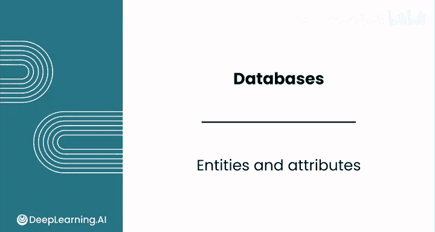
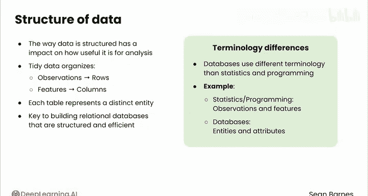
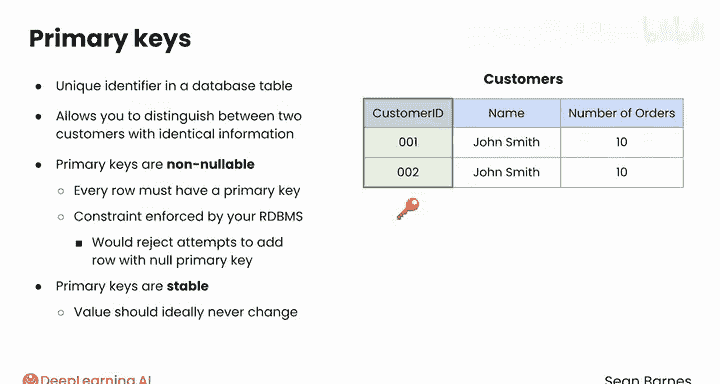
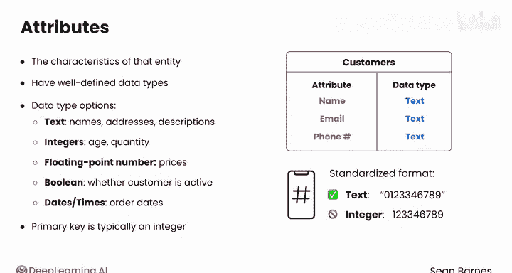

#  045：实体与属性 🧱

在本节课中，我们将学习关系型数据库中“实体”与“属性”的核心概念。这是理解如何构建整洁、高效数据库的基础。

上一节我们介绍了整洁数据原则如何简化数据分析。本节中，我们将进一步学习这些原则如何应用于关系型数据库的实体和属性。数据的结构方式，包括其分类和关联方式，对其分析价值有重大影响。

## 实体：数据库中的独立事物

实体代表现实世界中一个独立的事物。这些事物可以是有形的，如人、产品或鬣蜥；也可以是无形的，如事件或过程。在关系型数据库中，实体通常以表的形式表示。

实体有两个关键约束：

以下是关于实体的两个关键约束：

1.  **每个实体必须可被唯一标识。**
    例如，假设你有一个客户表，其中有多个同名客户（如“John Smith”）。如果没有唯一的标识符（如客户ID），就无法区分不同的“John Smith”，也无法追踪他们各自的交易。

2.  **每个表必须只包含一个实体。**
    例如，你的客户表应该只包含客户信息。如果一个表同时包含了客户详情（如姓名、邮箱）和订单详情（如产品名称、购买数量），你就创建了一个混合实体，这会使分析变得更加复杂。相反，客户数据应存储在一个表中，订单数据存储在另一个表中。当需要组合客户和订单数据时（例如，分析每位客户购买了哪些不同种类的商品），你可以使用一种特殊的查询来临时连接这些表。但为了保持整洁性，客户和订单数据应分开存储。

## 主键：实体的唯一标识符

数据库表中的唯一标识符称为**主键**。例如，客户表中的 `customer_id`。虽然许多客户可以有相同的姓名或订单数量，但任何两个客户都不能拥有相同的ID。主键允许你区分两个信息完全相同的客户。

主键具有以下特性：
*   **非空性**：这意味着每一行都必须有一个主键。你的关系型数据库管理系统会强制执行此约束，并拒绝任何试图添加主键为空的行的操作。
*   **稳定性**：这意味着其值理想情况下应永不改变。例如，`customer_id` 很可能永远不会被更新，除非客户删除账户并重新创建。

## 属性：实体的特征

实体拥有**属性**，即该实体的特征。你可以将属性视为数据中的特征。例如，在客户表中，属性可能包括姓名、邮箱和电话号码。就像在 Pandas 的 DataFrame 中一样，数据库的每一列都代表一个属性。

属性最好有明确定义的数据类型。在 Python 中处理数据时，你应该知道每列包含什么类型的数据，并且该列的所有数据都应是同一类型。数据库的数据类型选项与 DataFrame 非常相似，包括：
*   **文本**：用于姓名、地址或描述。
*   **整数**：用于离散数值，如年龄或数量。
*   **浮点数**：用于连续数值，如价格。
*   **布尔值**：用于真/假标志，如客户是否活跃。
*   **日期和时间**：用于捕获时间数据，如订单日期。

数据库中的主键通常是整数。你应该仔细考虑存储特定属性的最佳类型。例如，存储电话号码时，你可能会认为应该将其存储为数字。然而，实际上通常将电话号码存储为文本。电话号码通常包含特殊字符（如国家代码前的加号“+”），并且如果电话号码以零开头，当该值被存储为整数时，这个零会消失。

## 总结与展望

本节课中，我们一起学习了关系型数据库的核心构件：**实体**和**属性**。我们了解到实体是独立的、可唯一标识的事物，以表的形式存在；而属性是实体的特征，以列的形式存在，并具有特定的数据类型。主键作为实体的唯一标识符，确保了数据的准确性和可追溯性。

一旦确定了数据库中应包含的实体和属性，下一步就是通过建立关系将它们连接起来。请跟随我进入下一个视频，了解如何实现这一点。