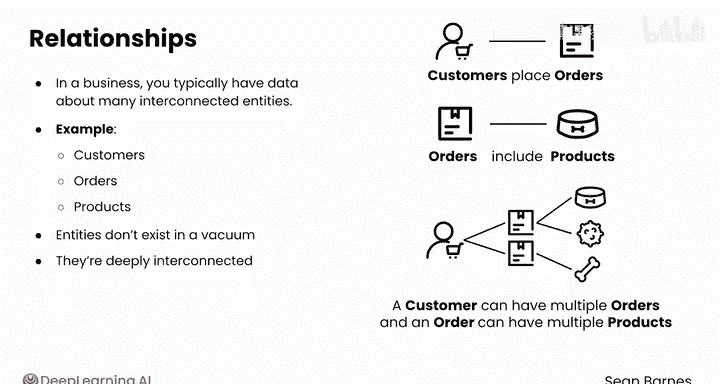
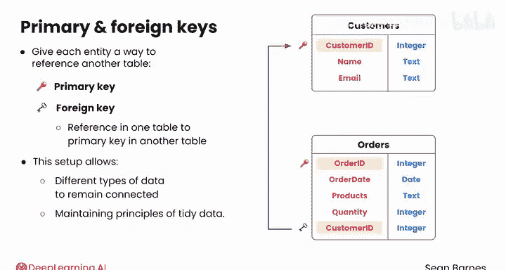
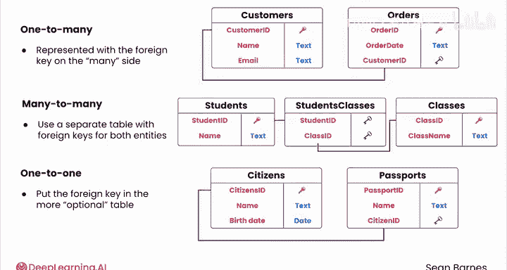

#  046：关系型数据 📊

在本节课中，我们将学习关系型数据库的核心概念——如何通过建立表与表之间的关系来有效组织数据。我们将重点理解外键的作用，以及如何用它来建模“一对多”、“多对多”和“一对一”这三种基本关系。

---

## 数据库的核心优势：建模关系

数据库的一个关键优势在于能够为不同实体之间的关系建立模型。

上一节我们介绍了数据库和表的基本概念，本节中我们来看看如何在数据库中表示实体间的联系。

在商业环境中，数据通常涉及许多相互关联的实体。例如，你可能需要追踪客户、订单和产品的信息。这些实体并非孤立存在，而是紧密相连的。客户下达订单，而每个订单包含特定的产品。一个客户可以有多个订单，每个订单也可以包含多个产品。然而，正如你所见，这些不同的实体被存储在不同的表中。

那么，数据库如何有效地为这些关系建模呢？

## 关系背后的思想：使用外键

关系背后的核心思想是为每个实体提供一种引用另一个表的方式。

以下是一个例子。假设你有一个 `customers`（客户）表。每个客户作为一行，拥有诸如 `customer_id`（客户ID）、`name`（姓名）和 `email`（邮箱）等属性。`customer_id` 是主键。

你还有一个 `orders`（订单）表。每个订单作为一行，拥有诸如 `order_id`（订单ID）、`order_date`（订单日期）、`products`（产品）和 `quantity`（数量）等属性。

你如何将订单与下达该订单的客户关联起来呢？

你可以为 `orders` 表添加一个新属性：`customer_id`。现在，对于代表单个订单的每一行，你都有一个对 `customers` 表的引用，这使你能够在订单表中唯一标识下达订单的客户。

在订单表中，`order_id` 是主键，而 `customer_id` 被称为**外键**。之所以称为“外”键，是因为它来自另一个表，几乎就像是对另一个“领域”的引用。它的目的是将订单链接回客户表中对应的客户。

总结来说，数据库使用**外键**来定义实体之间的关系。**外键是一个表中对另一个表主键的引用**。这种设置允许不同类型的数据保持连接，同时遵循整洁数据的原则。

## 关系型结构的优势

这种结构有几个好处。例如，假设你尝试将所有数据存储在一个大表中。对于每个订单，你都必须重复客户的详细信息（如姓名和邮箱）以及产品的详细信息（如名称和价格）。这种重复不仅浪费存储空间，还会使更新操作容易出错。

例如，如果客户更新了他们的邮箱，你只需要在 `customers` 表中更改一次，更新后的信息就会立即在所有引用该客户的地方反映出来。

## 关系的类型

你可以使用外键建模多种关系，包括“一对多”、“多对多”和“一对一”。“一对多”和“多对多”关系非常常见，而“一对一”关系则较为少见。

以下是这三种关系的定义：
*   **一对多关系**：当一个实体与另一个实体的多个实例相关联时发生。例如，一个客户有多个订单，但每个订单只属于一个客户。
*   **多对多关系**：每个实体都可以与另一个实体的多个实例相关联。例如，一个学生可以选多门课，而一门课可以有多个学生。多对多关系的建模更为复杂。
*   **一对一关系**：当一个实体的每个实例恰好与另一个实体的一个实例相关联时发生。它不如前两种类型常见。例如，一个公民有一本护照，而一本护照只属于一个公民。

## 如何在数据库中表示关系

这些关系在数据库中通过外键的不同排列方式来表示。

**一对多关系**的表示方法是在“多”的一方放置外键。

为了表示一个客户有多个订单，你可以在 `orders` 表中放置一个 `customer_id` 列作为外键。这个外键将每个订单链接到其客户，允许同一个 `customer_id` 在 `orders` 表中出现多次。

为了建模**多对多关系**，你需要使用一个单独的表，其中包含两个实体的外键。

例如，如果你想建模学生和课程之间的多对多关系，你可以有 `students` 表和 `classes` 表，然后有另一个通常称为 `student_classes` 的表。该表的每一行都有一个 `student_id` 和一个 `class_id`。因此，每一行都代表一个学生和一门课程之间的关系（即该学生选了这门课，以及这门课里有这个学生）。

对于**一对一关系**，通常将外键放在更“可选”的表中。

例如，在公民和护照的例子中，你应该将 `citizen_id` 放在 `passports` 表中，因为每本护照都有一个公民，但并非每个公民都有护照。这种方法有助于避免外键出现空值。

## 参照完整性

你的关系型数据库管理系统通常会为外键强制执行**参照完整性**，这仅仅意味着外键不能引用不存在的行。

---

## 总结

本节课中，我们一起学习了关系型数据库中关系的核心概念。我们了解到，数据库通过**外键**来连接不同的表，从而高效地建模现实世界中的复杂联系。我们探讨了三种基本关系类型（**一对多**、**多对多**、**一对一**）及其在数据库中的具体表示方法，并理解了关系型结构在避免数据冗余和确保数据一致性方面的优势。

现在你已经熟悉了数据库中关系的表示方式，接下来就可以准备在数据库中构建多个相互关联的表了。请跟随进入下一个视频，学习有效的数据库设计。