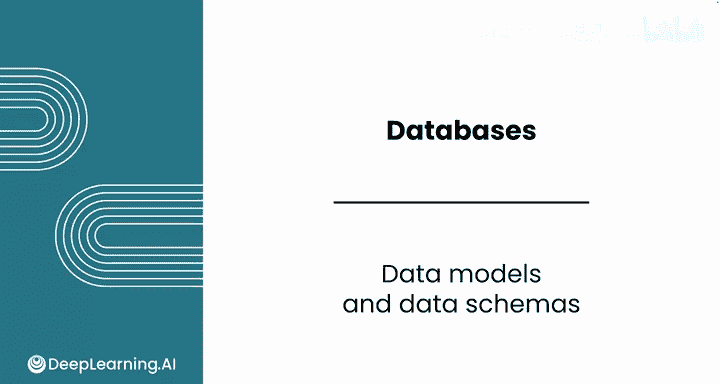
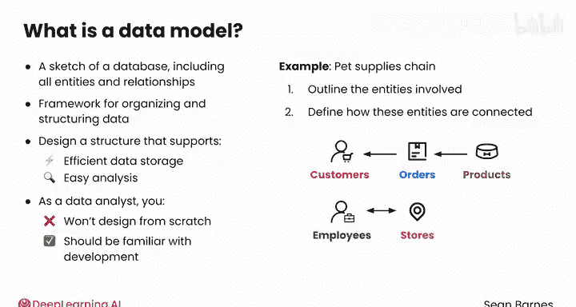
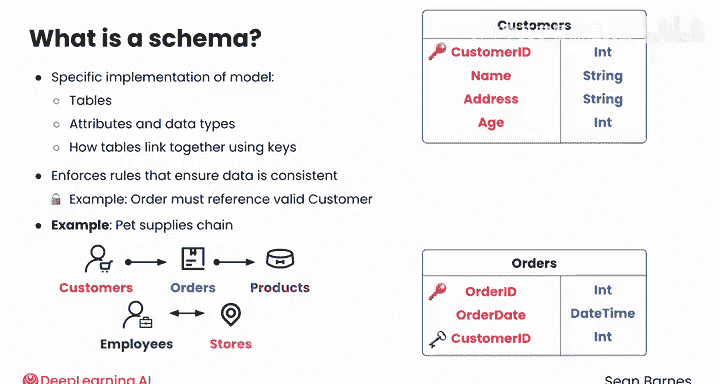
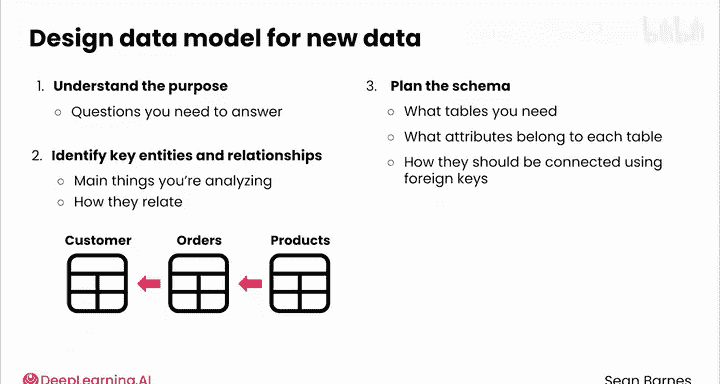

#  047：数据模型与数据模式 📊

在本节课中，我们将学习数据库设计的两个核心概念：数据模型与数据模式。理解它们有助于我们组织数据，确保数据存储的一致性和高效性，并为后续的数据分析工作打下坚实基础。

---

## 概述

每个数据库都有其独特的结构，这个结构允许你访问关于不同实体及其关系的数据。数据模型和数据模式共同定义了这个结构。

上一节我们介绍了数据库的基本概念，本节中我们来看看如何具体规划和设计数据库的结构。

---

## 数据模型：数据库的蓝图 🏗️

数据模型就像是数据库的草图，它包含了所有实体和关系。它是一个用于组织和构建数据的框架，但不会具体规定这个结构在数据库中应如何实现。

数据模型的目标是设计一个既能支持高效数据存储，又能方便数据分析的结构。

作为一名数据分析师，你通常不会从零开始设计数据模型，但你应该熟悉它的开发过程，以便更好地与数据工程师沟通。

### 构建数据模型的步骤

以下是构建数据模型时需要考虑的关键步骤：

1.  **识别实体**：首先，勾勒出所涉及的实体。例如，一个宠物用品连锁店可能包含顾客、订单、员工、门店、产品等实体。大型企业通常有数十甚至数百个实体。
2.  **定义关系**：接下来，定义这些实体之间如何连接。例如：
    *   一个顾客可以有多个订单（一对多关系）。
    *   一个订单可以包含多个产品（一对多关系）。
    *   一个门店可以有多名员工（一对多关系）。
    *   一名员工也可能在多家门店工作（多对多关系）。

一旦确定了有助于存储业务关键数据的数据模型，你就可以进一步思考该模型的具体实现方式了。

---

## 数据模式：模型的具体实现 ⚙️

上一节我们介绍了数据模型作为蓝图的概念，本节中我们来看看它的具体实现——数据模式。

如果说数据模型提供了实体和关系的草图，那么数据模式就是该模型的具体实现。它包括：
*   需要哪些表
*   每个表有哪些属性及其对应的数据类型
*   不同的表如何通过键（Keys）链接在一起

在实践中，数据模式强制执行规则以确保数据的一致性。例如，你可能要求每一条订单记录都必须引用一个有效的顾客。

### 从模型到模式的示例

假设你正在处理宠物用品连锁店的数据。你的数据模型已经指定应该有五个实体：顾客、订单、员工、门店和产品，并且存在以下关系：
*   顾客与订单：一对多
*   订单与产品：一对多
*   门店与员工：多对多

那么，你的数据模式将定义每个实体及其属性。例如：

**顾客表** 可能包含以下属性：
*   `customer_id` (整数，主键 Primary Key)
*   `name` (字符串)
*   `address` (字符串)
*   `age` (整数)

**订单表** 可能包含以下属性：
*   `order_id` (整数，主键 Primary Key)
*   `order_date` (日期时间)
*   `customer_id` (整数，外键 Foreign Key，链接到顾客表)

> **注意**：对于“多对多”关系（如门店与员工），你需要一个单独的表，其中包含链接另外两个表的外键。

---

## 数据库设计的关键考量 🤔

在设计数据库结构时，退一步思考非常重要。

1.  **明确存储目的**：首先理解存储所有这些数据的目的是什么。思考你需要用这些数据回答什么问题。记住，你不仅对特定结果（如销售额）感兴趣，也对丰富你分析故事的背景信息感兴趣。
2.  **识别核心实体与关系**：确定你要分析的主要对象以及它们之间的关系。例如，如果你的目标是分析销售业绩，你的数据模型还应包含顾客、订单和产品等实体。
3.  **规划数据模式**：思考你需要哪些表，每个表应包含哪些属性，以及它们应如何通过外键连接。

像大语言模型这样的生成式AI工具，可以帮助你构思可能的数据结构，或澄清关于如何组织复杂数据的问题。例如，你可以询问关于如何为实体间复杂关系建模的建议。

---

## 总结

本节课中，我们一起学习了数据模型与数据模式。

*   **数据模型**是高级别的蓝图，定义了数据库中的**实体**和**关系**。
*   **数据模式**是数据模型的具体实现，定义了**表**、**属性**、**数据类型**和**键**。

数据模型和数据模式有助于确保你的数据在投入数据库实现之前就是整洁有序的。在你熟悉数据库时，也可以参考数据模式。在下一个视频中，你将学习数据库中会遇到的不同类型的表。