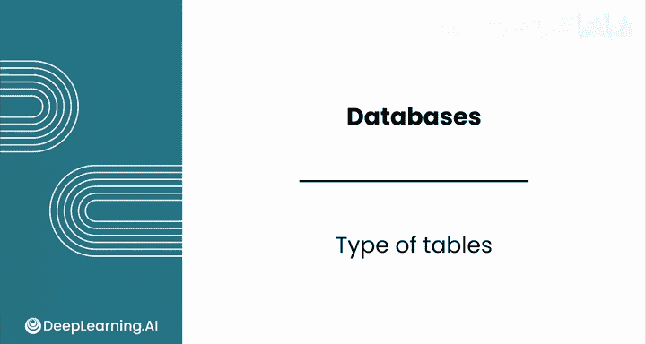
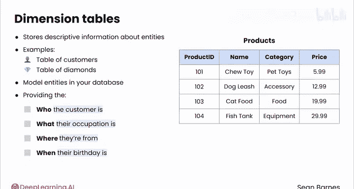
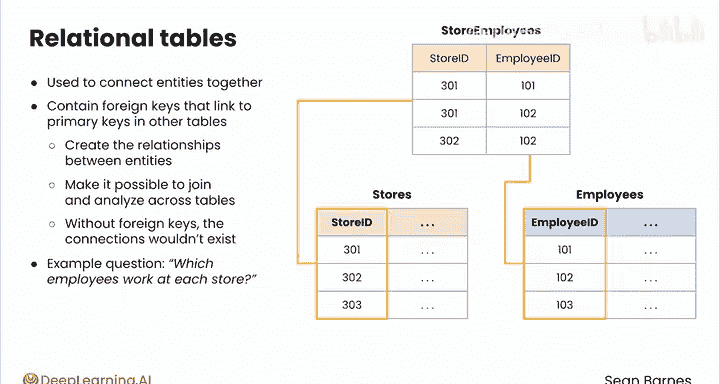
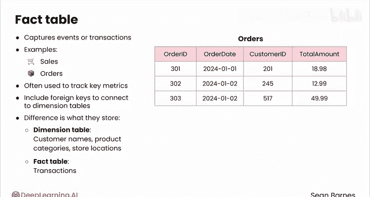
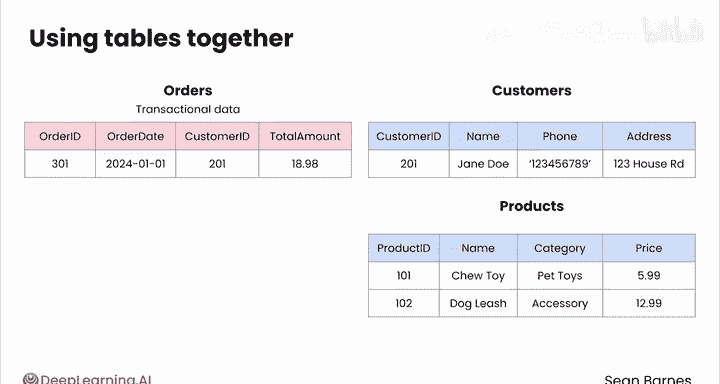

#  048：47_表类型 🗂️

在本节课中，我们将学习数据库中三种主要的表类型：维度表、关系表和事实表。理解这些表类型对于有效地组织和分析数据至关重要。

正如你在多对多关系中已经看到的，并非所有表都服务于相同的目的。本节视频将介绍这三种表的核心概念和用途。

## 维度表 📊

上一节我们介绍了表的不同用途，本节中我们首先来看看维度表。维度表存储关于实体的描述性信息。“维度表”是一个专业术语，指代你在本课程中一直在处理的那种数据表，例如客户表或钻石表。它们为数据库中的实体建模。

它之所以被称为维度表，是因为它为单一实体类型增添了上下文，就像维度为物理对象增添了深度一样。可以将其视为提供了构成分析框架的“谁、什么、哪里、何时”等信息。

以下是维度表的一些例子：
*   对于宠物用品连锁店，一个维度表是产品表，它包含诸如 `product_id`、`name`、`category`、`price` 等属性。
*   这些字段描述了产品，但不存储交易数据，例如产品何时被购买或每个产品包含在多少订单中。

这个维度表将帮助你回答诸如“我们销售的产品名称和价格是什么？”这样的问题。

## 关系表 🔗

接下来，我们看看关系表。关系表用于将实体连接在一起。这些表总是包含链接到其他表主键的外键。

外键创建了实体之间的关系，使得跨表连接和分析数据成为可能。没有外键，实体之间的联系将不复存在。

以下是关系表的一个例子：
*   在宠物用品店，你可能有一个名为 `stores_employees` 的表。它通过存储 `store_id`（链接到商店表的外键）和 `employee_id`（链接到员工表的外键）来将员工与商店关联起来。

这个关系表允许你回答“哪些员工在每家商店工作？”这样的问题。

## 事实表 📈

最后，我们介绍事实表。事实表捕获事件或交易，例如销售或订单。

事实表不像客户那样为单个实体建模，而是为涉及多个实体的事件（如一次销售）建模。它们通常用于跟踪关键指标，如销售额或体育比赛中的得分。

事实表包含连接到维度表的外键。维度表和事实表之间的关键区别在于它们存储的内容。

以下是事实表的一个例子：
*   维度表描述实体的细节，如客户姓名、产品类别或商店位置。
*   事实表用于记录交易。在宠物用品店，订单表就是一个事实表。它包含诸如 `order_id`、`order_date`、`customer_id` 和 `total_amount` 等数据。每一行代表一笔独立的交易。

事实表回答诸如“我们从特定订单中产生了多少收入？”或“某个产品售出了多少单位？”等问题。

## 表类型的协同工作 🤝

当这些表类型在数据库模式中组合使用时，它们允许你以一种支持复杂分析的方式为数据建模。

例如，如果你想分析宠物用品店的总销售额，你会使用订单事实表来收集交易数据，并使用客户和产品维度表来添加关于谁购买了商品以及售出了什么的描述性细节。

维度表、关系表和事实表帮助你组织数据以回答正确的问题。说到回答问题，是时候通过实践作业来测试你到目前为止所学到的知识了。完成后，请跟随我进入下一课，学习如何使用 SQL 查询数据库。

---

**本节课总结**：在本节课中，我们一起学习了数据库中的三种核心表类型。**维度表**（如 `产品表`）存储描述性信息，**关系表**（如 `商店员工表`）通过外键连接实体，而**事实表**（如 `订单表`）则记录交易事件。理解它们的区别和联系是构建有效数据模型和进行分析的基础。