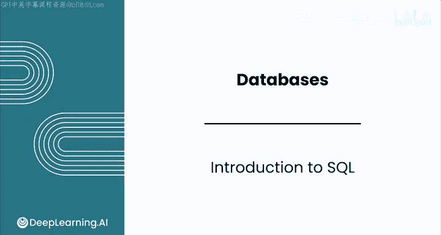
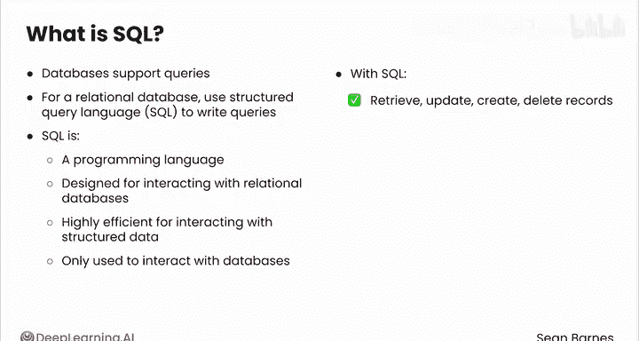
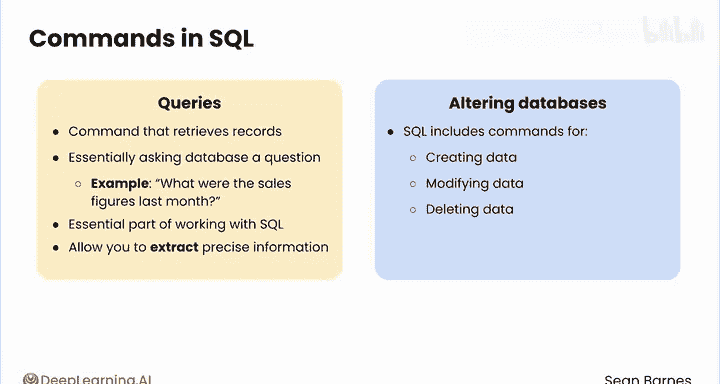
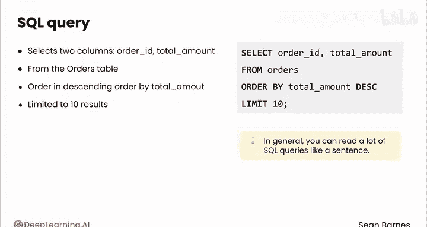
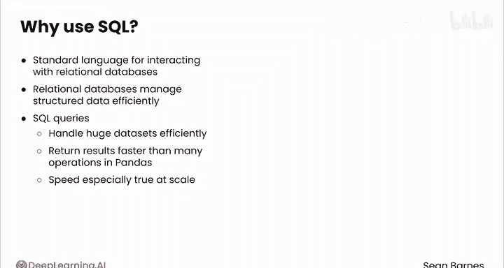
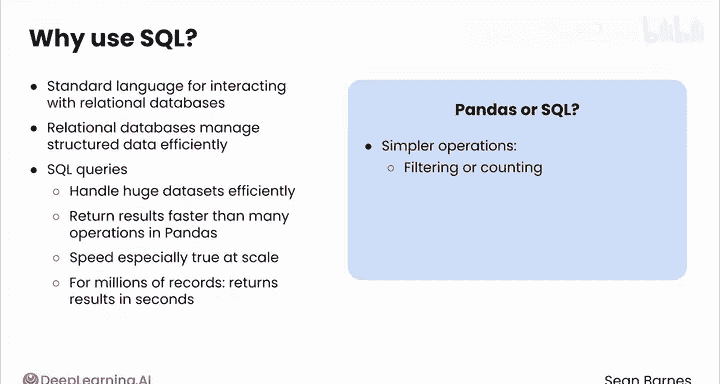
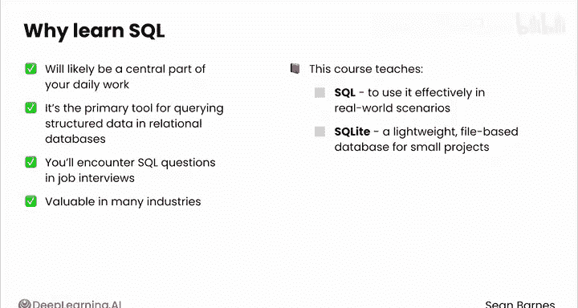

#  049：SQL入门 🚪

在本节课中，我们将要学习结构化查询语言（SQL）的基础知识。SQL是用于与关系型数据库交互的核心编程语言，对于数据分析师而言是一项至关重要的技能。我们将了解SQL是什么、它能做什么，以及为何它在数据处理中如此高效。

---

## 什么是SQL？🤔

上一节我们介绍了数据库是存储数据的可靠方式。本节中，我们来看看如何从数据库中检索特定信息进行分析。

你已了解到数据库支持查询操作。作为关系型数据库的数据分析师，查询将是你与数据库的主要交互方式，而你将通常使用**结构化查询语言**（SQL）来编写这些查询。

SQL是一种专门设计用于与关系型数据库中存储的数据进行交互的编程语言。你可能会听到人们使用“SQL”或“Sequel”两种发音，两者都很常见。

这种专门化的设计使其在与结构化数据交互时非常高效。虽然像Python这样的通用编程语言可以执行广泛的任务（如统计建模或数据可视化），但SQL仅用于与数据库交互。

以下是SQL可以执行的核心操作：
*   **检索**记录
*   **更新**记录
*   **创建**记录
*   **删除**记录

不过，你无法用它来运行线性回归模型。





---

## 理解查询 🔍

正如之前所学，检索记录的命令称为**查询**。查询本质上是向数据库提问，例如“上个月的总销售额是多少？”，然后得到答案。

查询是使用SQL工作的核心部分，它允许你提取分析所需的精确信息。

除了查询（不改变数据库内任何数据）之外，SQL还包括用于创建、修改或删除数据的命令。然而，作为数据分析师，你的主要重点将是通过查询来检索数据。更新、创建或删除记录以改变数据库的操作，通常由数据库管理员或数据工程师处理，尤其是在大型组织中。

---



## 你的第一个SQL查询示例 📝

以下是一个SQL查询的示例。花点时间看看它，可以暂停视频，猜猜它的作用。

```sql
SELECT order_id, total_amount
FROM orders
ORDER BY total_amount DESC
LIMIT 10;
```

这个查询从`orders`表中选择了`order_id`和`total_amount`两列数据，并按照`total_amount`降序排列结果行。这样你就能在顶部看到最大的总金额。此查询将结果限制为仅10条。

通常，你可以像读句子一样阅读SQL查询：
> 从`orders`表中选择`order_id`和`total_amount`，并按`total_amount`降序排列，将结果限制为10条。

在下一个视频中，你将更深入地学习如何编写SQL查询。

---

## 为何SQL对数据分析师很重要？💡

SQL是与关系型数据库交互的标准语言，这使其成为数据分析师一项非常抢手的技能。

关系型数据库因其高效管理结构化数据的能力而获得广泛采用。SQL查询能高效处理海量数据集，并且返回结果的速度比pandas中的许多操作快得多。这种速度优势在数据规模很大时尤其明显。事实上，即使处理数百万条记录，SQL查询也能在几秒钟内返回结果。





也就是说，根据你试图执行的操作，pandas或SQL都可能是合适的选择。像过滤或计数这样的简单操作，通常用SQL更高效；而更复杂或自定义的计算，则更适合在你的Python笔记本中进行。



作为数据分析师，SQL很可能成为你日常工作的核心部分，因为它是查询关系型数据库中结构化数据的主要工具。你会在求职面试中遇到SQL问题，也会发现它在许多行业中都非常有价值。这就是本课程教授SQL的原因，以确保你能为在实际场景中有效使用它做好充分准备。

你将使用**SQLite**，这是一个轻量级的、基于文件的数据库，非常适合小型项目。

通过掌握SQL，你将为处理更大的数据集和更复杂的工具做好准备。

---

## 总结 📚



本节课中我们一起学习了：
1.  **SQL的定义**：一种专门用于与关系型数据库交互的编程语言。
2.  **查询的核心作用**：作为向数据库提问并获取答案的主要方式。
3.  **SQL的基本能力**：检索、更新、创建和删除数据记录。
4.  **SQL查询示例**：初步了解了`SELECT`、`FROM`、`ORDER BY`和`LIMIT`等基本子句的结构。
5.  **SQL的重要性**：因其在处理大规模结构化数据时的高效性和行业普遍性，成为数据分析师的关键技能。

在下一个视频中，我们将一起看看SQL在实际操作中是什么样子。