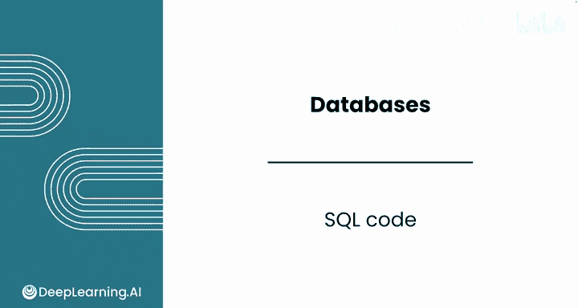
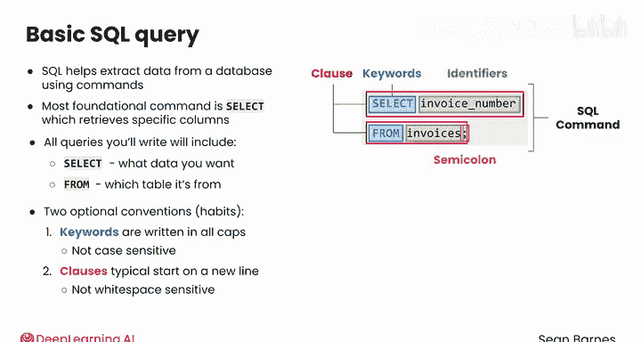
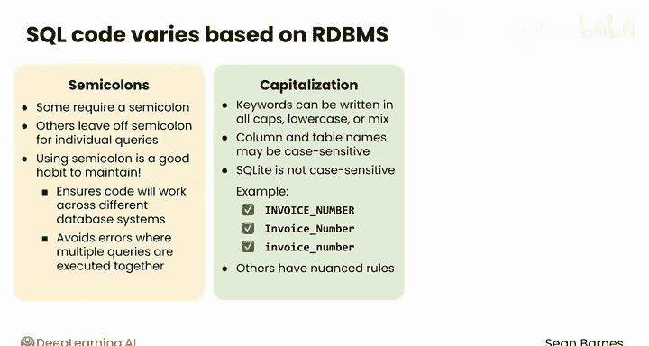

#  050：SQL语句结构详解 📝



在本节课中，我们将深入学习SQL查询语句的基本结构。我们将拆解一个SQL查询的各个组成部分，了解其语法规则和书写惯例，为后续编写自己的查询打下坚实基础。

---

## SQL查询的基本结构

上一节我们介绍了SQL的用途，本节中我们来仔细剖析一个SQL查询的构成。

SQL通过数据库能理解的命令帮助你从数据库中提取数据。所有查询中最基础的命令是 **`SELECT`**，它允许你从数据库中检索特定的列。

以下是一个示例：

```sql
SELECT invoice_number FROM invoices;
```

你编写的所有查询都将包含 **`SELECT`** 和 **`FROM`**。你通过它们指定你想要什么数据以及从哪个表中获取。

`SELECT` 和 `FROM` 被称为**关键字**。每个关键字开启一个**子句**，即整个命令的一部分。

子句通常包含**标识符**。标识符是子句中除关键字外的另一部分，它们与你正在处理的数据相关，包含诸如列名或表名等信息。

所有这些子句共同构成了完整的SQL命令。最后，SQL查询以分号结束。

---

## SQL代码的书写惯例

在展示的SQL代码中，还有两个可选的惯例或习惯。

以下是关于关键字大小写的惯例：

*   **SQL关键字通常全部大写**。这有助于将它们与命令的其他部分区分开来。但这只是一种风格选择，SQL关键字本身不区分大小写。
*   一些SQL界面会应用特殊格式（如加粗或颜色）使关键字更突出。你在使用Python代码的Jupyter笔记本中已经见过类似的例子。

以下是关于代码排版的惯例：

*   **子句通常在新的一行开始**。这个惯例有助于提高可读性，尤其是当你的查询变得更长、更复杂时。
*   然而，SQL对空白字符不敏感。因此，你的换行、空格和制表符不会影响查询。将所有查询写在一行仍然有效，但会难以阅读。

你可以通过添加更多子句，或为每个子句添加更多细节来扩展你的SQL查询。你将在下一个视频中看到更多示例。

---

## 关于大小写敏感性和命名的注意事项

不同的数据库管理系统在编写SQL代码时有略微不同的惯例。

以下是关于分号使用的说明：

*   一些RDBMS（如MySQL）要求你以分号结束每个SQL查询。
*   其他系统（如本课程将使用的SQLite）则更灵活，允许你在单个查询中省略分号。
*   尽管如此，使用分号结束查询是一个应该保持的好习惯。它能确保你的代码在不同的数据库系统中都能工作，并避免在多个查询一起执行时出错。

你刚才了解到，SQL对于像`SELECT`和`FROM`这样的关键字是不区分大小写的。它们可以全部大写、全部小写或混合大小写，尽管全部大写的格式通常更具可读性。

然而，列名和表名是否区分大小写则取决于具体的RDBMS。

以下是关于标识符大小写的说明：

*   **SQLite默认不区分大小写**。因此，如果你要选择`invoice_number`，你可以像这样全部大写，或像这样首字母大写，或全部小写，仍然会得到相同的响应，无论列名在数据库中是如何存储的。
*   然而，其他RDBMS（如Postgres）对于大小写敏感性有更复杂的规则。你需要确保遵循你正在使用的特定RDBMS的惯例。

在SQLite中，如果你处理的列名包含空格（例如`employee base name`），你应该用双引号将其括起来。其他RDBMS可能有不同的规则。

最好确保你的数据库具有一致的大小写规范，并尽可能使用下划线而不是空格。然而，当你处理较旧的系统时，有时会遇到格式不理想的列名。



---

## 在SQL中编写注释

就像在Python中一样，你也可以在SQL中编写注释。

单行注释用两个破折号编写：

```sql
-- 这是一个单行注释
SELECT column FROM table;
```

破折号告诉计算机忽略该行上的任何其他文本并跳到下一行。

在你的SQL代码中编写注释有助于你或他人理解查询在做什么。当你的查询很复杂时，注释尤为重要。

---

## 总结

本节课中我们一起学习了SQL查询语句的核心结构。我们明确了`SELECT`和`FROM`关键字的基础作用，了解了子句和标识符的概念。我们还探讨了SQL代码的书写惯例，包括关键字大写、子句换行以及使用分号的重要性。最后，我们讨论了不同数据库系统在大小写敏感性和命名规则上的差异，并学会了如何使用注释来提高代码的可读性。



现在，是时候动手实践SQL了。请跟随我到下一个视频，开始编写你自己的查询。