#  051：SQL 选择查询 🎯

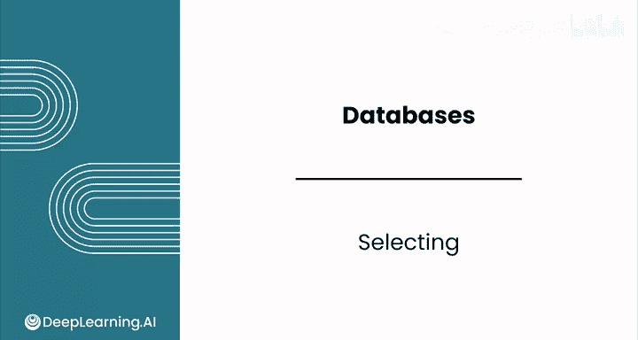

在本节课中，我们将学习如何使用 SQL 的 `SELECT` 语句从数据库表中检索数据。我们将通过一个音乐流媒体服务的案例，探索其数据库中的专辑和曲目信息，并了解编写查询语句的基本规则和最佳实践。

## 数据库结构与数据概览

上一节我们介绍了 SQL 查询的整体结构，本节中我们来看看如何动手设计和编写 SQL 查询。

在本课程中，你将扮演一家音乐流媒体服务公司的数据分析师角色。你的公司最近收购了一家旧的数字音乐商店，该商店过去在线销售单曲。现在的目标是将这家新公司庞大的音乐目录整合到一个订阅服务中。你的任务是对收购公司的 SQLite 数据库进行探索性数据分析，以更好地了解其目录范围。

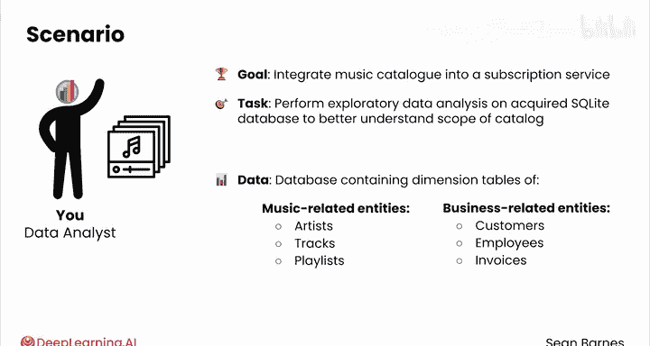

在开始编写查询之前，你应该先查看数据库模式，以了解有哪些数据可用。否则，你将不知道不同表和属性有哪些标识符可用。

以下是你要使用的数据库的实体关系图。从左上角开始，有一个包含艺术家 ID 和艺术家姓名的表。该表与专辑表存在关系，因为一位艺术家拥有多张专辑，所以外键位于这个“多”方关系的表中。因此，每张专辑都有一个 ID、一个标题和链接到艺术家表的艺术家 ID。

还有许多其他表，例如曲目表，它包含更多字段，包括 `album_id`（对应曲目所属的专辑）、`media_type_id`（另一个外键）、`genre_id`（另一个外键）、`composer`、`milliseconds` 等。

你可以使用实体关系图来了解有哪些属性可用，以及表之间是如何链接的。

## 执行基础查询

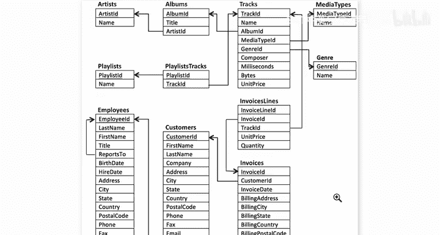

既然你了解了数据库的布局，现在可以查看实际数据了。本课程的前几个 SQL 查询将在这个网站界面中执行，其格式与许多允许你直接查询数据库的分析应用程序非常相似。

由于你的目标是更好地了解音乐目录，第一步可能是选择一些专辑标题。

以下是编写基础查询的步骤：

*   **选择特定列**：使用 `SELECT` 语句指定要检索的列，用 `FROM` 指定表名，并用 `LIMIT` 限制返回的行数。
    ```sql
    SELECT title FROM albums LIMIT 10;
    ```
    这条语句请求专辑表中的前 10 个标题。

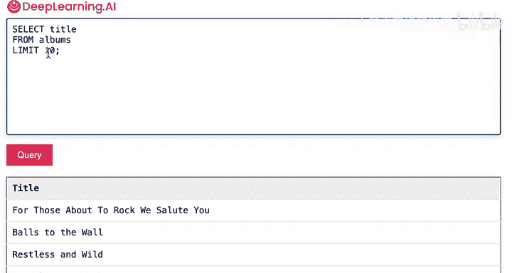

*   **选择多列**：通过用逗号分隔每个列名，可以同时获取多个列。
    ```sql
    SELECT name, milliseconds, unitprice FROM tracks LIMIT 10;
    ```
    现在你获得了每条曲目的多个列。注意，`unitprice` 的写法是单词间无空格但每个单词首字母大写。

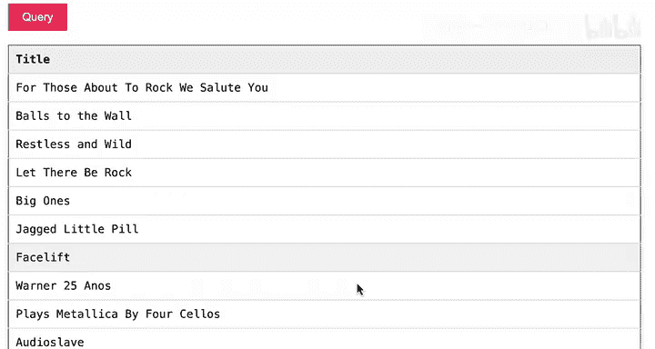

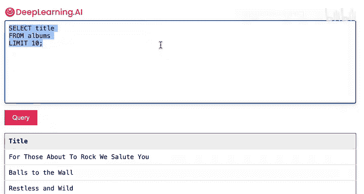

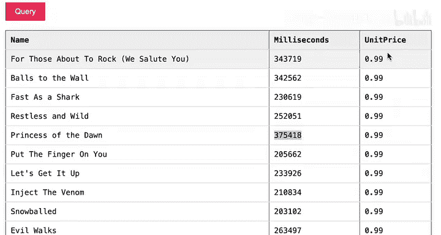

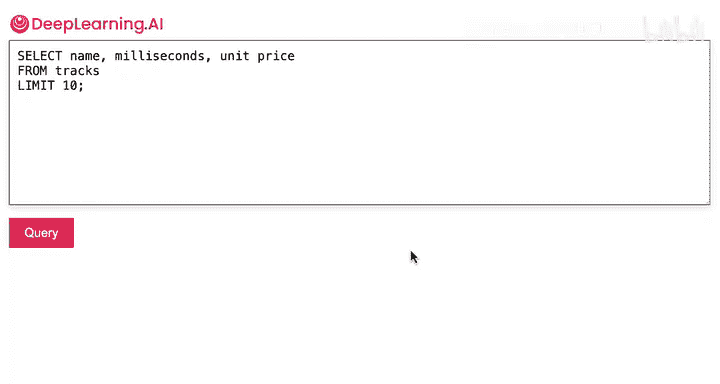

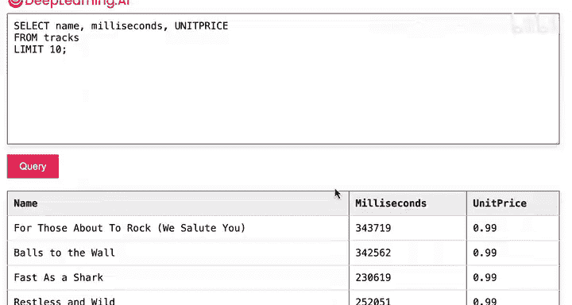

*   **注意语法细节**：SQLite 对关键字不区分大小写，但对标识符（如表名、列名）中的额外空格敏感。例如，`unit price`（带空格）会导致查询无法正确执行，而 `UNITPRICE`（全大写）则可以正常工作。

我鼓励你在接下来的练习中尝试不同的空格、大小写、逗号和分号用法，以更好地理解什么有效、什么无效。

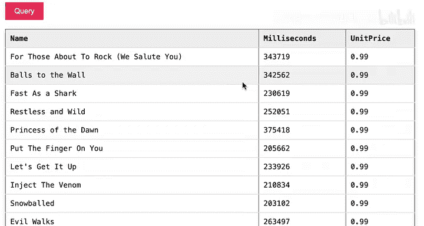

## 使用 SELECT * 进行探索

如果你手头没有实体关系图，或者只是想获取表中的所有信息，可以使用 `SELECT *` 这个快捷方式。

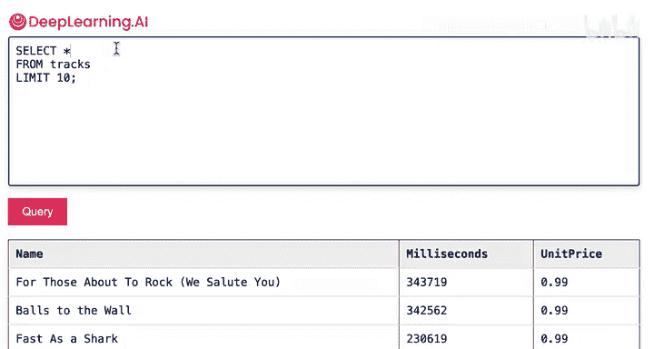

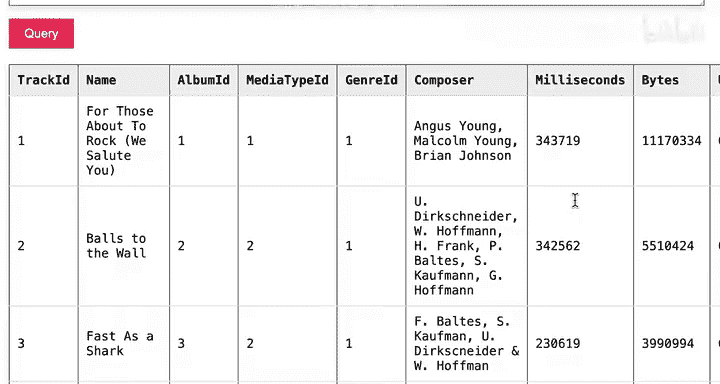

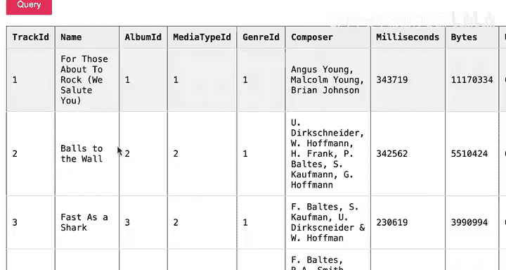

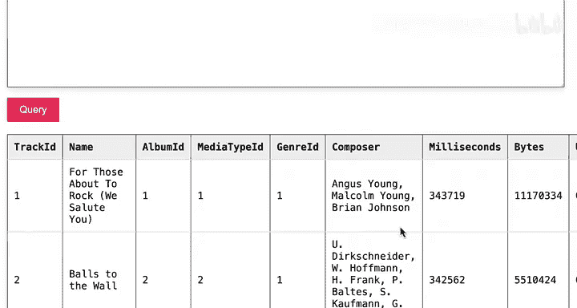

以下是使用 `SELECT *` 的示例：

*   **检索所有列**：`SELECT *`（或 `SELECT asterisk`）会选择表中的所有列。
    ```sql
    SELECT * FROM tracks LIMIT 10;
    ```
    你会看到与之前相同的曲目，但信息更完整。

*   **探索外键关联**：`SELECT *` 对于探索性数据分析很有用。例如，在曲目表中看到 `media_type_id` 为 2，你可以查询 `media_types` 表来了解其含义。
    ```sql
    SELECT * FROM media_types;
    ```
    结果显示它是受保护的 AAC 音频文件。

虽然 `SELECT *` 很方便，但应注意，对于非常大的表，它可能会变得缓慢或计算成本高昂。通常最好只选择分析所需的列。

## 课程总结与注意事项

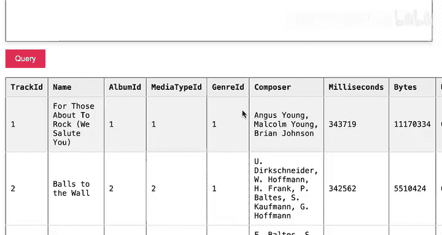

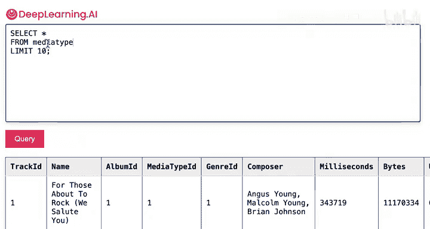

本节课中我们一起学习了 SQL 的基础查询操作。

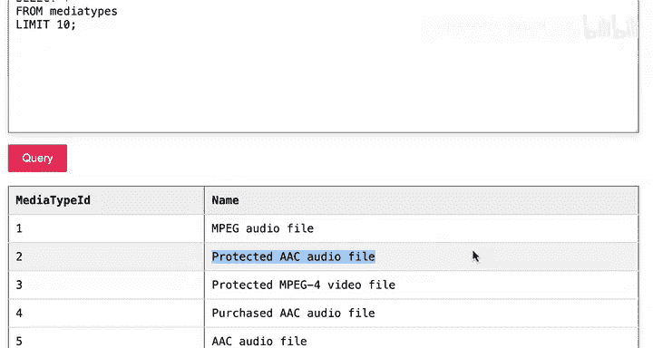

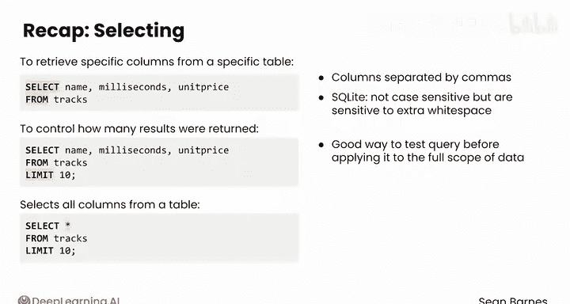

快速回顾一下，你看到可以使用 `SELECT column_names FROM table_name` 从特定表中检索特定列，多个列用逗号分隔。在 SQLite 中，这些标识符不区分大小写，但对额外的空格敏感。你还使用了 `LIMIT` 来控制查询返回的结果数量，这是在将查询应用于全部数据范围之前进行测试的好方法。最后，你看到了 `SELECT *` 操作符的实际应用，它选择表中的所有列。

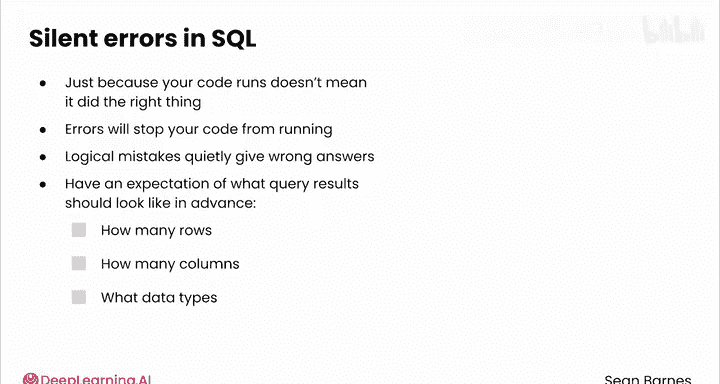

需要记住的是，就像在 Python 中一样，仅仅因为你的代码运行了，并不意味着它做了正确的事情。事实上，虽然错误会阻止你的代码运行，但逻辑错误可能会悄无声息地给出错误的答案。你应该提前对查询结果的样子有一个预期，例如，应该返回多少行、多少列以及会看到什么数据类型。在接下来的视频中，你将看到一些调试查询的策略。

这些 SQL 查询工作做得很好。使用快速数据库工作非常令人满意，在接下来的视频以及下一个模块中，你将获得越来越多的工具。接下来，你将看到如何组织 SQL 查询的结果。