#  052：SQL 结果排序 📊

在本节课中，我们将学习如何使用 SQL 的 `ORDER BY` 子句对查询结果进行排序。排序是组织和理解数据的关键步骤，能帮助我们快速识别数据中的模式，例如找出最大或最小的值。

---

## 概述

SQL 提供了强大的功能来组织查询结果中的信息。本节视频将重点介绍如何对查询结果进行排序。我们将通过一个音乐流媒体服务的案例来实践，该服务最近收购了一个竞争对手，需要分析其音乐目录，以了解不同曲目的长度和存储空间需求，从而为存储音乐分配适当的数据库资源。

---

## 基础排序：使用 `ORDER BY`

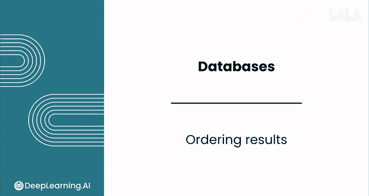

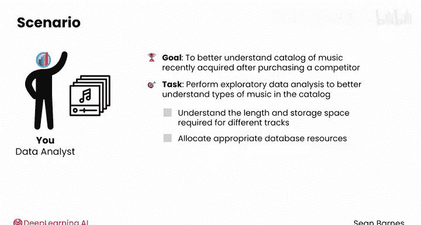

首先，我们来看一个基础查询，它从 `tracks` 表中选择了名称、毫秒数和字节数。

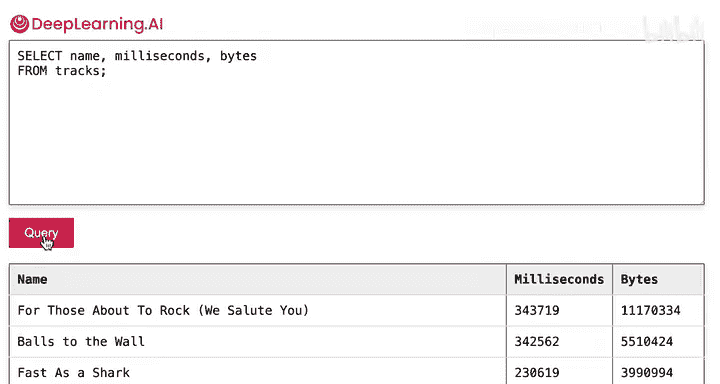

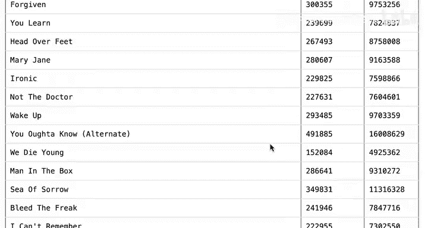

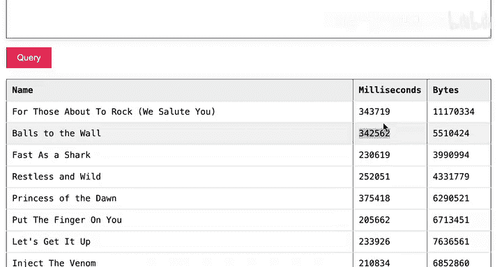

```sql
SELECT name, milliseconds, bytes FROM tracks;
```

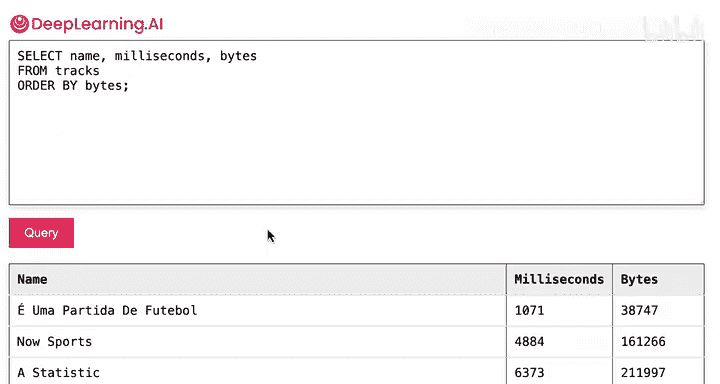

这个查询会返回 `tracks` 表中的所有行和三列数据。`bytes` 列表示文件在计算机上占用的存储空间大小。你会发现这些曲目的大小差异很大。

为了根据文件大小对这些曲目进行排序，我们可以使用 `ORDER BY` 关键字。

```sql
SELECT name, milliseconds, bytes FROM tracks ORDER BY bytes;
```

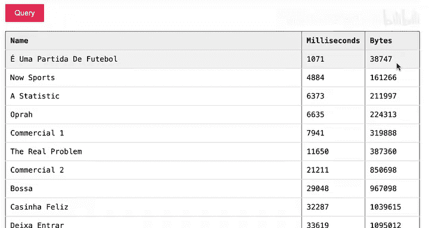

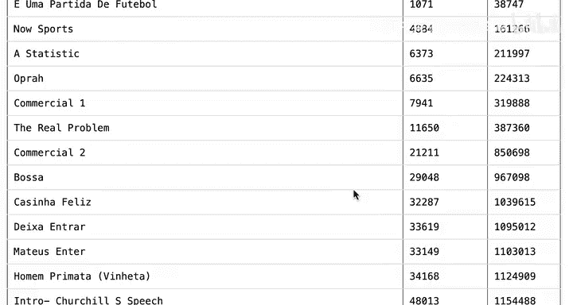

默认情况下，SQL 会按**升序**排序。对于数字，这意味着从小到大；对于日期，从早到晚；对于文本，则按字母顺序。因此，执行上述查询后，结果集中最先显示的是数据集中最小的文件。

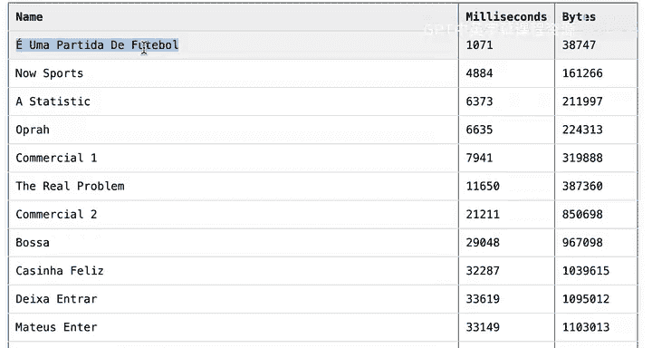

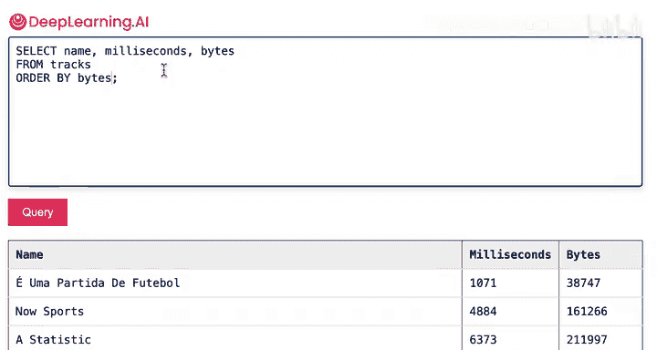

---

## 降序排序：使用 `DESC` 关键字

如果你希望最大的曲目显示在结果顶部，可以使用 `DESC`（降序）关键字。只需将其添加到 `ORDER BY` 子句的末尾即可。

```sql
SELECT name, milliseconds, bytes FROM tracks ORDER BY bytes DESC;
```

现在，结果将按字节数从大到小排列，最大的文件会出现在最前面。

---

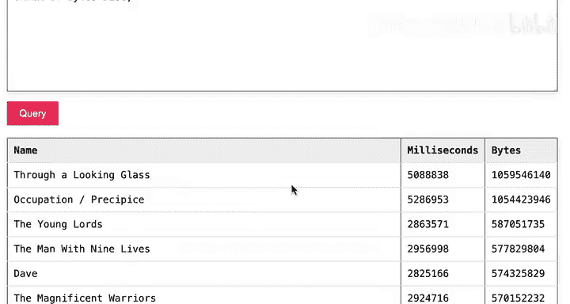

## 按多列排序

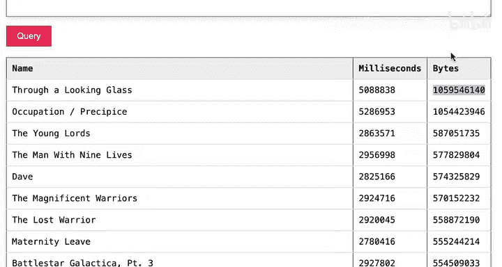

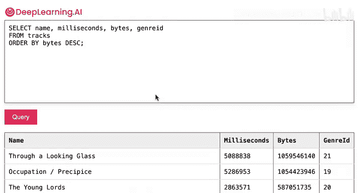

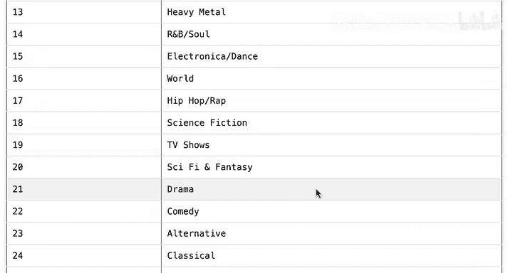

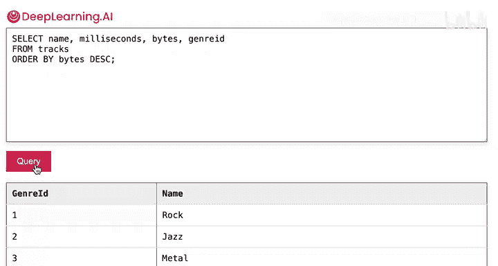

有时，你可能希望按多个条件组织数据。例如，你可能想先按流派对曲目进行分组，然后在每个流派内按文件大小降序排列。

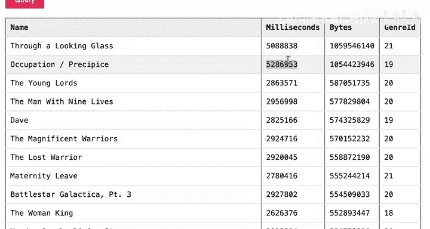

这可以通过在 `ORDER BY` 子句中指定多个列来实现，列名之间用逗号分隔。

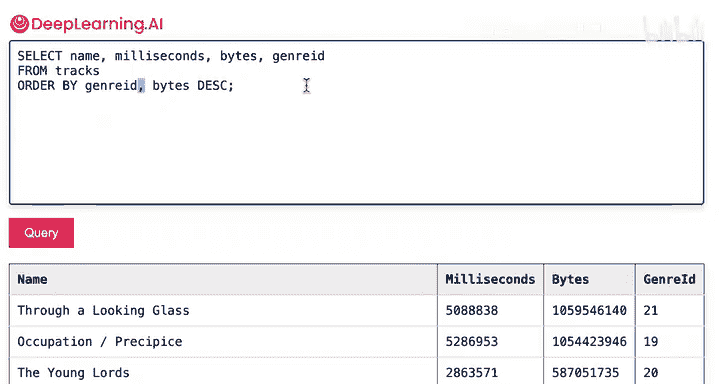

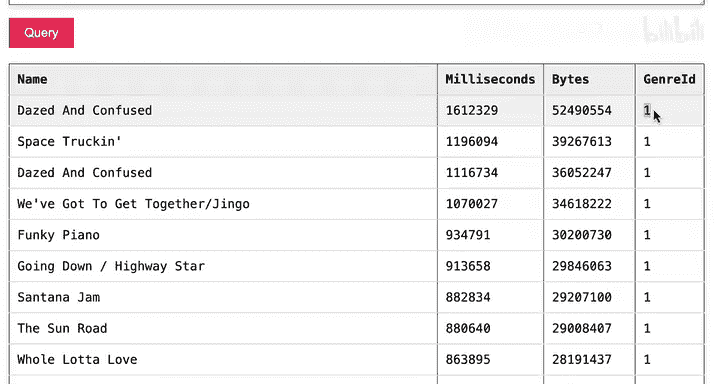

```sql
SELECT name, genre_id, bytes FROM tracks ORDER BY genre_id ASC, bytes DESC;
```

这个查询会首先按 `genre_id` 升序排列，然后在每个流派内按 `bytes` 降序排列。**排序的顺序很重要**：首先列出的列拥有最高的排序优先级。

需要注意的是，用于排序的列不一定需要出现在 `SELECT` 子句中。你可以隐藏它，这在你希望优化查询速度或简化输出时很有用。

---

## 使用 `AS` 关键字重命名列

当表中原有的列名较长或不易理解时，可以使用 `AS` 关键字为列创建临时别名。这不会改变底层数据库的结构，只是在你查询时提供一个更友好的名称。

例如，为了让输出对业务方更清晰，可以这样写：

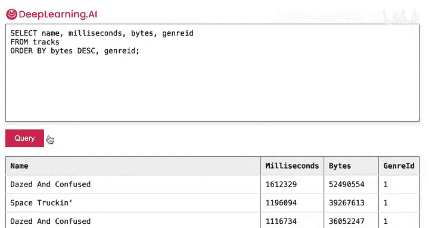

```sql
SELECT
    name AS track_title,
    milliseconds AS length_in_ms,
    bytes AS size_in_bytes
FROM tracks
ORDER BY genre_id, bytes DESC;
```

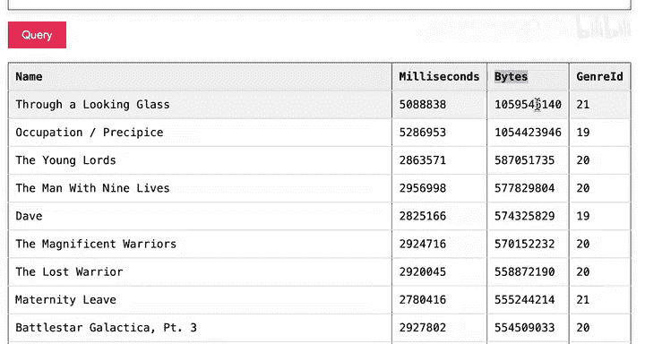

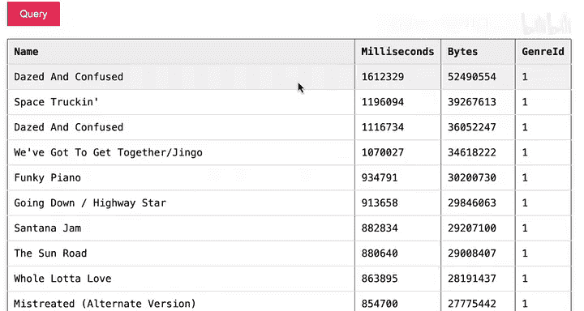

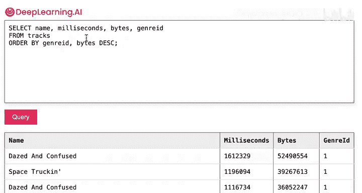

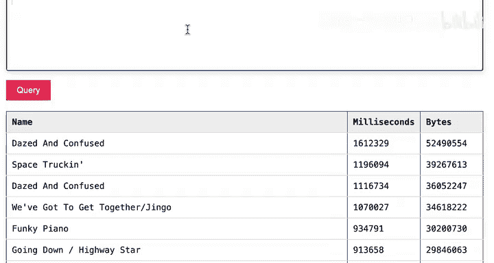

这样，输出的列标题将显示为 `track_title`、`length_in_ms` 和 `size_in_bytes`，更易于理解。

以下是关于排序和列别名的一些关键点总结：

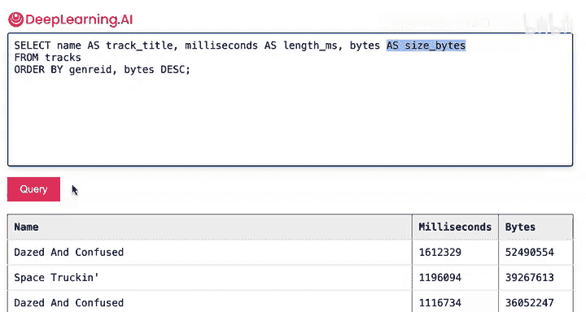

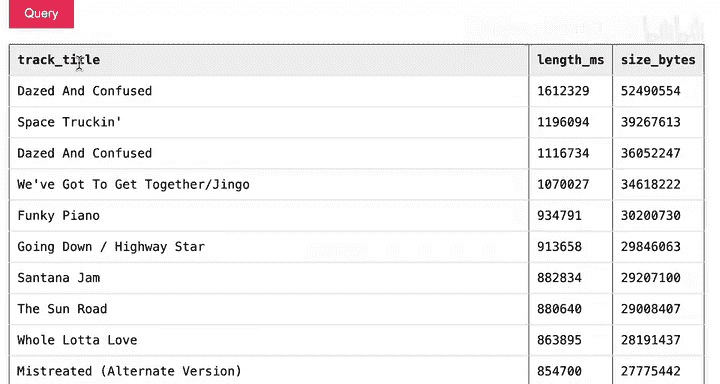

*   **`ORDER BY` 子句**用于对结果排序，应放在 `FROM` 子句之后。
*   **默认排序**是升序（`ASC`）。
*   **`DESC` 关键字**用于指定降序排序。
*   **多列排序**时，列名用逗号分隔，排序优先级从左到右。
*   **`AS` 关键字**用于为列创建临时别名，提高结果的可读性。

---

## 总结

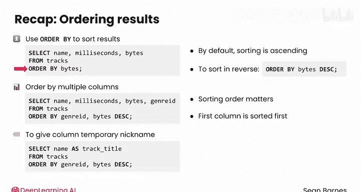

本节课我们一起学习了 SQL 中结果排序的核心技巧。我们掌握了如何使用 `ORDER BY` 进行单列和多列排序，了解了升序与降序的区别，并学会了使用 `AS` 关键字来重命名输出列，使结果更清晰。这些技能是进行有效数据探索和分析的基础。

你已经学会了编写几种强大的 SQL 查询。在接下来的视频中，我们将探索如何使用大语言模型（LLMs）来处理数据库。