#  053：在数据库应用中利用大语言模型 🧠💾

在本节课中，我们将学习如何利用大语言模型来辅助数据库工作。自从大语言模型出现以来，与数据库的协作变得比以往任何时候都更加高效。你将看到几种使用大语言模型处理 SQL 数据库的不同技术。

我们将继续使用音乐数据库，并通过探索性数据分析来更好地理解其目录结构。

## 概述：使用推理模型

本次演示使用了 OpenAI 提供的 ChatGPT-o1 推理模型。该模型在回应前会花更多时间进行逐步思考。它目前对免费和付费账户均开放。请注意，你还有其他推理模型选项，例如 Claude 3.5 Sonnet 的扩展思考模式，并且你可能拥有更新的可用模型。

---

## 理解数据库模式

假设你刚刚加入这个项目，并拿到了这个数据库模式图。理解数据库模式是一项涉及大量视觉推理的复杂任务。

因此，你可以尝试使用像 ChatGPT-o1 这样的推理模型。这类模型在回应前会花更多时间，逐步思考你的请求。

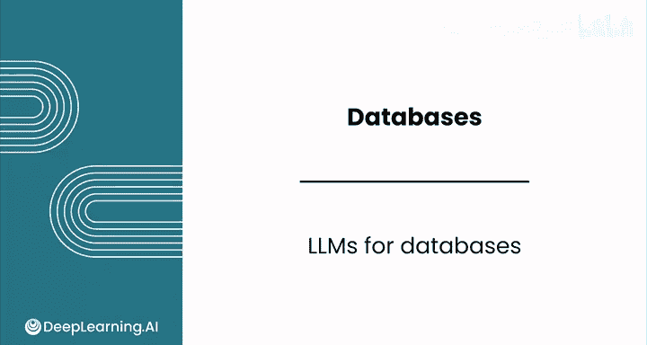

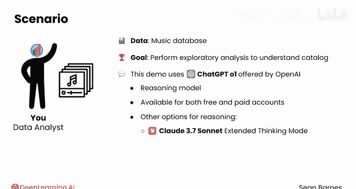

你可以复制这张实体关系图的截图，并将其粘贴到 ChatGPT-o1 中，然后询问相关信息。

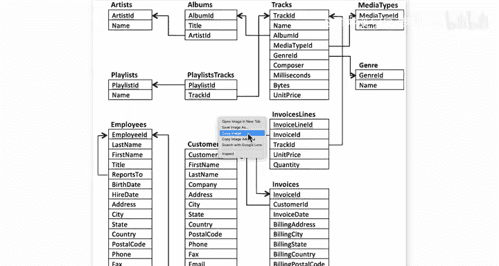

例如，你可以提问：“为这个数据库模式创建一个探索性数据分析的提纲。”


模型会基于你的上下文（例如：“我的公司刚刚收购了拥有这些数据的公司。我们正计划将其整合到我们自己的数据库中。我的目标是更好地理解与音乐相关的表，以及将这些数据与我们自己的音乐目录一起存储可能需要什么。”）来生成建议。

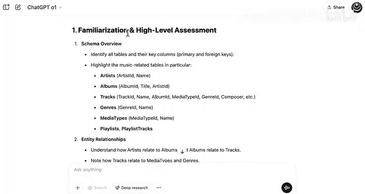

以下是模型建议的主要步骤：

1.  **高层评估与模式熟悉**：首先，对整体模式和实体关系进行高层评估和熟悉。
2.  **数据字典总结**：总结描述列定义以及所有主键和外键约束的数据字典。
3.  **数据质量与剖析**：讨论数据质量和剖析，理解关于数据的基本描述性统计以及某些特征的分布情况。
4.  **集成考量**：阐述关于模式对齐、数据映射与转换以及迁移需求的思考方法。该建议还提到处理历史或事务数据，建议考虑是否要保留部分数据，以及如何将部分数据合并到现有数据中。


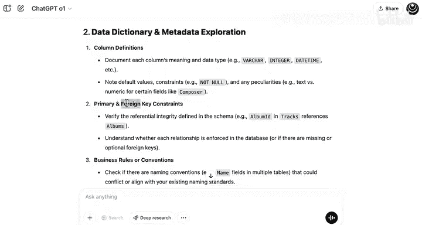
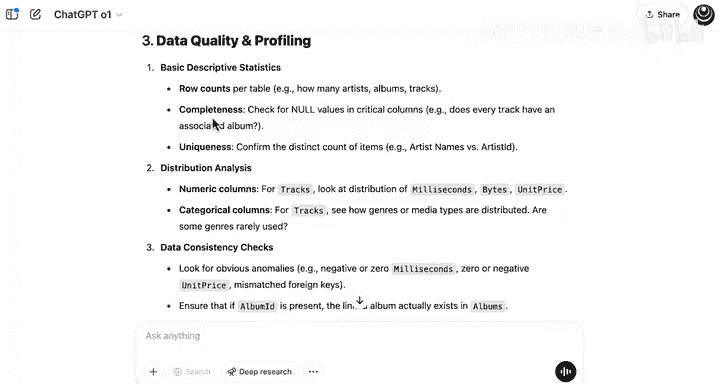
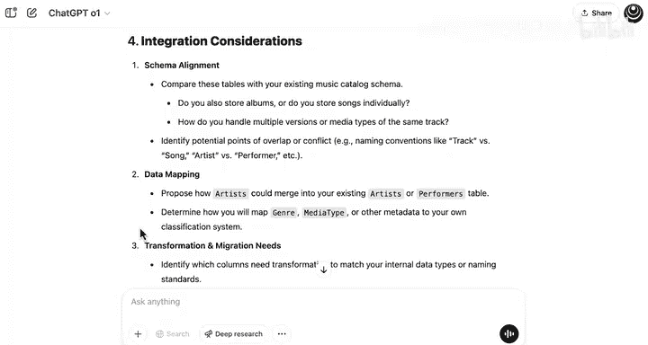
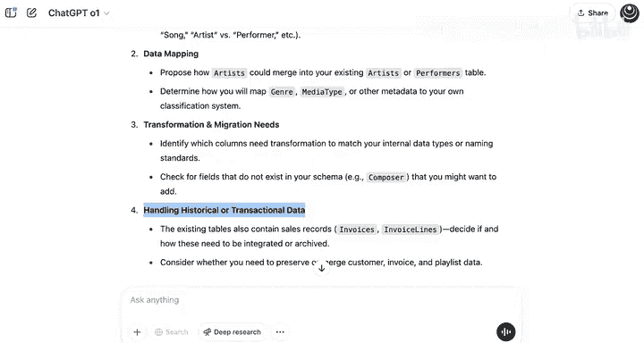
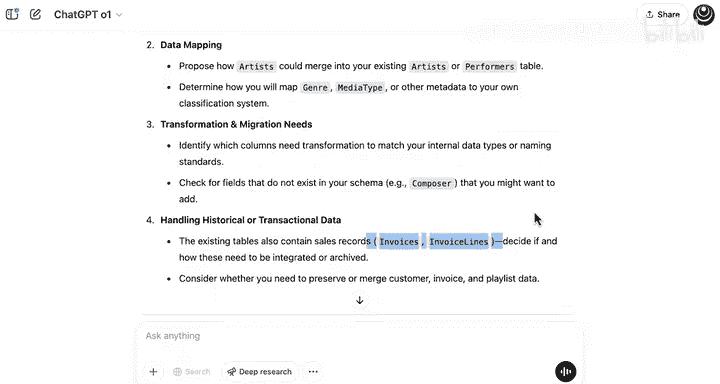

---

## 识别过时信息

上一节我们介绍了如何利用大语言模型理解数据库结构，本节中我们来看看如何让它帮助识别潜在的无用信息。


作为快速跟进，你可以要求模型识别对于你的分析可能过时或无关的属性和表，并确保指出任何遗留技术或过时信息。


例如，你可能会注意到一个可能过时的列是“员工传真号码”，这可能是一个不再相关的遗留列。

因为你使用了推理模型，你可能会注意到模型处理这个请求花了更多时间，因此它使用了更多的计算能力来给出答案。在此期间，模型正在逐步思考你的请求，几乎就像在自言自语地解决问题。

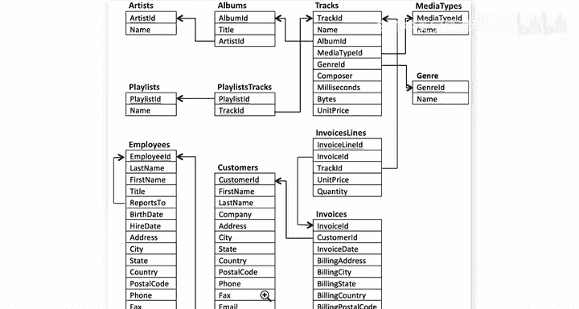
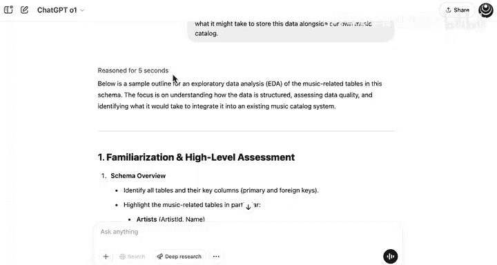

这个查询对模型来说思考起来更复杂一些，它花了 14 秒来完成推理过程。


模型可能会指出，无关的表可能包括 `employees`、`customers`、`invoices`，以及潜在的 `playlists`（尽管可以说播放列表可能有用）。如果你的公司维护某种播放列表架构，你或许可以将这些旧的播放列表与你自己的整合。

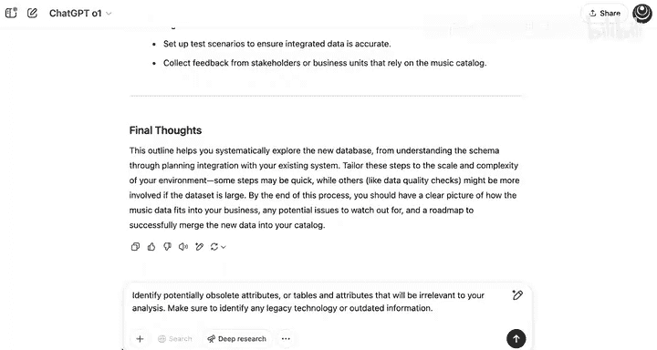
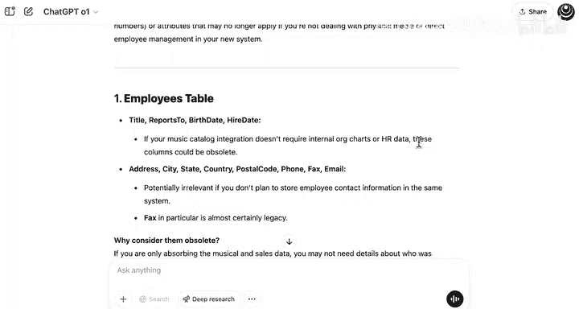
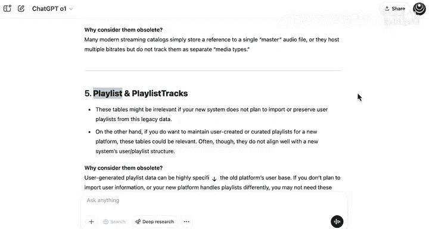


你可能还会注意到，在遗留技术指标下，它确实指出传真号码是遗留字段的一个典型例子。因此，这可能是你希望从数据中删除内容的一个好例子。

---

## 生成结构化数据格式


除了识别问题，大语言模型还能协助进行数据文档化。作为文档化步骤，你可以要求该模型获取这张图片，并创建一个结构化的数据格式来存储图片内容。


例如，你可以提出请求：“创建一个表示此数据库模式内容的 JSON 文件。”

以前，这对于大型多模态模型来说是一项非常具有挑战性的任务。虽然这仍然是一项非常具有挑战性的任务，并且你需要验证其输出，但与以前的模型相比，像 ChatGPT-o1 这样的推理模型往往更擅长此类任务。

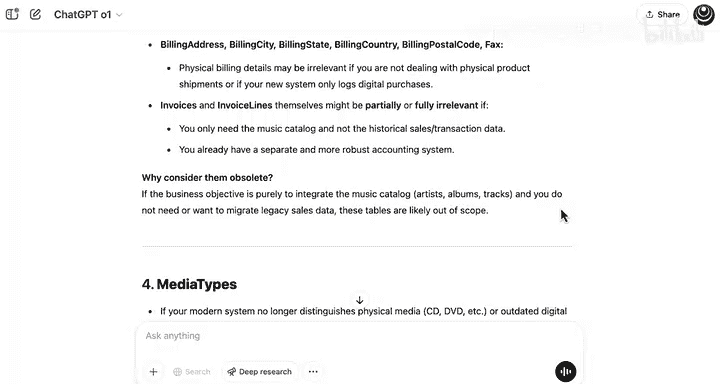

这项任务看起来很困难可能违反直觉，因为它只是读取文本和解释箭头。然而，你可以将这些人工智能系统视为具有“模糊视觉”。它们能很好地看到图像的大致轮廓，但可能在细节上遇到困难。

以下是模式的一种可能的 JSON 表示：


```json
{
  "database_schema": {
    "tables": [
      {
        "table_name": "Artist",
        "primary_key": "ArtistId",
        "columns": [
          {"column_name": "ArtistId", "data_type": "INTEGER"},
          {"column_name": "Name", "data_type": "TEXT"}
        ]
      }
      // ... 其他表
    ]
  }
}
```

它实际上非常复杂地解释了这些信息。在验证了这些信息的准确性之后，你可以将此 JSON 文件分享给你的数据团队，以帮助他们将这些数据迁移到你公司的数据库中。

---

## 总结

本节课中，我们一起学习了如何利用大语言模型辅助数据库工作。主要内容包括：

*   使用推理模型（如 ChatGPT-o1）来理解和分析数据库模式图。
*   让模型为探索性数据分析生成提纲，涵盖高层评估、数据字典、质量剖析和集成考量。
*   识别数据库中可能过时或无关的属性和表（例如遗留的传真号码字段）。
*   将数据库模式图转换为结构化的 JSON 格式，以辅助数据迁移和团队协作。

大语言模型可以帮助你在开始编写 SQL 查询之前更好地理解数据库的结构。

接下来，你将通过学习如何在 Python 中编写 SQL 查询来结束这个模块。我们将在本模块的最后一个视频中再见。

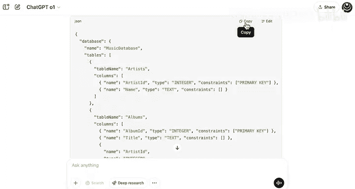

