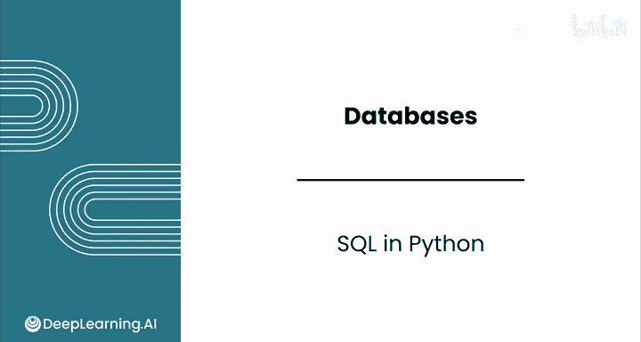
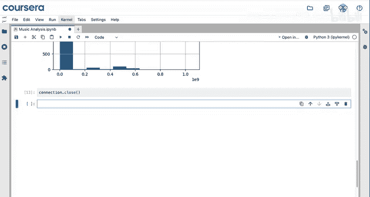
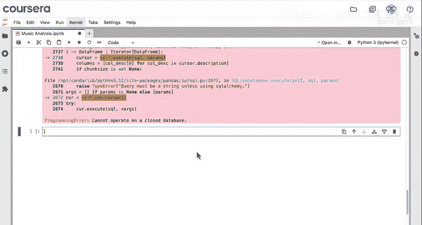
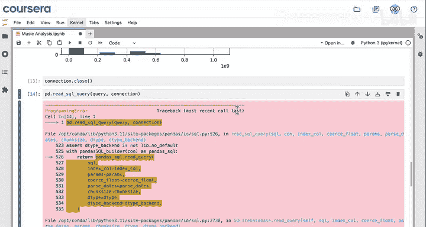
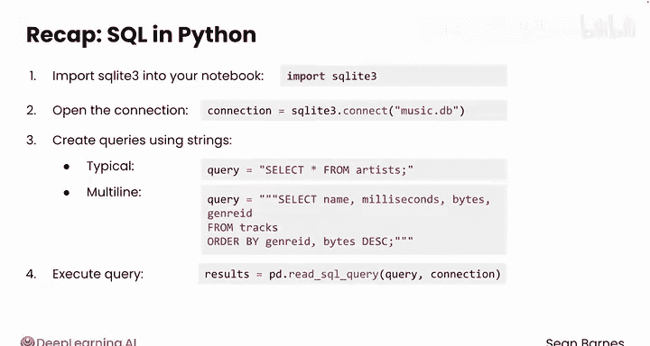

#  054：在 Python 中使用 SQL 🐍➡️🗄️



在本节课中，我们将学习如何在 Python 环境中直接执行 SQL 查询。你将了解如何连接数据库、编写查询语句，并将查询结果转换为 Pandas DataFrame 以便进行后续的数据分析和预处理。

---

## 概述

到目前为止，我们主要在网页界面中编写 SQL，这是一种与数据库交互的常见方式。然而，为了进行更强大的分析，我们需要能够在 Python 笔记本中直接执行 SQL 查询。本节将介绍实现这一目标的具体步骤。

## 导入必要的库

开始之前，首先需要导入必要的 Python 库。我们将使用 `pandas` 进行数据处理，并使用 `sqlite3` 模块来连接和操作 SQLite 数据库。

以下是导入代码：
```python
import pandas as pd
import sqlite3
```

## 建立数据库连接

第一步是与数据库建立连接。这就像给数据库“打电话”，接通线路后才能向它提问。

我们使用 `sqlite3.connect()` 函数来建立连接，并传入数据库文件的路径。SQLite 是一种基于文件的数据库。

连接数据库的代码如下：
```python
connection = sqlite3.connect(‘music.db’)
```
这里的 `music.db` 就是我们的数据库文件，它包含了专辑、曲目等相关信息。

## 编写并执行 SQL 查询

在 Python 中，SQL 查询语句以字符串形式存储。查询的编写方式与普通 SQL 完全一致。

一个简单的查询示例如下：
```python
query = “SELECT * FROM artists;”
```
要执行这个查询并向数据库提问，我们需要使用 pandas 的 `pd.read_sql_query()` 函数。该函数接受两个参数：查询语句字符串和数据库连接对象。

执行查询的代码如下：
```python
df = pd.read_sql_query(query, connection)
```
这个函数会返回一个 Pandas DataFrame，其中每一行代表一位艺术家，列对应数据表中的属性（如 `artist_id` 和 `name`）。

## 使用多行字符串编写复杂查询

将复杂的 SQL 查询写在一行中很不方便。遵循最佳实践，我们应该将每个子句写在单独的行上。

在 Python 中，可以使用**三引号**来创建多行字符串，以便编写格式清晰的查询。

以下是使用多行字符串的示例：
```python
query = “””
SELECT *
FROM artists;
“””
```
然后，同样使用 `pd.read_sql_query()` 来执行这个格式良好的查询。

## 在 Python 中分析查询结果

将数据获取到 DataFrame 后，就可以利用 Python 强大的数据分析工具了。

例如，你可以：
*   使用 `df.describe()` 获取数据概览。
*   使用 `df.info()` 查看数据类型并检查缺失值。
*   使用 `df[‘bytes’].hist()` 绘制直方图来探索数据分布。

这些工具能帮助你深入理解从数据库中检索到的数据。

## 关闭数据库连接



完成所有数据库操作后，良好的习惯是关闭连接。保持连接开放会持续占用计算机资源。





关闭连接的代码如下：
```python
connection.close()
```
请注意，关闭连接后，除非重新建立连接，否则无法再执行新的查询。

## 总结

本节课我们一起学习了在 Python 中使用 SQL 的核心流程：



1.  **导入库**：导入 `pandas` 和 `sqlite3`。
2.  **建立连接**：使用 `sqlite3.connect(‘数据库文件.db’)` 连接数据库。
3.  **编写查询**：将 SQL 语句写成字符串，复杂查询可使用三引号的多行字符串。
4.  **执行查询**：使用 `pd.read_sql_query(查询语句, 连接对象)` 获取 DataFrame 格式的结果。
5.  **分析数据**：利用 Pandas 的各种方法对查询结果进行探索和分析。
6.  **关闭连接**：使用 `connection.close()` 释放资源。

## 后续步骤

现在，你已经掌握了在 Python 笔记本中连接和使用数据库的技能，为进行高效的数据预处理与分析打下了基础。接下来，你将在练习和作业中巩固这些 SQL 查询技巧。在课程的最后一个模块，我们将学习更高级的、在工作中常用的 SQL 查询技术。