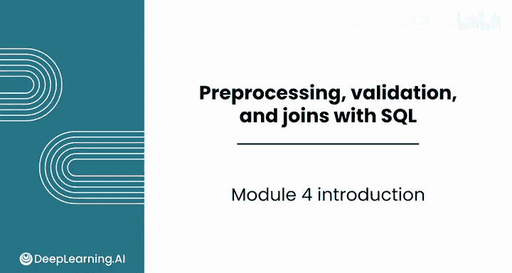
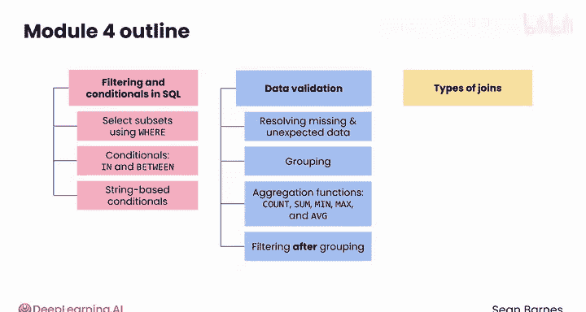

#  055：SQL数据预处理与验证模块简介 🧹

在本课程中，我们将学习如何使用SQL进行数据预处理与验证。SQL是处理关系型数据库的强大工具，掌握其核心技巧能帮助我们高效地清洗和验证数据，为后续分析打下坚实基础。

## 模块概述 📋

欢迎来到模块四：使用SQL进行数据预处理与验证。

在本模块中，你将深化对关键SQL技术的理解，以有效地清洗和验证数据。

## 课程内容详解 📚

### 第一课：数据筛选与条件语句

上一节我们介绍了本模块的整体目标，本节中我们来看看数据筛选与条件语句。

你将探索SQL中的筛选和条件语句。筛选功能允许你仅选择感兴趣的数据子集，这通过使用`WHERE`关键字实现。

以下是本课将涉及的核心操作：
*   你将使用诸如`IN`和`BETWEEN`等条件，以及基于字符串的条件来筛选数据。
*   你将学习如何通过筛选来创建新的数据特征。

### 第二课：数据验证

掌握了数据筛选后，接下来我们将聚焦于数据验证。

数据验证包括识别和解决数据缺失或异常问题。

以下是本课将学习的关键方法：
*   你将结合使用分组与聚合函数（如`COUNT`、`SUM`、`MIN`、`MAX`和`AVERAGE`）来验证数据是否符合预期。
*   你将学习如何在数据分组后进行筛选。

### 第三课：表连接

在学习了数据验证之后，最后我们将探索不同类型的表连接，这是处理关系型数据库的基石。

你将使用`LEFT JOIN`、`INNER JOIN`和`OUTER JOIN`等操作，将来自多个表的数据组合起来。

## 总结 🎯

在本课程中，我们一起学习了SQL数据预处理与验证模块的核心内容。

到本模块结束时，你将能熟练地使用SQL对数据进行筛选、分组、聚合和连接。这些技能对于应对现实世界中的数据挑战是不可或缺的。

让我们在下一个视频中开始学习。