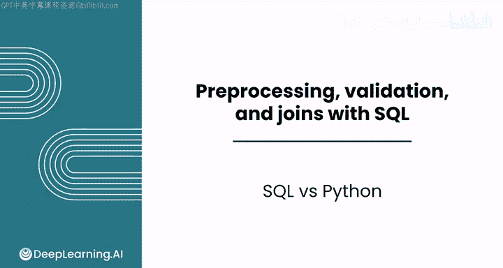
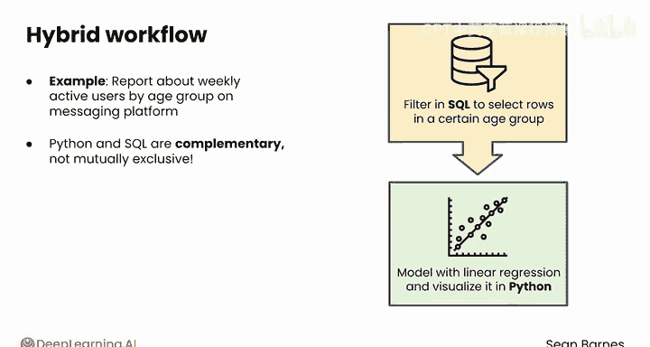

#  056：SQL 与 Python 对比 🆚

在本节课中，我们将探讨 SQL 与 Python 在数据处理任务中的适用场景与选择策略。你将了解这两种工具各自的优势，以及如何在实践中将它们结合使用。

在接下来的课程中，你将探索许多在 pandas 中也有对应操作的 SQL 技术。

换句话说，完成本模块后，你将掌握完成同一任务的两种方法。

这是一个由来已久的问题：何时应该使用 SQL，何时应该使用 Python？

## SQL 的适用场景 🗃️

通常，在最高效的情况下你会希望使用 SQL，而在需要更定制化分析时则使用 Python。

在实践中，你经常需要处理包含数百万或数十亿行的大规模数据集。

将所有数据行通过网络拉到你的本地计算机上仅仅是为了进行过滤或聚合，这可能会浪费大量时间。

使用 SQL 仅选择分析所需的行通常更为高效。具体来说，分组、通过连接合并表以及排序等操作，通常由关系数据库管理系统进行高度优化，这使得它们非常快速且内存高效。

SQL 在协作环境中也可以成为一个更好的起点。当多个分析依赖于相同的逻辑时，你可以维护一套标准化的 SQL 查询，以保持解释的一致性。

SQL 查询还可以被调度，这意味着同一个查询可以定期运行。



以下是 SQL 调度查询的一个例子：

```sql
-- 获取过去七天所有运输订单的数据，用于生成周报
SELECT * FROM shipping_orders WHERE order_date >= DATE_SUB(CURDATE(), INTERVAL 7 DAY);
```

与 Python 笔记本相比，这种类型的调度查询可能更容易维护。

## Python 的适用场景 🐍

当你需要进行更高级的分析，而对效率和可重复性的要求相对较低时，Python 就展现出其优势。

例如，如果你处于探索模式，可能会优先考虑快速可视化，并快速组合多个分析。在 SQL 中进行探索性数据分析可能会感觉更笨拙。

Python 对于高级和定制化分析也是必需的。SQL 查询无法构建箱线图或训练线性回归模型。

此外，不要忘记，SQL 仅在你的数据存储在数据库中时才相关。如果你处理的是平面文件，或者正在使用来自 API 的数据，你将更多地依赖你的 Python 技能。

## 混合工作流 🤝

你经常会使用混合工作流。

例如，如果你正在为某个消息平台整理一份关于按年龄组划分的周活跃用户的报告，你可能会先在 SQL 中过滤数据，仅选择特定年龄组的行，然后在 Python 中使用线性回归对该行为进行建模并进行可视化。

最终，Python 和 SQL 是互补的，而非相互排斥的工具。



## 总结 📝

本节课中，我们一起学习了如何在相似的操作中选择使用 SQL 还是 Python。你已经了解了 SQL 在处理大规模数据、标准化查询和调度任务方面的效率优势，以及 Python 在高级分析、定制化处理和探索性工作方面的灵活性。关键在于根据具体任务的需求，灵活选择或将两者结合使用。

在下一课中，我们将开始学习数据预处理与 SQL。