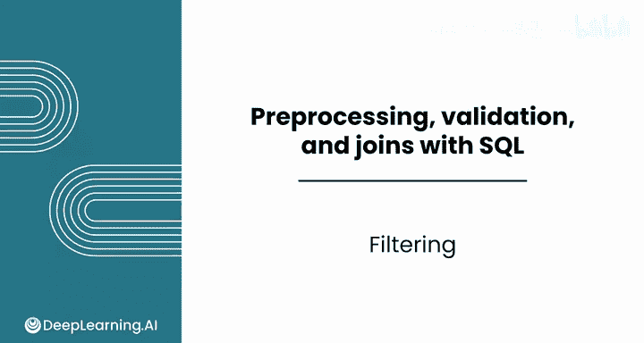
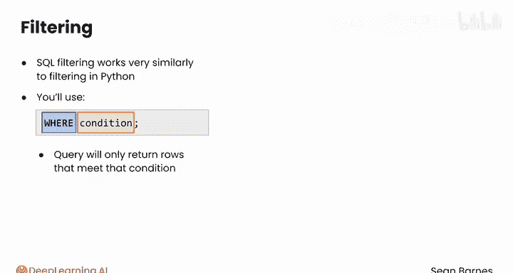
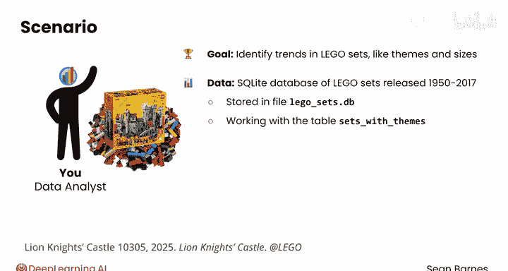
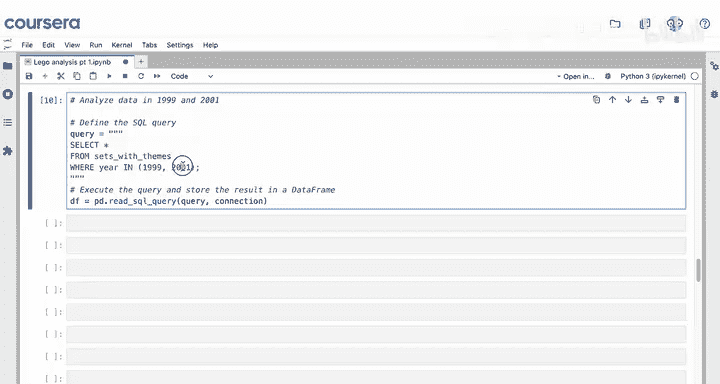
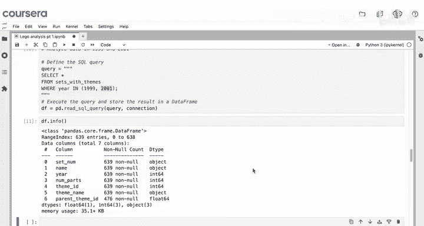
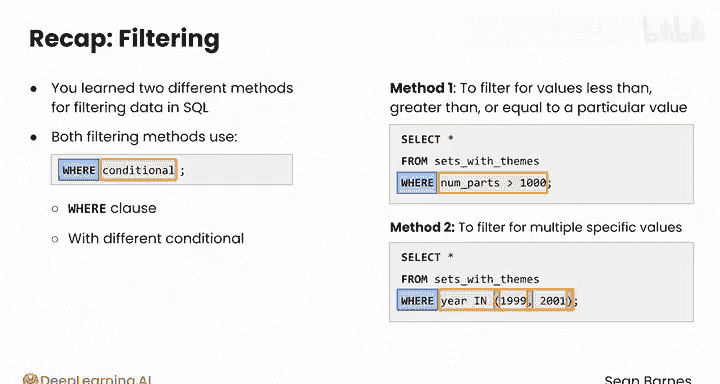

#  057：SQL 数据过滤 🎯

在本节课中，我们将学习如何使用 SQL 进行数据预处理，特别是通过过滤操作，从数据库中提取干净且相关的数据，以便在 Python 笔记本中进行分析。SQL 的过滤功能与 Python 中的过滤逻辑非常相似。

## 概述

SQL 是数据预处理的强大工具，它允许你将仅经过清洗且相关的数据提取到 Python 笔记本中进行分析。你第一个要掌握的 SQL 预处理工具就是数据过滤。





SQL 过滤的工作原理与 Python 中的过滤非常相似。你将使用 `WHERE` 关键字来过滤数据集，后面跟上过滤条件。查询将只返回满足该条件的行。

## 项目背景与数据介绍

最近，你与一家转售乐高套装的企业签订了一个数据分析项目。乐高是一种可以拼接在一起的彩色塑料积木。乐高套装包含了搭建一个物体或场景（如巫师塔）所需的所有零件。

你的总体目标是识别这些乐高套装的趋势，例如主题和尺寸。你有一个 SQLite 数据库文件 `lego_sets.db`，其中存储了 1950 年至 2017 年间发布的所有乐高套装数据。你将主要使用 `sets_with_themes` 这个数据表。

你的第一个任务是识别多年来流行的乐高套装主题。你对最大的套装特别感兴趣，因为它们往往更昂贵。

## 在 Python 笔记本中操作

在本次演示以及本课程所有后续演示中，你将直接在 Python 笔记本中操作。请记住，你可以使用课程中提供的练习项目来跟随演示。



首先，导入必要的库并建立数据库连接。

```python
import pandas as pd
import sqlite3

# 建立数据库连接
conn = sqlite3.connect('lego_sets.db')
```

请记住，此连接有效是因为 `lego_sets.db` 文件与此笔记本位于同一文件夹中。本课程中你无需进行文件管理，但应了解此约束。

所有查询都将以包含 SQL 代码的多行字符串形式出现，然后使用 `pd.read_sql_query()` 根据查询结果创建 DataFrame。

## 初步探索数据

为了熟悉数据集，我们先执行一个未过滤的查询来更好地了解数据。

```python
query = """
SELECT *
FROM sets_with_themes
"""
df = pd.read_sql_query(query, conn)
df.info()
```

结果显示有超过 11,600 行和 7 列。请记住，列编号从 0 开始。你有 3 个分类列和 4 个数字列。

查看 `theme` 列的唯一值，你会发现有“城堡”、“建筑”、“星球大战”等多种不同类型的套装。

使用 `df.describe()` 来总结数值列：
*   平均年份是 2002 年，年份范围从 1950 年到 2017 年，所以目录中包含一些古董套装。
*   零件的平均数量是 162 个，最大的套装拥有近 6000 个零件。
*   检查 `num_parts` 列的最小值，它是 -1。乐高套装似乎不可能有 -1 个零件，这值得进一步调查，我们将在后续视频中进行。

## 应用数据过滤

上一节我们介绍了数据集的基本情况，本节中我们来看看如何使用 `WHERE` 子句进行数据过滤。

### 1. 基于数值范围的过滤

由于你想探索最大的套装，可以从过滤零件数超过 1000 的套装开始。

以下是过滤零件数大于 1000 的套装的查询：

```sql
SELECT *
FROM sets_with_themes
WHERE num_parts > 1000
```

此查询将只返回 `num_parts` 大于 1000 的行。

```python
query_large = """
SELECT *
FROM sets_with_themes
WHERE num_parts > 1000
"""
df_large = pd.read_sql_query(query_large, conn)
df_large.info()
```

`df.info()` 显示这个 DataFrame 现在只包含 278 个套装。使用 `df.describe()` 可以看到，这些套装的平均年份（2009年）比整体平均（2002年）要新。但请注意，你需要进行统计检验才能确定这种观察到的差异是否显著。

### 2. 基于特定值的过滤

接下来，我们学习如何使用 `IN` 关键字过滤多个特定值。

假设你被要求分析 1999 年和 2001 年的套装数据，你的查询将如下所示：

```sql
SELECT *
FROM sets_with_themes
WHERE year IN (1999, 2001)
```



`IN` 是一个新的关键字，其工作原理与 Python 中的 `in` 运算符完全相同。它检查指定列中的值是否属于列表中的某一项。你的值列表必须放在括号内，例如 `(1999, 2001)`。



```python
query_years = """
SELECT *
FROM sets_with_themes
WHERE year IN (1999, 2001)
"""
df_years = pd.read_sql_query(query_years, conn)
df_years.info()
```

查看 `df.info()`，有 639 个套装满足此条件。你可以从这里继续分析它们的特征。

## 总结



本节课中我们一起学习了 SQL 中两种不同的数据过滤方法。

两种过滤方法都使用带有不同条件的 `WHERE` 子句：
1.  你可以使用**布尔表达式**（如 `>`， `<`， `=`）来过滤小于、大于或等于特定值的行。
2.  你可以使用 **`IN` 关键字**来过滤多个特定的值。请注意，各个值必须放在括号内并用逗号分隔。

在下一个视频中，你将扩展过滤技能，学习编写具有多个条件的复杂查询。这些查询将使你能够回答更细致的业务问题。