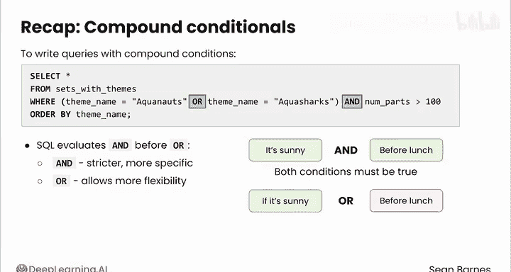

#  058：复合条件过滤 🧩

在本节课中，我们将学习如何在 SQL 中使用 `AND` 和 `OR` 逻辑运算符构建复合条件，以回答更复杂的数据查询问题。

## 概述

为了回答更复杂的问题，你可以使用复合条件来过滤数据。让我们看看如何在 SQL 中使用它们。与 Python 类似，SQL 可以使用逻辑运算符基于复杂条件过滤行，包括 `AND`（返回所有条件都为真的行）和 `OR`（返回至少一个条件为真的行）。这些运算符允许你通过多个列来过滤行。

## 使用 AND 运算符


假设你正在处理乐高套装数据库，你需要根据主题和年份两个条件来过滤套装，具体关注水生主题。

首先，你需要查询选择 1995 年和 1996 年、主题为 “Aquanauts” 的所有套装。“Aquanauts” 是一个关于海底矿工的主题套装，并且只在这两年生产。

以下是查询语句：
```sql
SELECT * FROM sets_with_themes
WHERE year IN (1995, 1996) AND theme_name = ‘Aquanauts‘;
```
第一个条件检查年份是否为 1995 或 1996。第二个条件检查主题是否为 “Aquanauts”。只有同时满足这两个条件的行才会被返回。

查询结果只返回了满足这两个条件的七个套装。请注意，此查询中 “Aquanauts” 需要加引号。如果省略引号，会出现错误。

## 使用 OR 运算符

由于你知道这些套装只在 1995 年和 1996 年发布，你可以省略查询的第一部分，转而过滤属于 “Aquanauts” 或 “Aquasharks” 主题的套装。

以下是查询语句：
```sql
SELECT * FROM sets_with_themes
WHERE theme_name = ‘Aquanauts‘ OR theme_name = ‘Aquasharks‘
ORDER BY theme_name;
```
请注意，你必须为每个条件包含列名，以区分这两组主题。现在你得到了七个 Aquanauts 套装和六个 Aquasharks 套装。

## 组合 AND 与 OR

你还可以组合 `AND` 和 `OR` 来创建更复杂的过滤器。例如，假设你只想关注来自 Aquanauts 和 Aquasharks 的、零件数超过 100 的大型套装。

你可能会尝试编写以下查询：
```sql
SELECT * FROM sets_with_themes
WHERE theme_name = ‘Aquanauts‘ OR theme_name = ‘Aquasharks‘ AND num_parts > 100
ORDER BY theme_name;
```
检查结果，你会发现这并不正确。数据框中包含了零件数少于 100 的套装。SQL 似乎只对 Aquasharks 检查了零件数量条件，而没有检查 Aquanauts。

这是一个逻辑错误而非代码错误的典型例子。你的代码运行了并返回了一个数据框，但它没有包含正确的信息。这提醒我们要始终检查查询的输出，确保它符合预期。

要修复此问题，你需要使用括号来确保 `OR` 应用于主题名称。修正后的查询如下：
```sql
SELECT * FROM sets_with_themes
WHERE (theme_name = ‘Aquanauts‘ OR theme_name = ‘Aquasharks‘) AND num_parts > 100
ORDER BY theme_name;
```
这个查询是一个很好的例子，说明了括号在分组条件中的重要性。

## 总结

本节课中，我们一起学习了如何编写带有复合条件 `AND` 和 `OR` 的查询。我们还了解到 SQL 会先计算 `AND` 再计算 `OR`，这是因为 `AND` 创建了更严格、更具体的条件，而 `OR` 则允许更大的灵活性。



为了避免查询中出现静默的逻辑错误，你需要使用括号来对条件进行分组。例如，你看到了如何在检查乐高套装零件数量之前，先对主题名称的检查进行分组。


复合条件为你检索正确数据提供了更大的灵活性。在下一个视频中，你将通过编写查询来匹配模式，从而将过滤应用于文本数据。