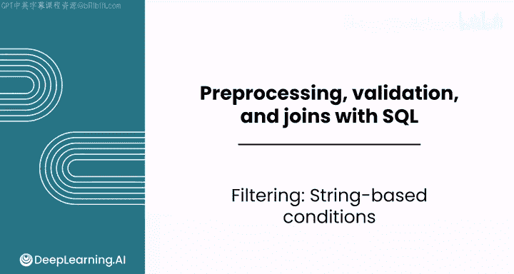
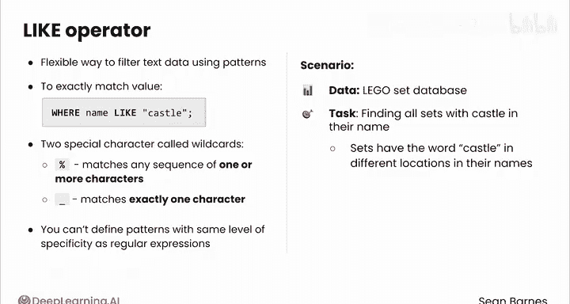
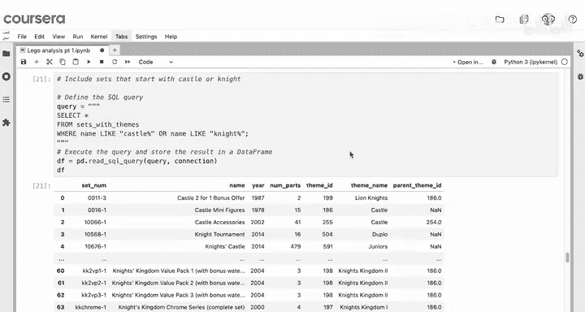
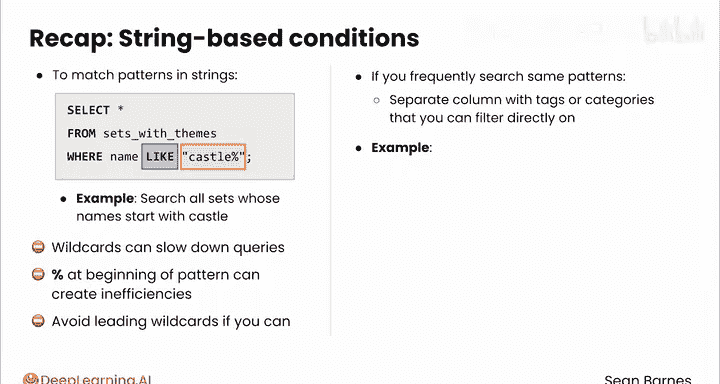

#  059：基于字符串的条件过滤 🧩



在本节课中，我们将学习如何在 SQL 中使用 `LIKE` 关键字进行灵活的文本模式匹配，以实现基于字符串的条件过滤。

## 概述

SQL 中的 `LIKE` 关键字允许我们使用模式来匹配文本数据。它类似于正则表达式，但功能相对有限。通过结合通配符，我们可以灵活地搜索符合特定模式的字符串。

## `LIKE` 关键字与通配符

`LIKE` 运算符为使用模式过滤文本数据提供了一种灵活的方法。它可以与字符串和引号一起使用来精确匹配值。然而，`LIKE` 更强大的功能在于使用两种称为通配符的特殊字符。

以下是两个核心通配符及其含义：
*   **百分号 `%`**：匹配任意一个或多个字符的序列。
*   **下划线 `_`**：精确匹配一个字符。

你可以将 `LIKE` 看作一个简化版的正则表达式。它提供了很大的灵活性，但无法像正则表达式那样定义同样精细的模式。



## 实践示例：乐高数据集

以乐高套装数据集为例。你可能对查找名称中包含“Castle”的所有套装感兴趣。但你知道，“Castle”这个词可能出现在套装名称的不同位置。

让我们看看如何在代码中实现这一点。快速提醒一下，你已在本笔记本顶部导入了必要的模块，并使用 `lego_sets.db` 打开了数据库连接。

### 精确匹配

你可以从以下查询开始：
```sql
SELECT * FROM sets_with_themes WHERE name LIKE 'Castle';
```
此查询返回所有**恰好**命名为“Castle”的套装。结果显示有两套。看起来乐高经典城堡在1981年重新发布时，零件数减少了两个。

### 使用通配符进行模式匹配

然而，你可能对查找**以**“Castle”这个词开头的所有套装感兴趣，而不仅仅是恰好命名为“Castle”的套装。

要查找这些套装，可以使用以下查询：
```sql
SELECT * FROM sets_with_themes WHERE name LIKE 'Castle%';
```
百分号 `%` 匹配任何字符序列。因此，只要套装名称以“Castle”开头，此查询就会包含该套装。

你可以看到结果多了很多，包括“Castle Minifig”和“Castle Dragons Accessory Set”等。你可以使用 `df.name.unique()` 来检查所有被选中的不同套装名称。看起来数据框中存在一些重新发布的记录，因为这里有20个套装名称，而不是27个。

### 复合条件匹配

你也可以将 `LIKE` 用于复合条件。例如，如果你想将搜索范围扩大到包括以“Castle”或“Knight”开头的套装，可以使用以下查询：
```sql
SELECT * FROM sets_with_themes WHERE name LIKE 'Castle%' OR name LIKE 'Knight%';
```
在 SQLite 中，匹配字符串（如‘Castle’）的大小写不需要与你搜索的文本完全一致。因此，全部大写或全部小写都会得到相同的结果。然而，其他关系型数据库管理系统（RDBMS）的行为可能不同。所以你需要了解你公司使用的系统的规则。只需记住在匹配字符串周围加上引号。

## 性能注意事项与最佳实践



最后需要注意，通配符（如百分号 `%`）在处理大型数据集时可能会降低查询速度。特别是，在模式开头使用前导通配符（例如 `%Castle`）会导致效率低下。

如果可能，应避免使用前导通配符。如果你需要频繁搜索相同的模式，可以考虑通过创建一个带有标签或类别的新列来预处理你的数据集，然后直接在该列上进行过滤。

例如，如果你经常搜索包含“Minifig”（乐高人仔）的套装，你可以在数据集中添加一个包含该信息的新列。

## 总结



本节课中，我们一起学习了 SQL 中基于模式的文本过滤。你了解到 `LIKE` 关键字允许你匹配字符串中的模式。我们使用 `WHERE name LIKE 'Castle%'` 这样的子句来搜索所有名称以“Castle”开头的套装。基于模式的 SQL 过滤是处理文本数据的一个多功能工具。

在下一个视频中，你将学习如何使用 SQL 条件语句为数据创建类别。希望你能继续学习。