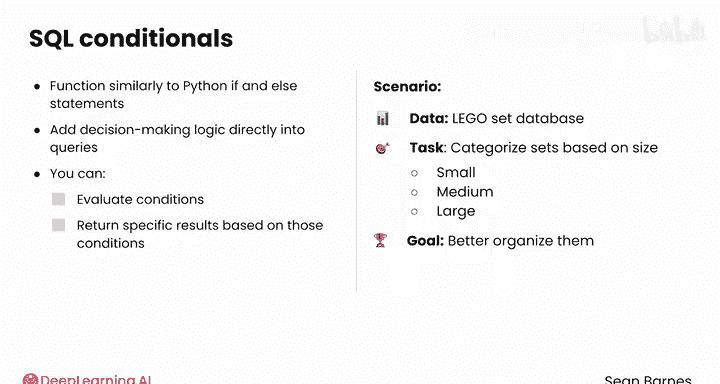
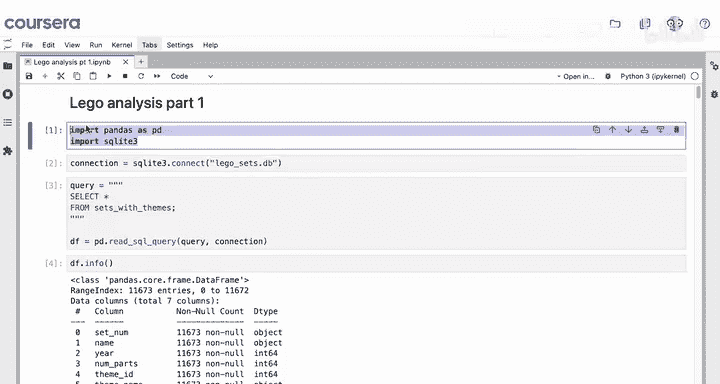
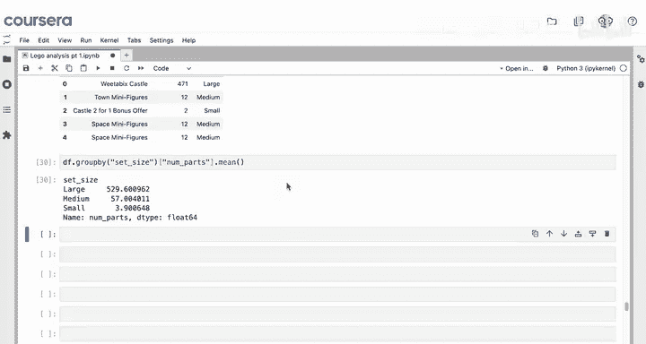
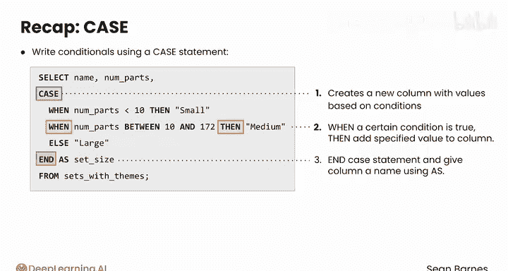

#  060：SQL CASE 条件语句 📊

在本节课中，我们将要学习 SQL 中的 `CASE` 条件语句。这是一种强大的工具，允许你根据数据中的条件动态创建新的分类或属性，类似于 Python 中的 `if-elif-else` 逻辑。

---

## 概述

SQL 条件语句让你能够高效地在数据中创建分类。当你需要动态创建新属性时，它们尤其有用。SQL 条件语句的功能与你在先前课程中接触过的 Python `if` 和 `elif` 语句类似。条件语句让你可以直接在查询中添加决策逻辑，评估条件并根据这些条件返回特定的结果。

例如，假设你想根据零件数量将乐高套装分类为小、中、大，以便更好地组织它们。你可以使用 SQL 查询来实现。

---




## 数据准备与初步观察



首先，我们执行一个简短的查询，从 `sets_with_themes` 表中选择名称和零件数量。

```sql
SELECT name, num_parts FROM sets_with_themes;
```

使用 `df.describe()` 查看数据摘要，可以发现零件数量的范围很广，从之前识别出的异常值 -1 到接近 6000，但平均值大约在 162 左右。快速查看直方图会发现，其分布是相当偏斜的。

---

## 使用 CASE 语句创建分类

为了对这些套装进行分类，我们可以在 SQL 查询中添加一个新列。是的，SQL 可以为你创建新列。

如果你想定义小、中、大套装，可以使用分位数边界。例如，小套装可能是底部 25% 的套装，中套装介于第 25 和第 75 百分位数之间，大套装则是高于第 75 百分位数的任何套装。

要创建这个查询，你需要使用 `CASE` 语句。从你的原始查询开始，`SELECT` 和 `FROM` 语句保持不变。现在，由于你要创建一个新列，需要添加一个逗号，然后添加 `CASE`。这标志着一个新条件块的开始。

本质上，你将编写一些不同的 `CASE` 或条件来告诉 SQL 在新列中放入哪个值。

以下是构建 `CASE` 语句的步骤：

1.  **使用 `WHEN` 定义条件**：指定一个要评估的条件。
2.  **使用 `THEN` 指定结果**：当条件为真时，在新列中放入指定的值。
3.  **使用 `ELSE` 处理其他情况**：为不满足任何前述条件的行提供一个默认值。
4.  **使用 `END` 结束语句**：用 `END` 关键字关闭 `CASE` 语句。
5.  **使用 `AS` 命名新列**：使用 `AS` 关键字给这个新列起一个名字。

让我们来看一个具体的例子。假设我们根据零件数量分类，边界是 10（第25百分位数）和 172（第75百分位数）。

```sql
SELECT
    name,
    num_parts,
    CASE
        WHEN num_parts < 10 THEN 'small'
        WHEN num_parts BETWEEN 10 AND 172 THEN 'medium'
        ELSE 'large'
    END AS set_size
FROM sets_with_themes;
```

在这个查询中：
*   `WHEN num_parts < 10 THEN 'small'`：如果零件数小于 10，则在新列 `set_size` 中填入 ‘small’。
*   `WHEN num_parts BETWEEN 10 AND 172 THEN 'medium'`：如果零件数在 10 到 172 之间（包含），则填入 ‘medium’。
*   `ELSE 'large'`：对于所有其他情况（即零件数大于 172），则填入 ‘large’。
*   `END AS set_size`：结束 `CASE` 语句，并将生成的新列命名为 `set_size`。

检查 `df.head()` 的结果，你现在有了一个名为 `set_size` 的新列，它似乎根据大小正确地分类了前五个套装。

---

## 应用与优势

现在，你可以继续做一些分析，例如分别计算每个类别的平均零件数量，这可以作为细分分析的开端。

条件语句非常适合高效地细分你的数据，或者减少你在分析或可视化中需要处理的不同值的数量。SQL 条件语句是在数据中创建类别的强大工具，它们还能让你有效地处理空值。



---



## 总结

本节课中，我们一起学习了如何使用 `CASE` 语句编写 SQL 条件语句。

*   `CASE` 语句会根据你编写的条件创建一个带有新值的新列。
*   你使用 `WHEN` 和 `THEN` 来编写条件：当某个条件为真时，就将指定的值添加到列中。
*   最后，使用 `END` 结束你的 `CASE` 语句，并使用 `AS` 为列命名。

掌握 `CASE` 语句能极大地增强你直接在数据库层面处理和转换数据的能力。在下一个视频中，我们将看到它如何处理空值。