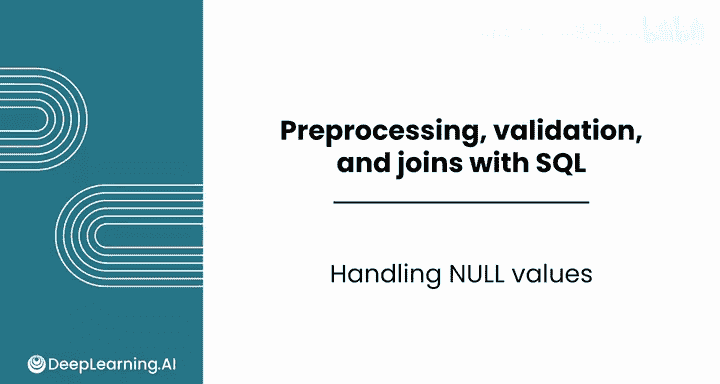
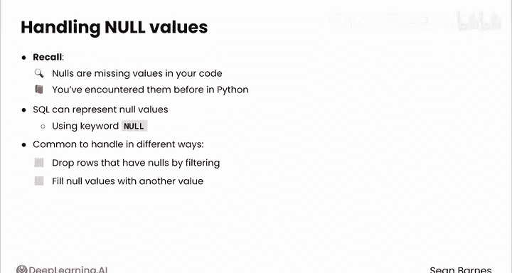
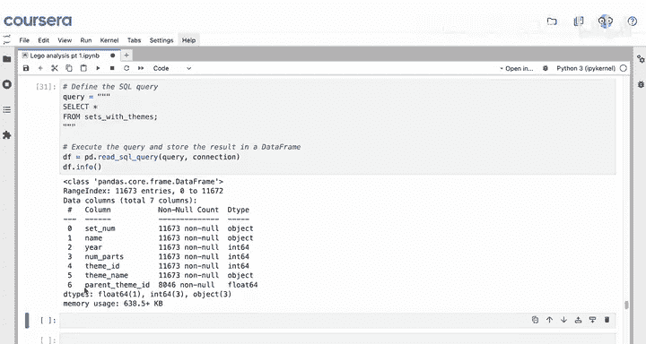
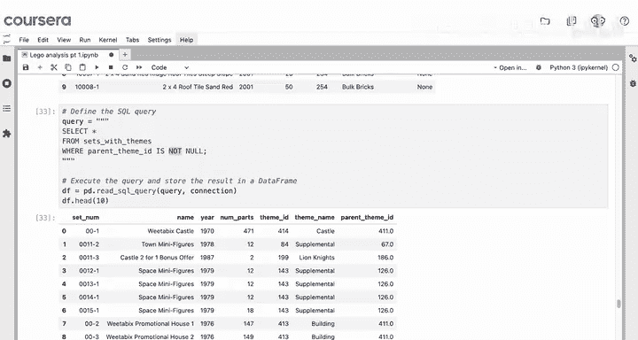
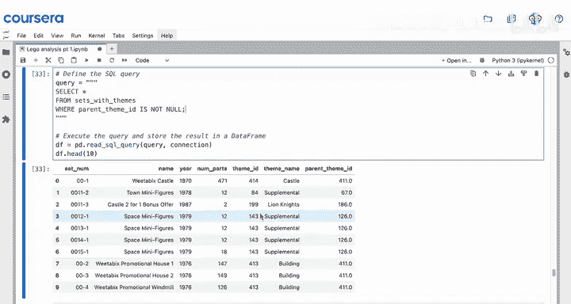
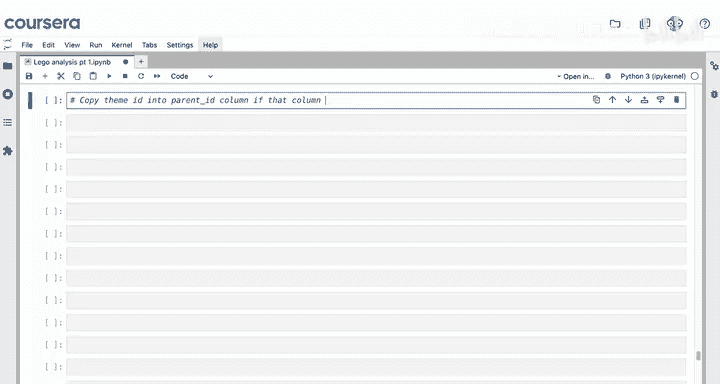
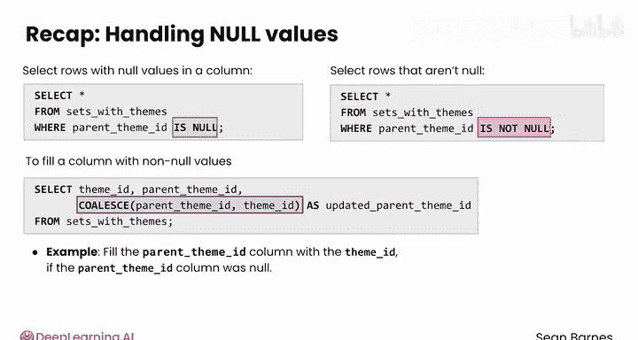

#  061：SQL空值处理指南 🧩



在本节课中，我们将学习如何在SQL中正确处理数据中的空值（Null）。空值是数据集中常见的缺失值，掌握其处理方法对于数据清洗和分析至关重要。

## 概述

在数据分析过程中，我们经常会遇到数据缺失的情况，这些缺失值在SQL中被称为空值（Null）。本节将介绍两种处理空值的主要方法：过滤空值行和使用特定值填充空值。

## 空值的基本概念

在SQL中，空值使用关键字`NULL`表示。它代表某个字段没有值。这与Python中处理缺失值的方式类似。

## 查看空值数据





首先，让我们查看包含空值的具体数据行，以便更好地理解数据结构。

以下SQL查询用于选择`parent_theme_id`为空值的所有行：

```sql
SELECT * FROM sets_with_themes WHERE parent_theme_id IS NULL;
```

运行此查询后，我们发现这些行的`parent_theme_id`列均为`NULL`。经分析，这些主题本身就是父主题，因此没有上级父主题。

## 方法一：过滤空值行



处理空值的一种直接方法是排除包含空值的行。

我们可以使用`IS NOT NULL`条件来筛选出`parent_theme_id`不为空的行：



```sql
SELECT * FROM sets_with_themes WHERE parent_theme_id IS NOT NULL;
```



这种方法将数据集从约11，600行减少到约8，000行。虽然有效，但可能会丢失大量有效数据，因此并非总是最佳选择。

## 方法二：使用COALESCE函数填充空值

另一种更优的方法是填充空值，而不是直接删除行。我们可以使用SQL的`COALESCE`函数。

`COALESCE`函数接受一系列参数，并返回第一个非空值。其基本语法如下：

```sql
COALESCE(value1, value2, ..., valueN)
```

在本例中，如果`parent_theme_id`为空，我们希望用`theme_id`的值来填充它。

以下是实现此功能的查询：

```sql
SELECT
    *,
    COALESCE(parent_theme_id, theme_id) AS updated_parent_theme_id
FROM sets_with_themes;
```

执行此查询后，原本`parent_theme_id`为`NULL`的行，其`updated_parent_theme_id`列现在已被`theme_id`的值填充。这样，我们既保留了所有数据行，又解决了空值问题，便于后续对父主题进行分析。

## 总结

本节课我们一起学习了SQL中处理空值的两种核心方法：
1.  **过滤**：使用`IS NULL`或`IS NOT NULL`条件筛选数据。
2.  **填充**：使用`COALESCE`函数，用指定的非空值替换空值。



现在，你已经掌握了有效过滤查询和处理缺失值所需的全部工具。接下来，请完成本课的练习作业和实践实验室。完成后，请继续学习下一课，我们将探索用于数据验证的更高级SQL查询。