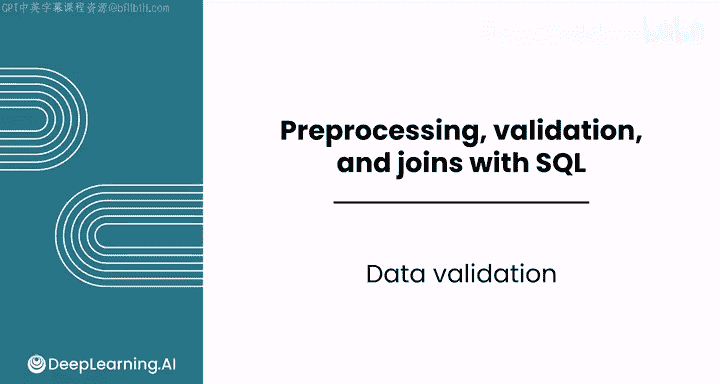
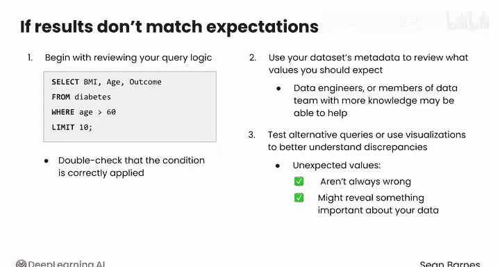

#  062：数据验证 🛡️



在本节课中，我们将学习数据验证的重要性及其在数据分析流程中的关键作用。数据验证是确保你所处理的数据符合预期、准确且完整的过程，它能帮助你在开始深入分析或建模之前，及时发现并纠正数据中的问题。

## 概述

在开始数据预处理和分析之前，你需要确认正在处理的数据是否符合你的预期。有时，你的数据可能并非如你所想，这会导致分析中的错误或失误。

## 为什么需要数据验证？

上一节我们介绍了数据验证的目的，本节中我们来看看数据不符合预期可能带来的具体问题。

例如，假设你运行了一个查询来获取一月份的销售数据。你期望看到数百条交易记录，但结果却只得到一个包含寥寥几个值的数据框。如果你在没有验证数据的情况下继续操作，可能会浪费大量时间在不完整的数据上创建报告或进行计算。

以下是进行数据验证时常见的一些问题：

*   **意外的数据格式**：例如，日期可能以文本形式存储，而不是正确的日期类型，这使得无法按时间顺序进行排序或筛选。
*   **重复或缺失的条目**：一个客户ID可能出现两次，这会虚增客户总数；或者完全缺失，导致分析不完整。
*   **意外的值**：像销售额这样的值可能不符合你对高低的预期。例如，你可能会质疑负的销售额是代表亏损，还是一个需要纠正的异常值。

作为分析师，你有责任在每个步骤验证数据，以确保其符合你的预期和分析目标。

## 如何进行数据验证？

你有一些工具可以做到这一点，特别是**思考预期**和**通过子集进行验证**。

考虑一个包含用于预测患者是否患有糖尿病的诊断测量值的数据集。该数据专门从21岁或以上的皮马印第安女性中收集。在对该数据集运行任何查询之前，你应该思考你期望得到什么样的结果。

例如：
*   你应该知道`outcome`特征只能有两个值：1代表糖尿病，0代表无糖尿病。如果此列有任何其他数字，则表明数据有问题。
*   同样，由于研究仅针对21岁或以上的女性进行，你知道任何低于21的值都应该被调查，以了解它们是错误，还是你对数据集的初步理解不正确。

这对数据集中的其他值也是如此。即使你不必成为医学专家，了解葡萄糖、血压、胰岛素和身体质量指数等测量指标的正常值范围也很有价值。这样，如果你看到任何人类不可能拥有的值，你会立即得到一个警告信号，表明数据有问题。

## 使用子集进行初步验证

当你处理一个拥有数百万行的大规模数据集时，立即加载和分析整个数据集通常是不必要甚至不切实际的。通过首先在数据集的一个小样本上测试查询，你可以验证数据的结构，及早识别缺失值或不一致之处，并在运行完整分析之前测试你的逻辑以确保其有效。

以下是具体步骤：

1.  **运行一个简单的查询**：例如，如果你想探索血糖低于100的老年患者，可以从一个无过滤的查询开始：
    ```sql
    SELECT * FROM diabetes LIMIT 10;
    ```
    输出将仅限于前10条记录。以这样的查询开始也允许你验证数据：值是否如预期那样是数字？

2.  **逐步添加条件**：一旦确认数据看起来正确，你可以添加更多条件。例如，你现在可以添加一个`WHERE`子句来关注年龄超过60岁且血糖低于100的患者：
    ```sql
    SELECT * FROM diabetes WHERE age > 60 AND glucose < 100 LIMIT 10;
    ```
    这一步缩小了数据范围，并确保筛选按预期工作。

3.  **检查结果**：你应该再次检查结果，看看`WHERE`子句是否正确过滤了行。年龄和血糖值是否在合理范围内？血糖是否与其他健康指标（如`outcome`特征）有合理的相关性？

手动审查你的数据可以让你更熟悉它。你并非在浪费时间，而是在培养良好的数据习惯。

## 当结果不符合预期时

如果你的结果不符合预期，请暂停并开始调查。

*   **首先，检查查询逻辑**：例如，如果你正在筛选年龄大于60岁的患者，请仔细检查条件是否正确应用。
*   **其次，利用数据元数据**：审查你应该期望哪些值。数据工程师或数据团队中更了解数据收集方式的其他成员，可能能够帮助你更好地理解它。
*   **另一种选择是测试替代查询**，甚至使用可视化来更好地理解潜在的差异。

请记住，意外的值并不总是错误的，它们可能揭示了关于你数据的一些重要信息。保持好奇心。

## 总结



在本节课中，我们一起学习了数据验证的核心概念。我们了解到，在分析前验证数据至关重要，可以避免基于错误或不完整数据得出错误结论。我们探讨了通过思考预期值和使用子集进行初步查询来验证数据的方法。最后，我们讨论了当发现数据异常时应采取的调查步骤。


你有多种选择来检查你的数据是否符合预期。在接下来的视频中，我们将开始学习在SQL中进行数据验证，从关键字`COUNT`和`DISTINCT`开始。