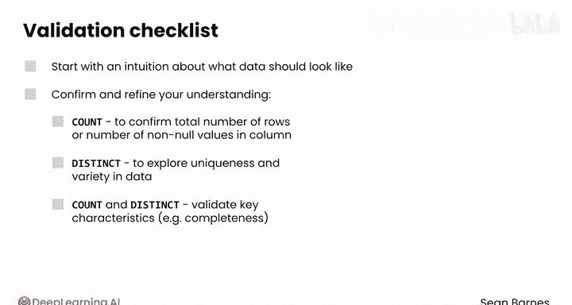

#  063：计数与去重 📊

在本节课中，我们将学习两种基础但至关重要的数据验证技术：**计数**和**去重**。我们将通过SQL查询来检查数据的总行数、非空值数量以及列中的唯一值，从而确保数据的完整性和准确性。

---

## 概述

数据验证是数据处理流程中的关键步骤。通过验证，我们可以确认数据是否符合预期，并发现潜在问题，如数据缺失或重复记录。本节课将重点介绍如何使用SQL的`COUNT`和`DISTINCT`关键字来执行这些验证。

---

## 计数（COUNT）验证

上一节我们介绍了数据验证的重要性，本节中我们来看看如何使用`COUNT`进行验证。`COUNT`关键字用于回答一个基础但重要的问题：**数据集中有多少条记录？** 将这个数字与你的预期进行比较，可以揭示数据是否缺失或是否存在重复行。

`COUNT`只计算非空行。而`COUNT(*)`用于计算每一行，即使某些列包含空值。

以下是使用`COUNT`进行验证的步骤：

1.  **计算总行数**：使用`SELECT COUNT(*) FROM table_name;`。这能告诉你数据集的总记录数。
2.  **计算特定列的非空值数量**：使用`SELECT COUNT(column_name) FROM table_name;`。这能告诉你该列中有多少有效数据。

---

## 去重（DISTINCT）验证

了解了如何计数后，我们来看看如何检查数据的唯一性。`DISTINCT`关键字用于识别列中的**唯一值**。这有助于你理解数据的多样性，并且对于检测重复条目特别有用。

以下是使用`DISTINCT`进行验证的步骤：

1.  **获取唯一值列表**：使用`SELECT DISTINCT column_name FROM table_name ORDER BY column_name;`。这会返回一个按字母顺序排序的唯一值列表。
2.  **计算唯一值的数量**：将`COUNT`和`DISTINCT`结合使用，可以计算列中不同值的总数。

---

## 实践演练：使用乐高数据集

为了看`COUNT`和`DISTINCT`如何实际操作，让我们使用上一课中使用的乐高数据集运行一些查询。你可以使用提供的练习文件跟着操作。

首先，导入库并打开数据库连接。快速回顾一下数据表的结构：
```sql
SELECT * FROM sets_with_themes;
```

现在，我们可以生成一些SQL查询来验证数据。

**首先，计算总行数：**
```sql
SELECT COUNT(*) FROM sets_with_themes;
```
结果是11,673，这是正确的。如果数字更高，可能表明存在重复记录或其他问题。

**接着，计算特定列的非空值数量：**
在上一课中，我们注意到有几千个`parent_theme_id`值缺失。为了计算该列中有多少非空条目，可以将`COUNT(*)`替换为`COUNT(parent_theme_id)`。
```sql
SELECT COUNT(parent_theme_id) FROM sets_with_themes;
```
该列包含8046个非空值。这个值与`COUNT(*)`返回的值之间的差异表明该列中存在一些空值。

**然后，检查唯一值：**
你可以使用`DISTINCT`关键字获取所有唯一主题名称的列表。
```sql
SELECT DISTINCT theme_name FROM sets_with_themes ORDER BY theme_name;
```
现在你看到了按字母顺序排序的各种主题。

**最后，结合使用COUNT和DISTINCT：**
结合`COUNT`和`DISTINCT`关键字是一种强大的数据验证技术。例如，假设你想检查每个主题是否具有唯一的ID。

你可以检查`theme_name`和`theme_id`两列中不同值的数量。
```sql
SELECT COUNT(DISTINCT theme_name) FROM sets_with_themes;
```
输出显示有386个独特的主题。
```sql
SELECT COUNT(DISTINCT theme_id) FROM sets_with_themes;
```
有趣的是，这里有575个不同的结果。所以看起来有些主题可能名称相同，但ID不同。值得进一步调查这种差异。

---

## 总结

本节课中我们一起学习了数据验证的核心技术。

当验证你的数据时，总是从对数据应该是什么样子的直觉开始，然后使用这些方法来确认和完善你的理解。
*   使用 **`COUNT`** 来确认总行数或列中非空值的数量。
*   使用 **`DISTINCT`** 来探索数据的唯一性和多样性。
*   将 **`COUNT` 和 `DISTINCT` 结合使用**，以验证关键特征，如完整性。



这些技术是你防御数据错误的第一道防线。

---


`COUNT`和`DISTINCT`允许你验证数据的基本特征，但如果你想验证数据的特定子集，你将需要用于分组数据的工具。请继续观看下一个视频来了解如何操作。