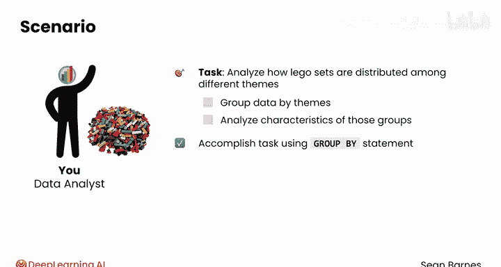
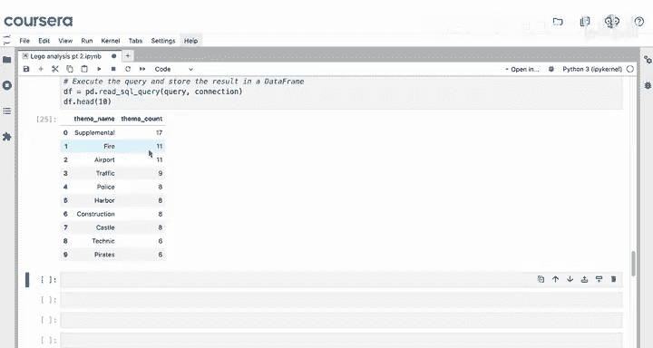
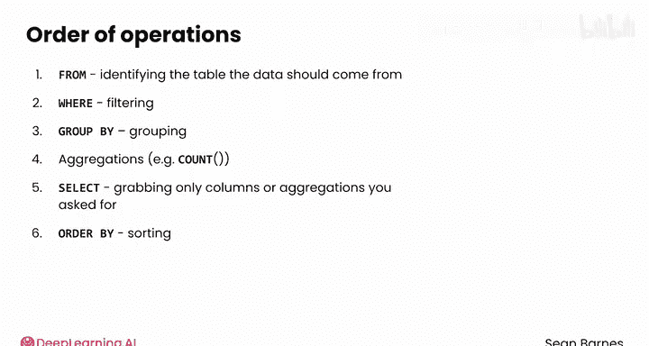

#  064：分组聚合 🧱

## 概述

在本节课中，我们将要学习 SQL 中一个非常强大的功能：**分组聚合**。我们将了解如何使用 `GROUP BY` 语句将数据按照一个或多个属性进行分组，并在此基础上应用聚合函数（如 `COUNT`、`SUM`）来分析每个组的特征。

---


## 分组操作简介



SQL 提供了工具，让你能够基于一个或多个属性对数据进行分组，从而创建数据的子集。

假设你的任务是分析乐高套装在不同主题系列中的分布情况。你可以先按主题对数据进行分组，然后分析这些组的特征。这个任务可以通过 `GROUP BY` 语句来完成。


## 使用 GROUP BY 进行分组

首先，请确保你已在笔记本顶部导入了必要的模块，并使用 `lego.db` 打开了数据库连接。

你可以使用 `GROUP BY` 语句按主题对套装进行分组。当 `GROUP BY` 子句与 `COUNT`、`SUM` 等聚合函数结合使用时，其功能会变得非常强大。

例如，如果你的目标是查看每个主题关联了多少个套装，你可以将 `GROUP BY` 语句与 `COUNT` 函数结合使用。

以下是具体的查询示例：

```sql
SELECT theme_name, COUNT(*) AS set_count
FROM sets_with_themes
GROUP BY theme_name
ORDER BY set_count DESC;
```

在这个查询中，`GROUP BY theme_name` 根据唯一的主题名称将数据组织成组，而 `COUNT(*)` 则统计每个组中的套装数量。尽管 `COUNT(*)` 在查询中出现在分组之前，但它实际上是在分组之后执行的。通过按降序排列结果，你可以快速找出最受欢迎的主题。

执行这个查询可以清晰地展示套装在不同主题间的分布情况。像“补充包”、“科技系列”、“城市系列”和“好朋友系列”这样的基础主题似乎拥有最多的套装数量。

如果你对最不受欢迎的主题更感兴趣，可以按套装数量升序排序。

```sql
SELECT theme_name, COUNT(*) AS set_count
FROM sets_with_themes
GROUP BY theme_name
ORDER BY set_count;
```

检查结果时，你可能会发现一些鲜为人知的主题，由于其稀有性，可能更具价值。




## 使用 COUNT DISTINCT

你还可以使用 `COUNT DISTINCT` 模式来检查每个组内唯一值的数量。

例如，你之前可能注意到有些主题名称对应多个唯一的 ID。你可以使用以下查询来检查每个主题名称关联了多少个 ID：


```sql
SELECT theme_name, COUNT(DISTINCT theme_id) AS theme_count
FROM sets_with_themes
GROUP BY theme_name
ORDER BY theme_count DESC
LIMIT 10;
```

然后查看前 10 个值，看看哪些主题名称拥有最多的唯一 ID。有趣的是，一些名称更通用的主题，如“补充包”、“消防与航空”，每个名称关联了 11 个或更多的唯一主题 ID。

## SQL 的执行顺序

现在我们来回顾一下。你可以使用 `GROUP BY` 语句并提供要分组的列名来对行进行分组，这类似于在 Pandas 中对行进行分组。如果你的查询包含分组，那么像 `COUNT` 这样的聚合函数将分别应用于每个组。

有趣的是，你并不一定要选择你用来分组的列，但选择它有助于你更好地理解结果。

你刚才了解到，像 `COUNT` 这样的聚合操作发生在分组之后。SQL 有一套固定的操作顺序：
1.  **FROM**：确定数据来源的表。
2.  **WHERE**：进行过滤。
3.  **GROUP BY**：进行分组。
4.  **聚合函数**：如 `COUNT`。
5.  **SELECT**：选择你请求的列或聚合结果。
6.  **ORDER BY**：最后进行排序。

你不需要死记硬背这个顺序，但你应该知道 SQL 有固定的操作顺序，并且聚合操作发生在分组之后。




## 总结


本节课中我们一起学习了 SQL 中的分组聚合操作。

一旦你对数据进行了分组，就可以对创建的子集应用许多不同的聚合函数。在本视频中，你应用了 `COUNT` 和 `COUNT DISTINCT` 与 `GROUP BY` 结合使用。

在下一个视频中，你将探索几个新的聚合函数。我们下节课见。