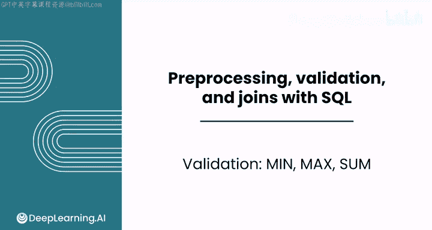
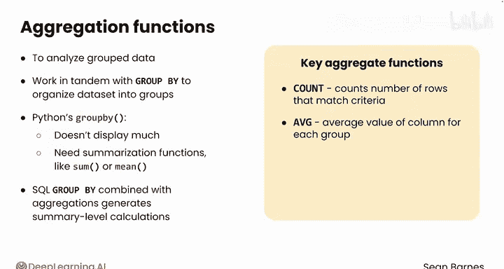
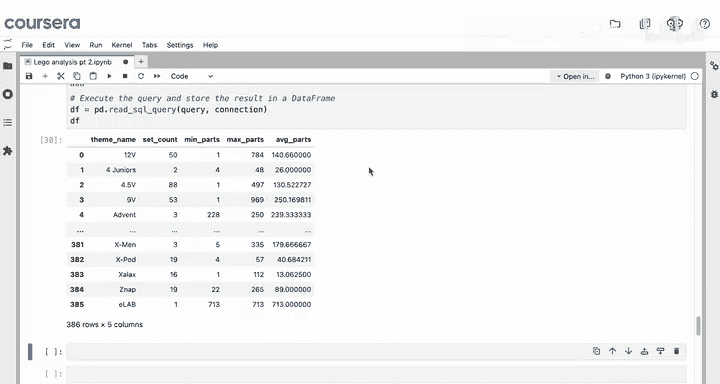
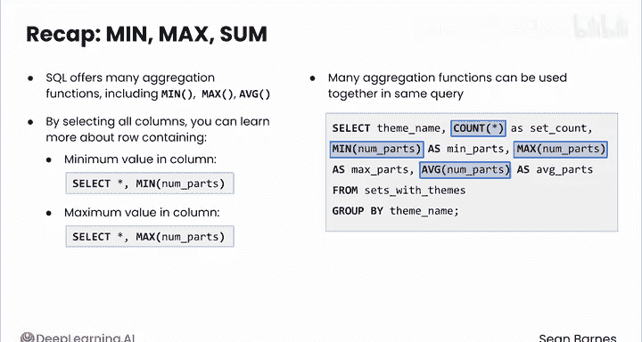

#  065：SQL 聚合函数（最小值、最大值、求和）📊

在本节课中，我们将学习如何使用 SQL 中的聚合函数，特别是 `MIN`、`MAX` 和 `SUM`，来对数据进行汇总分析。我们将了解如何结合 `GROUP BY` 子句，高效地计算分组数据的统计信息。

除了计数，SQL 还提供了多种聚合数据的方式。对于数值型数据，常见的选项包括最小值、最大值和求和，用于分析分组数据。



SQL 提供了强大的聚合函数。这些函数与 `GROUP BY` 子句协同工作，先将数据集组织成有意义的组，然后再进行计算。

可以这样理解：Python 中单独的 `groupby` 函数本身不会显示太多信息，你需要配合 `sum` 或 `mean` 这样的汇总函数来提取洞察。



SQL 遵循相同的原则，它将 `GROUP BY` 与聚合函数结合，以高效地生成汇总级别的计算。

关键的聚合函数包括：
*   `COUNT`：你在之前的视频中已经使用过。
*   `AVERAGE`：计算每个组中某列的平均值。
*   `SUM`：对每个组中某列的值进行求和。
*   `MIN` 和 `MAX`：找出每个组中的最小值和最大值。

作为快速回顾，你已在本笔记本顶部导入了必要的模块，并使用 `Legoets.bbb` 打开了数据库连接。

假设你想探索每个主题系列中最大的乐高套装。你可以使用以下查询：

```sql
SELECT theme_name, MAX(num_parts)
FROM sets_with_themes
GROUP BY theme_name;
```

结果显示，“12 volt”主题系列有一个包含超过 700 个零件的套装，而“agogori”系列的套装似乎非常小。

这个查询告诉了你最大套装的尺寸，但没有告诉你具体是哪个套装。为了包含每个主题系列中最大套装的所有详细信息，你可以在 `SELECT` 语句中添加 `*`，这将显示该最大套装所在行的所有列。

请注意，这是 SQLite 的一个特殊功能，并不适用于所有数据库系统。添加 `*` 并非冗余，因为当你使用 `MAX(num_parts)` 时，你选择的是该列具有最大值的行。然而，要检索该行的所有详细信息，你需要查看所有列。因此，选择像 `MAX` 这样的聚合函数与选择相应的列值是分开进行的。

看起来最大的“12 volt”套装是“Intercity passenger train”，这很合理，它似乎会有很多零件，并且发布于 1980 年。

现在，让我们对零件数最少的套装进行同样的操作。你只需将查询中的 `MAX` 改为 `MIN`，并添加排序以查看拥有最小套装的系列：

```sql
SELECT theme_name, MIN(num_parts)
FROM sets_with_themes
GROUP BY theme_name
ORDER BY num_parts;
```

有趣的是，有三个套装的零件数是 -1。这代表什么意思？如果不进一步阅读数据集说明，并不完全清楚。其中一些零件数为 0 和 -1 的主题甚至根本不是乐高套装，它们是木制收纳盒或创意书籍。目前尚不清楚 -1 和 0 是否有不同的定义，或者这些负值是否代表某种无效值。有时，当你想保持列为数值型时，负值会被用作特定原因的标记。

SQL 还允许你在一个查询中包含多个聚合函数。例如，与其分别查看每个主题系列的零件数计数、最大值和最小值，不如将它们合并到一个查询中：



```sql
SELECT theme_name,
       COUNT(*) AS set_count,
       MIN(num_parts) AS min_parts,
       MAX(num_parts) AS max_parts,
       AVG(num_parts) AS average_parts
FROM sets_with_themes
GROUP BY theme_name;
```

这非常有用。现在你得到了一个类似于 `df.describe()` 的表格，并且可以在大型数据集上高效运行，而无需将所有数据加载到本地计算机上。

## 总结



本节课中我们一起学习了：
*   SQL 提供了多种不同的聚合函数，包括 `MIN`、`MAX` 和 `AVERAGE`。
*   通过选择所有列（`*`），你可以了解更多关于包含某列最小值或最大值的行的信息。请记住，这通常只适用于 SQLite，你需要探索其他数据库系统的功能以确保兼容。
*   你学会了可以在同一个查询中同时使用多个聚合函数。

就像 pandas 一样，SQL 也提供了许多不同的聚合函数。我鼓励你在本课的最后一个视频中探索所有可用的选项。在下一个视频中，你将学习如何使用聚合结果来过滤分组数据。我们下个视频见。