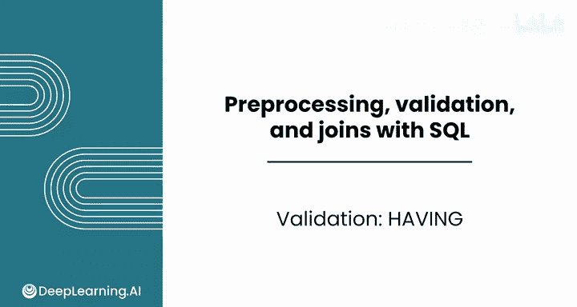
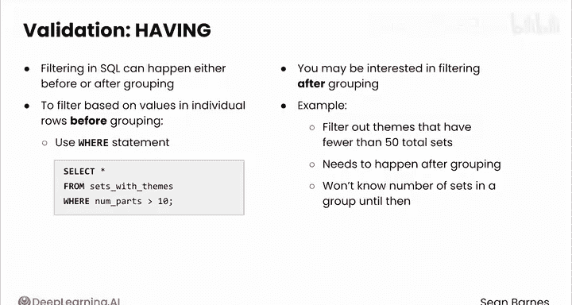
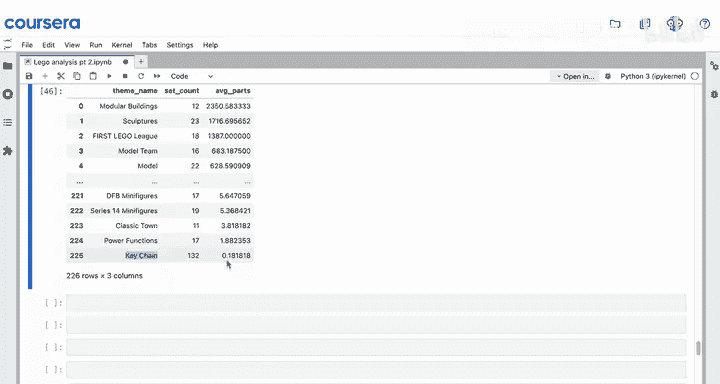
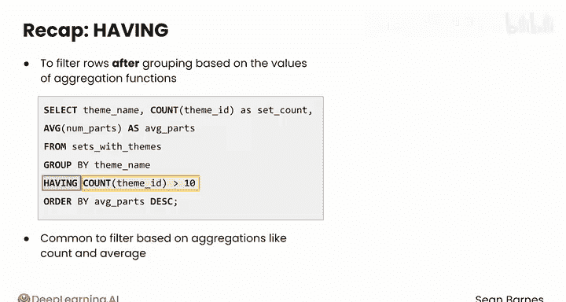

#  066：数据验证 - HAVING子句 📊

在本节课中，我们将学习如何使用SQL的`HAVING`子句对分组后的数据进行筛选。这是一种识别数据中异常值和重复项的有效技术。

## 概述



分组数据后，可以基于聚合函数的结果对分组进行筛选。`HAVING`子句在此过程中扮演关键角色。

在SQL中，筛选可以在分组之前或之后进行。


## 分组前筛选：WHERE子句

分组前，可以使用`WHERE`语句基于单行数据进行筛选。

例如，可以检查每个独立的数据集是否包含超过10个部分。然而，有时我们更关心分组后的筛选。

## 分组后筛选：HAVING子句

上一节我们介绍了分组前筛选，本节中我们来看看如何在分组后进行筛选。

例如，可以筛选出总数据集数量少于50的主题。这个操作必须在分组之后进行，因为只有在分组完成后，我们才能知道每个组中的数据量。

以下是具体操作步骤。

首先，需要在本笔记本顶部导入必要的模块，并与Legos数据库建立连接。

在之前的视频中，我们使用了以下查询来统计每个主题的数据集数量：
```sql
SELECT theme_name, COUNT(*) AS set_count FROM sets_with_themes GROUP BY theme_name
```



可以扩展此查询，通过添加`HAVING COUNT(*) > 50`语句，仅包含至少拥有50个数据集的主题。

```sql
SELECT theme_name, COUNT(*) AS set_count FROM sets_with_themes GROUP BY theme_name HAVING COUNT(*) > 50
```

这里，`HAVING COUNT(*) > 50`充当过滤器，只保留数据集数量超过50的主题。此语句有助于将分析重点集中在最受欢迎的主题上。


## WHERE与HAVING的区别

需要记住，`WHERE`处理行级筛选，而`HAVING`在聚合后生效。当处理大型数据集并需要对结果进行精确控制时，这一区别至关重要。

分组后筛选不一定需要使用与`SELECT`语句中相同的聚合函数。

例如，可以先筛选出至少拥有10个数据集的主题，然后显示每个主题的平均零件数。

该查询如下所示：
```sql
SELECT theme_name, COUNT(theme_id) AS set_count, AVG(num_parts) AS average_parts FROM sets_with_themes GROUP BY theme_name HAVING COUNT(theme_id) > 10 ORDER BY average_parts DESC
```

这个查询允许我们仅对拥有最小样本量（10个）的主题计算平均值。应该包含数据集数量以验证`HAVING`语句是否正确执行。按平均零件数降序排列，可以查看平均零件数最多的主题。

因此，模块化建筑（非常大且复杂的套装）平均拥有许多零件，而钥匙链则很少。事实上，似乎有很多钥匙链的平均零件数低于1，因为平均值小于1。




## 总结

本节课中我们一起学习了`HAVING`语句，它允许基于聚合函数的值对分组后的行进行筛选。

通常基于`COUNT`和`AVG`等聚合函数进行筛选。




## 课程结尾

学得很棒！您已经掌握了使用SQL进行数据验证的许多强大工具，从聚合到分组。

接下来，您将完成本课的练习作业和实践实验室。完成后，请跟随我进入本课程的下一节，也是最后一节课：SQL连接。