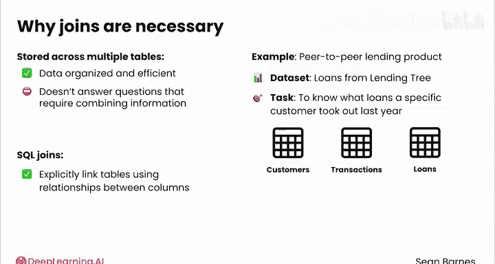
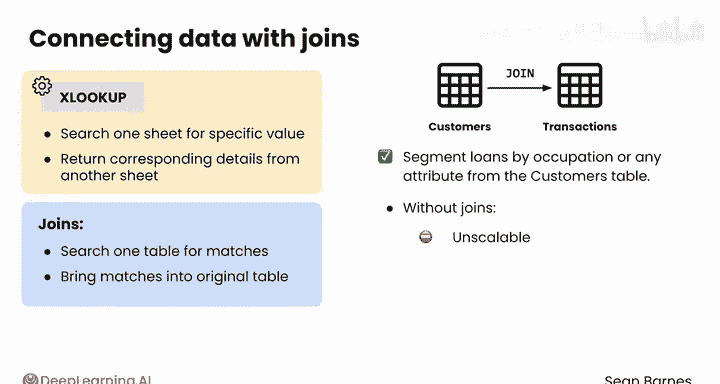
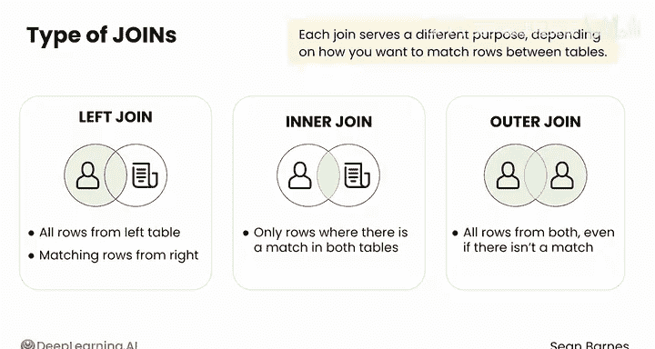

#  067：表连接介绍 🧩


在本节课中，我们将要学习 SQL 中一个极其强大的功能——表连接（Joins）。到目前为止，我们编写的查询都只能从单个表中检索数据。然而，当数据分散在多个表中时，通过连接将表关联起来，SQL 的能力将得到质的飞跃。

## 为什么需要连接表？ 🔗

在关系型数据库中，为了保持数据的组织性和高效性，信息通常被拆分存储在不同的表中。每个表通常专注于一个单一的实体。例如，你可能有一个存储客户信息的表，一个存储交易记录的表，以及一个存储产品信息的表。

上一节我们介绍了多表存储的优势，本节中我们来看看它的局限性。这种设计虽然整洁，但无法直接回答那些需要组合多个表信息的问题。例如，假设你是一名数据分析师，正在分析一个P2P借贷平台的数据集。你想知道某位特定客户去年申请了哪些贷款。客户详情可能存储在一个表中，交易记录在另一个表中，而贷款信息又在第三个表中。

如果没有表连接功能，你将不得不通过耗时且容易出错的手动流程来匹配和合并这些数据。SQL 连接正是为了解决这个问题而生的。



## 表连接的核心原理 ⚙️

SQL 连接允许你根据表之间列的关联关系，显式地将多个表链接起来，从而将所有相关数据整合在一起。连接操作通常依赖于一个唯一的标识符，最常见的是像 `customer_id` 这样的 ID 列。

**核心概念公式：**
```
结果集 = 表A JOIN 表B ON 表A.关联键 = 表B.关联键
```

如果客户表和贷款表都有一个 `customer_id` 列，你就可以通过这个列将客户信息“附加”到贷款记录上，为贷款数据提供更丰富的上下文。这种连接表的能力是关系型数据库最强大的特性之一。

一个简单的类比是 Excel 或 Google Sheets 中的 `XLOOKUP` 函数（如果你不熟悉也没关系，这只是一个给了解它的人做的快速类比）。`XLOOKUP` 允许你在一个工作表中搜索特定值，并从另一个工作表中返回对应的详细信息。SQL 连接遵循相同的原理，但规模更大、灵活性更高。它允许你搜索一个表中的匹配项，并将这些匹配的记录带入你的原始表中。

## SQL 连接的主要类型 📊



SQL 中有几种不同类型的连接，每种连接根据你希望如何在表之间匹配行而服务于不同的目的。让我们继续以贷款数据为例，假设有两个表：一个包含客户及其人口统计详情（`customers` 表），另一个包含记录每笔贷款交易的详情（`loans` 表）。

以下是不同连接类型的工作原理：

在深入了解每种类型之前，以下是主要的连接类型及其简要说明：

*   **左连接 (LEFT JOIN)**：返回左表（此处是 `customers` 表）的所有行，以及右表（`loans` 表）中的匹配行。如果某个客户没有申请过贷款，其详细信息仍会出现在结果中，而贷款信息将显示为 `NULL`。
*   **内连接 (INNER JOIN)**：仅返回两个表中都有匹配的行。例如，如果你只想查看那些申请过贷款的客户，内连接将只给出这部分数据，排除没有贷款的客户，以及那些在客户表中找不到匹配项的贷款记录。
*   **外连接 (OUTER JOIN)**：返回两个表中的所有行，即使没有匹配项。它通常用于表示同一实体的两个表。例如，如果你有两个来自不同公司的客户表，你可以使用外连接将它们合并成一个包含所有客户的巨型表。

## 总结与展望 🚀



本节课中我们一起学习了 SQL 表连接的重要性、核心原理以及主要类型。你了解了为什么在多表数据库中连接是必不可少的，并且能够区分左连接、内连接和外连接的不同用途。

现在你已经明白了连接为何如此重要，并能区分不同的连接类型，接下来就准备好观看它们在实战中如何应用吧。请跟随我进入下一个视频。