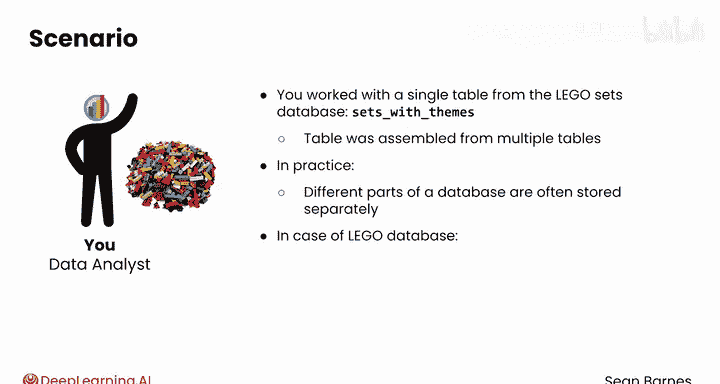
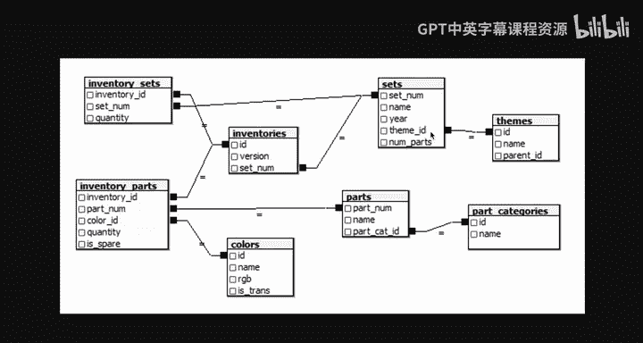
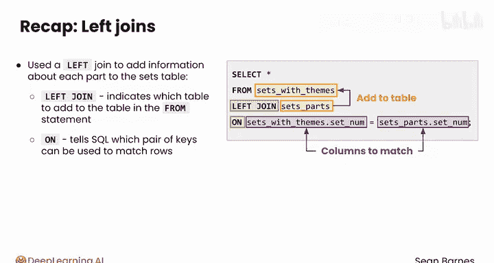

#  068：左连接 🧩

在本节课中，我们将要学习 SQL 中的 **左连接** 操作。左连接是一种强大的工具，它允许我们将一个表中的所有记录与另一个表中的匹配记录组合起来，从而为现有数据添加更多上下文信息。

---

## 回顾与引入

上一节我们介绍了 SQL 连接的基本概念，它用于合并来自不同表的数据。

本节中我们来看看 **左连接** 的具体应用。左连接有助于为你当前的表添加更多背景信息。在本模块之前的课程中，我们一直使用乐高套装数据库中的一个单一表（`sets_with_theme`）。实际上，这个表是由多个表组合而成的。在实践中，数据库的不同部分通常分开存储。以乐高数据库为例，套装和主题信息就分别存储在不同的表中。


查看实际的乐高数据模式，你会注意到套装和主题存储在独立的表中。`set_num` 是 `sets` 表的主键。那么 `sets` 表中的 `theme_id` 是什么呢？




`theme_id` 是一个**外键**，它允许你访问 `themes` 表中的主题信息。因此，左连接将允许你把主题名称和父级ID等信息添加到套装表中。

---

## 在 Python 中实践左连接

让我们看看如何在你的 Python 笔记本中执行类似的连接操作。假设你对查看每个套装包含的零件感兴趣。

你可以将 `parts` 表左连接到 `sets` 表，以添加关于每个零件所属套装的信息，例如套装名称和发布年份。

以下是具体步骤，你可以使用本课提供的练习项目跟随操作。

首先，导入必要的库并创建数据库连接。

```python
# 示例：导入库和建立连接（具体代码取决于你使用的库，如 sqlite3, pandas, sqlalchemy 等）
import pandas as pd
import sqlite3

conn = sqlite3.connect(‘your_database.db’)
```



左连接会返回**左表**的所有条目，以及**右表**的匹配条目。如果没有匹配项，结果中右表的列将显示为 `NULL` 值。

我们将逐步构建查询。首先，执行 `SELECT * FROM sets_with_themes`，这会给出每个套装及其主题的信息。数据框底部显示总共有 11673 行。

同时，查询 `SELECT * FROM sets_parts` 会给出 `set_num`, `part_num`, `color_id`, `quantity` 和 `is_spare`。这个表代表每个零件，因此只包含零件的独立信息。数据框底部显示有近 600,000 行。


为了连接它们，我们这样写查询：

```sql
SELECT *
FROM sets_with_themes
LEFT JOIN sets_parts
ON sets_with_themes.set_num = sets_parts.set_num;
```

你已经知道查询的前两个语句。`LEFT JOIN` 行指明了你要执行的连接类型。然后你指定想要从哪个表添加信息。最后一行指明应该匹配两个表中的哪些列。

两个表都有一个 `set_num` 列，它是每个套装的唯一标识符，因此你可以使用这个数字来匹配行。此查询将匹配 `sets_with_themes` 表中与 `parts` 表中 `set_num` 相同的行。

`ON` 子句中的点符号（`table.column`）有助于明确指定某个列来自哪个表。如果没有点符号，你会写成 `set_num = set_num`，SQL 将无法判断你指的是哪个表，这会导致“列名不明确”的错误。为了可读性，通常将左表放在等号左边，右表放在等号右边。

现在，这个查询会返回一个巨大的表，因为你连接了所有套装和所有零件，这意味着现在每个套装中的每个零件都对应一行。这是一个可以进一步探索的有趣表格。

例如，你可以在查询末尾添加 `WHERE sets_with_themes.set_num = ‘8480-1’` 来筛选出 1996 年发布的复古太空梭套装（这是一个热门套装）。现在，你可以逐行查看这个套装中的各个零件。

---

## 左连接的高级应用

这种连接还允许你做一些很酷的分析，比如检查每年发布的套装中包含的独特零件数量。

以前，你无法完成这个计算，因为发布年份和零件信息是分开存储的。现在可以尝试以下查询：

```sql
SELECT year, COUNT(DISTINCT part_num) AS parts_per_year
FROM sets_with_themes
LEFT JOIN sets_parts
ON sets_with_themes.set_num = sets_parts.set_num
GROUP BY year;
```

确保选择 `year` 列，这样你才能看到每年对应的零件数量。结果显示，1950年只有6个独特零件，1953年也是如此，然后这个数字似乎逐渐增加，直到2010年代达到300多个。

你还可以使用折线图将这些数据可视化。



增长趋势非常明显。

---

## 本节总结

本节课中我们一起学习了如何使用 **左连接** 为套装表添加每个零件的详细信息。

*   `LEFT JOIN` 语句指明了要向 `FROM` 语句中的表添加哪个表的信息。
*   `ON` 语句则告诉 SQL 可以使用哪对键来匹配行。`ON sets_with_themes.set_num = sets_parts.set_num` 指定了每个表中要匹配的列。

我们看到，这种连接可以创建一个更丰富的数据集，并实现以前不可能完成的分析。

---


你已经学会了如何使用左连接为当前表添加更多上下文。在下一个视频中，你将练习使用**内连接**来合并多个表中的共同观测数据。