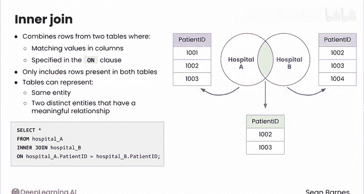
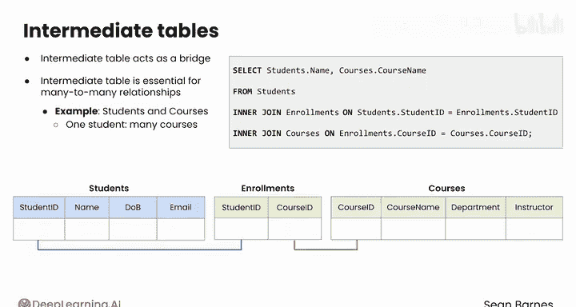

#  069：68_内连接 🧩


在本节课中，我们将学习 SQL 中的 **内连接（INNER JOIN）** 操作。内连接用于合并两个表中具有匹配值的行，从而获取更丰富的数据上下文。我们将通过具体示例来理解其工作原理和应用场景。

## 概述

在数据分析中，我们经常需要处理多个包含相同实体信息的表格。通过连接这些表格，我们可以找到共同的行，从而获得关于该实体的更丰富上下文。内连接是其中一种核心的连接方式。

## 内连接的基本概念

内连接将两个表中在指定列（`ON` 子句中定义）具有匹配值的行组合起来。这种连接**只包含同时存在于两个表中的行**。这些表格可以代表同一个实体，也可以代表两个具有有意义关系的不同实体。

其基本语法结构可以用以下伪代码表示：
```sql
SELECT 列名
FROM 表A
INNER JOIN 表B
ON 表A.共同列 = 表B.共同列;
```

## 内连接的应用示例

假设您有两家医院的病人记录，并且只想分析同时入住过这两家医院的病人。以下查询可以实现这个目标：

```sql
SELECT *
FROM hospital_A
INNER JOIN hospital_B
ON hospital_A.patient_id = hospital_B.patient_id;
```



此查询的输出结果将只显示同时去过 A 医院和 B 医院的病人。在这个案例中，需要假设两家医院使用相同的病人 ID 系统，因此同一病人在每家医院都有相同的 ID。

## 内连接的可视化理解

我们可以用韦恩图来可视化内连接。左边的圆圈代表第一个表（例如 A 医院的数据），右边的圆圈代表第二个表（例如 B 医院的数据）。


内连接代表两个圆圈重叠的交叉区域。只属于 A 医院或只属于 B 医院的病人不会被包含在内。因此，内连接最适合用于聚焦两个表之间的共享数据。

## 通过中间表进行连接

有时，两个表的数据无法直接连接，因为它们没有共同的字段。在这种情况下，可以使用一个中间表作为桥梁。

考虑一个涉及学生、课程和中间选课表的场景：
*   `students` 表包含学生信息，如 `student_id`、`name`、`date_of_birth`、`email`。
*   `courses` 表包含课程详情，如 `course_id`、`course_name`、`department`、`instructor`。
*   `enrollments` 选课表通过 `student_id` 和 `course_id` 列将学生与他们所选的课程关联起来。

要查找所有学生及其注册的课程，可以编写如下查询：

```sql
SELECT students.name, courses.course_name
FROM students
INNER JOIN enrollments ON students.student_id = enrollments.student_id
INNER JOIN courses ON enrollments.course_id = courses.course_id;
```

这个查询首先通过 `student_id` 这个共同字段将 `students` 表与 `enrollments` 表连接起来。然后，这个新形成的表再通过 `course_id` 这个共同字段与 `courses` 表连接。换句话说，查询利用 `enrollments` 表将学生和他们的课程联系起来。

以这种方式使用中间表对于处理“多对多”关系至关重要，例如学生和课程的关系（一个学生可以选多门课，一门课可以有多个学生）。



## 总结


本节课我们一起学习了 SQL 中的内连接操作。我们了解到，内连接是 SQL 中最复杂、最强大的操作之一，它通过匹配两个表中的共同值，来合并行并聚焦于共享数据。我们还学习了当表之间没有直接共同字段时，如何利用中间表作为桥梁进行连接，这对于处理现实世界中的多对多关系非常有用。

内连接是连接操作的基础。在下一节视频中，我们将学习另一种重要的连接类型：**外连接（OUTER JOIN）**。