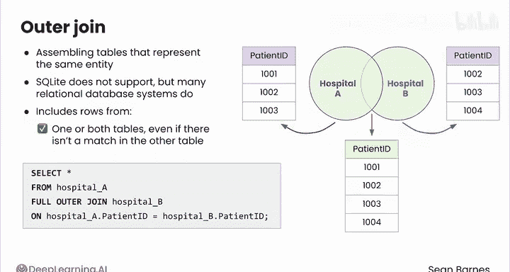
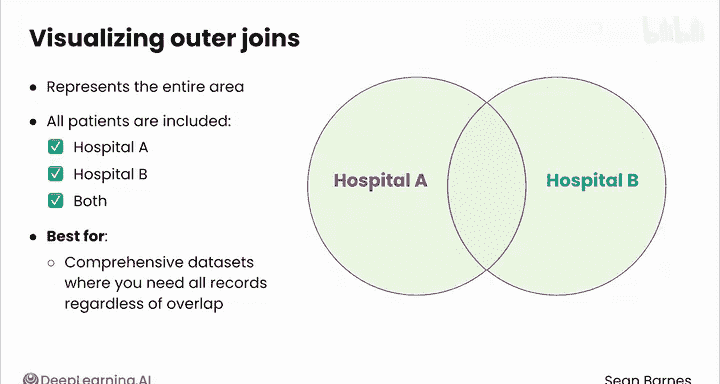

#  070：外连接 🧩


在本节课中，我们将学习如何使用外连接来组合多个数据表。外连接是一种强大的工具，它允许我们合并代表同一实体的表格，即使某些记录在另一个表中没有匹配项，也能将其包含在结果集中。

---

当处理代表同一实体的多个表格时，您可能希望组合成一个完整的数据集。即使某些记录不匹配，您仍然可以将这些表连接起来。组合代表同一实体的多个表通常使用外连接来完成。

请注意，SQLite 不支持外连接，但许多其他关系型数据库管理系统支持。您应该熟悉外连接的工作原理。

外连接包含来自一个或两个表的行，即使这些行在另一个表中没有匹配项。

例如，您可以编写如下查询：
```sql
SELECT * FROM hospital_A FULL OUTER JOIN hospital_B ON hospital_A.patient_id = hospital_B.patient_id;
```
查询输出将显示来自两家医院的所有患者的完整列表，包括重叠的部分。换句话说，结果会包含同时去过两家医院的患者，以及只去过其中一家医院的患者数据缺失的情况。

再次强调，您需要假设患者ID系统在医院之间是共享的。

您可以使用类似的维恩图来可视化外连接。对于内连接，左边是医院A的第一个表，右边是医院B的数据。

外连接代表整个区域，包括重叠和非重叠的部分。所有患者都被包含在内，无论他们去过医院A、医院B，还是两家都去过。



因此，当您需要所有记录而无论它们是否重叠时，外连接最适合用于创建全面的数据集。

虽然外连接有一些限制需要注意，但它们在汇集代表特定实体的大型组合数据集方面极其有用。

每种连接都有其适用场景，具体取决于您的数据和业务问题。作为数据分析师，您的职责是将业务目标与最合适的连接类型相匹配。

这带您来到了本课的结尾，也几乎来到了本课程的终点。

接下来，您将完成本课的练习作业和实践实验，然后处理评分项目，包括本课程的评分作业、实验和顶点项目。

在顶点项目中，您将探索餐厅特征，以更好地理解如何预测餐厅的检查表现。



完成顶点项目后，我将在最后一个视频中与您见面，讨论您作为数据分析师的下一步计划。

---

**总结**

本节课中，我们一起学习了外连接的概念和应用。我们了解到，外连接能够合并多个表格的所有记录，无论它们是否匹配，这对于创建全面的数据集至关重要。通过具体的SQL代码示例和维恩图解释，我们掌握了外连接的执行方式和适用场景。最后，我们明确了根据具体业务需求选择合适连接类型是数据分析师的关键技能。