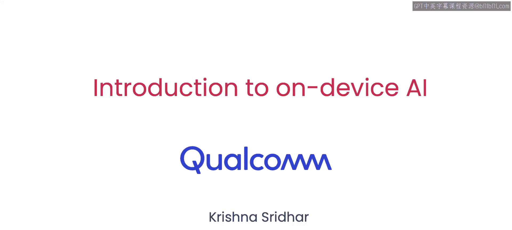
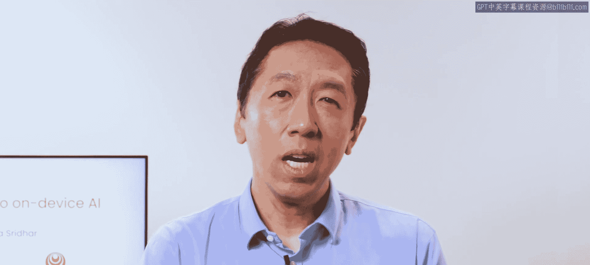
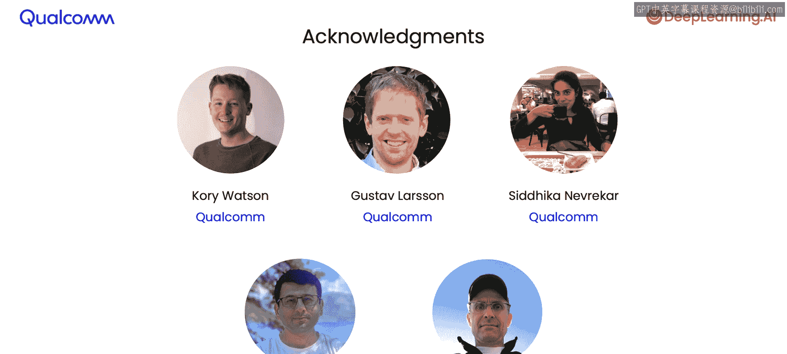

# 001：课程概述 🚀

在本课程中，我们将学习如何创建能够在设备上（如智能手机、摄像头、机器人等）本地运行的人工智能应用。我们将了解从模型转换、设备优化到性能验证和模型量化的完整流程，最终构建一个可实际运行的安卓应用。

现代智能手机可能拥有10到30万亿次的计算能力。当你拍照时，手机可能同时运行数十个AI模型，以实现实时的语义分割和场景理解。

## 设备端AI的优势与挑战

上一节我们了解了设备端AI的潜力，本节中我们来看看其核心优势与面临的挑战。将AI模型部署在设备端，可以降低延迟、提升隐私保护并提高运行效率。然而，这需要克服不同硬件和操作系统带来的差异。

尽管这些设备在硬件和操作系统上存在差异，但对于许多设备而言，部署模型的关键技术步骤原则实际上是相似的。

## 部署流程概览

以下是部署一个已训练好的模型（可能在云端训练）到设备端的主要步骤：

1.  **模型转换**：将模型从原始框架（如PyTorch、TensorFlow）转换为设备端运行时兼容的格式。在此过程中，模型被“冻结”成一个神经网络计算图，然后被转换为可在设备上执行的文件。
2.  **设备优化**：智能手机和边缘设备通常包含多种处理单元，如CPU、GPU和神经处理单元（NPU）。了解应用将运行的确切设备，可以进行针对性优化，有时能使模型运行速度提升高达10倍。
3.  **性能验证**：确保模型在众多不同设备上表现一致。这可能意味着需要在广泛的设备上验证其数值正确性，以防止因硬件差异导致模型在一台设备上运行正常而在另一台上出错的情况。
4.  **模型量化**：量化是运行设备端AI模型的常见步骤。如课程中将展示的实时分割应用，量化可以使应用运行速度提升数倍，同时显著减小模型体积。在我们的案例中，速度提升了约4倍，模型大小也缩小了约4倍。

## 讲师与课程目标

我们的讲师Krisishna Ser是高通公司的工程高级总监，拥有约十年的设备端AI经验。他构建的关键部署基础设施可能正运行在你的智能手机上。Krishna直接帮助部署了超过一千个模型在设备上，超过十万个应用使用了他及其团队构建的技术。

在本课程中，你将首先学习如何部署一个设备端模型。你只需几行代码就能部署你的第一个模型，该模型将对你的摄像头流进行实时分割。

你将学习四个核心概念：

*   **模型图捕获**：如何将模型捕获为一个可在设备上移植和运行的计算图。
*   **模型编译**：为该计算图针对特定设备进行编译的过程。
*   **硬件加速**：为了在设备上高效运行而对模型进行的硬件加速。
*   **数值验证**：在设备上验证该模型数值正确性的过程。

最后，你将学习如何量化模型，从而将性能提升近4倍，同时减少该模型的存储占用。最终，我们将把这个模型集成到一个你可以实际把玩的安卓应用程序中。

## 总结

本节课中我们一起学习了设备端人工智能的基本概念、优势、挑战以及完整的部署流程。设备端AI模型的部署正在兴起，为AI系统的构建者开启了大量激动人心的可能性。让我们进入下一个视频，开始动手实践。