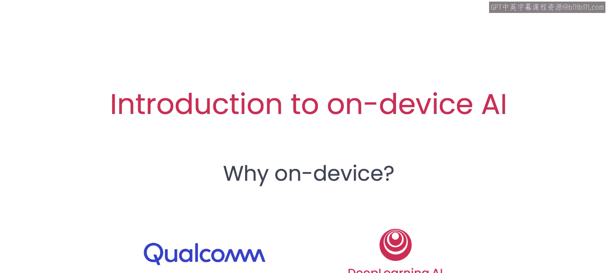
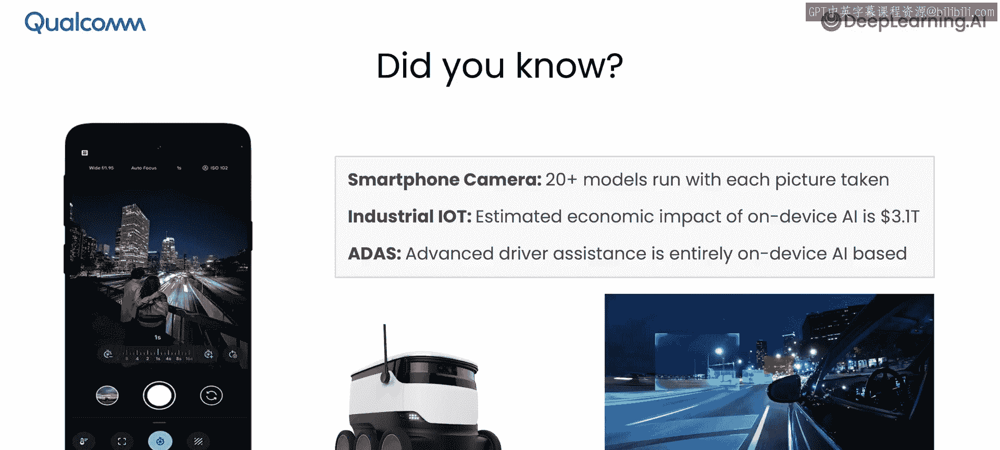
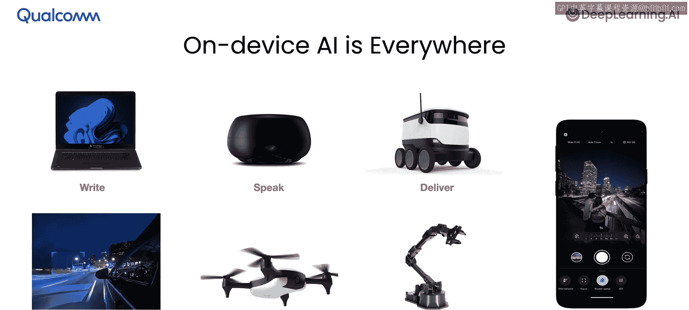
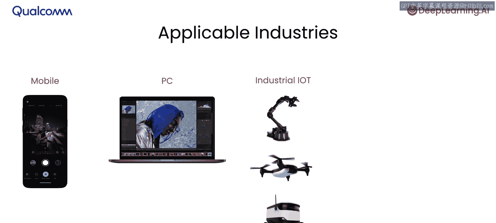
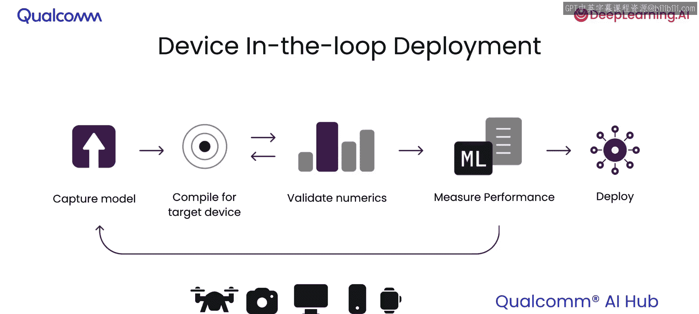
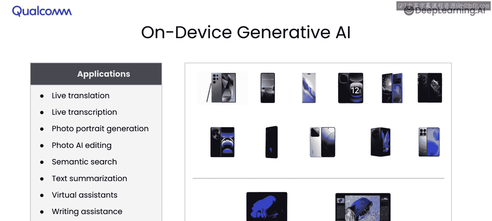
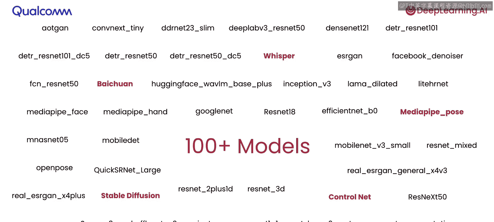

# 002：为何选择设备端AI？🤔

在本节课中，我们将学习设备端人工智能（On-Device AI）为何如此流行。我们将探讨其带来的多种益处，例如降低延迟、提升效率、节约成本以及保护隐私。同时，我们也将了解设备端AI在当今现实世界中的各种应用，包括实时语音检测、实时语义分割、实时目标检测以及物理活动检测。让我们开始吧。

## 无处不在的设备端AI 🌍

首先，让我们了解一些关于设备端AI的有趣事实。你是否知道，每次你用智能手机拍照时，都有超过20个AI模型在几百毫秒内运行，以捕捉完美的照片？在工业物联网领域，设备端AI的预估经济影响高达约3万亿美元。此外，每次你驾驶配备高级驾驶辅助系统的汽车时，其功能完全基于设备端AI。

设备端AI无处不在。当你在笔记本电脑键盘上打字时，它由一个在设备上运行的语言模型驱动。当你与智能音箱对话时，文本转语音功能完全在设备端运行。负责配送和组装的机器人大量使用设备端AI。用于工业和农业场景的景观扫描无人机也使用设备端AI。每次你在智能手机或笔记本电脑上编辑图片，以及每次你驾驶汽车，背后都有设备端AI的驱动。

## 设备端AI的应用场景 📱

以下是设备端AI在音频、图像和传感器方面的几个应用案例。

**音频与语音应用**包括：
*   文本转语音
*   语音识别
*   机器翻译
*   音频降噪

**图像与视频应用**包括：
*   照片分类
*   二维码检测
*   虚拟背景分割

**传感器应用**包括：
*   物理活动检测
*   键盘输入模型
*   数字手写识别

所有这些都由设备端AI驱动。更令人着迷的是，你甚至可以混合音频、图像、视频、语音和传感器等多种模态，创造出多模态的设备端AI模型。

设备端AI最流行的应用行业包括移动智能手机行业、个人电脑行业、工业物联网行业以及汽车行业。

## 为何选择设备端AI？🔍

现在，让我们看看为何要在设备上运行模型。主要有四个原因。

**第一，成本效益高。** 因为你可以利用本地所有可用的计算资源，无需额外的云计算资源。

**第二，效率高。** 因为你可以本地处理数据，无需将其发送到云端、接收结果，然后再在本地处理。这整个过程在计算上变得更加高效。

**第三，保护隐私。** 因为你的数据将保留在你的设备上，永远不会离开它。

**第四，实现个性化。** 因为让模型在你的设备上本地定制，无需任何外部数据，可以创造出独特的个性化体验。

## 如何部署设备端模型？🚀

上一节我们介绍了选择设备端AI的原因，本节中我们来看看如何部署模型到设备上。我们将介绍一种新的部署方式，它能让你将在云端训练好的模型，在大约五分钟内就能在设备上运行。

这个过程主要包括四个步骤。

**第一步，捕获模型为计算图。** 你将获取模型的计算图表示。

**第二步，为目标设备编译计算图。** 你将把捕获的计算图编译成适合目标设备的形式。

**第三步，在目标设备上验证模型的数值准确性。** 你将确保模型在部署设备上的计算结果正确。

**第四步，在设备上测量性能。** 你将评估模型在设备上的运行效率。

所有这些步骤都需要一个真实的设备参与。因此，你将使用一个“设备在环”的流程来完成这四个步骤。最终，当这四个步骤完成后，你将获得一个可以在设备上部署并集成到应用程序中的成品。

为了使这个过程极其顺畅，你将使用高通的AI Hub平台。该平台自动化了捕获、编译、验证和性能测量这四个步骤，并为你提供所需的设备，让你可以在大约五分钟内完成整个过程。

## 设备端AI与生成式AI ✨

设备端AI在生成式AI应用中也极为流行。这包括实时翻译、实时转录、照片生成、基于AI的照片编辑、语义搜索、文本摘要、各种虚拟助手、写作辅助以及图像生成等。所有这些都是在你的智能手机或笔记本电脑上商业部署的设备端AI应用。

## 可部署的模型集合 📚

以下是当今可以在智能手机、笔记本电脑、物联网设备或汽车上部署的各种模型集合。这包括像Llama和Bichn这样的语言模型，像Whisper这样的语音模型，像MediaPipe这样的面部检测模型，Stable Diffusion以及超过100多个模型。如今，所有这些模型都非常容易部署到设备端。

## 总结 📝

本节课中，我们一起学习了设备端人工智能为何如此重要和流行。我们了解了它在成本、效率、隐私和个性化方面的核心优势，探索了其在音频、图像、传感器及生成式AI领域的广泛应用。我们还简要了解了将云端模型快速部署到设备端的关键步骤。设备端AI正推动着智能手机、汽车、物联网等行业的创新，为我们的数字生活带来更快速、更安全、更个性化的体验。