# 003：3.L2 在设备端部署分割模型 🚀

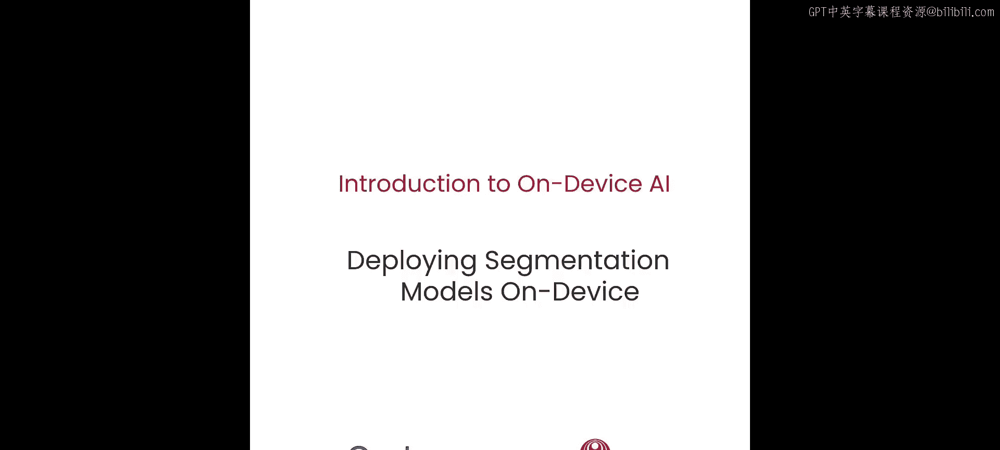

在本节课中，我们将学习如何在设备端部署你的第一个模型，仅需几行代码。我们将介绍实时图像分割技术，了解该任务中流行的模型，并选择一个先进的模型将其部署到设备上。我们还将进行数值正确性验证和性能测试，并最终在真实的智能手机上看到推理过程。


## 设备端AI的应用场景

上一节我们介绍了课程目标，本节中我们来看看设备端人工智能的几种常见应用。

以下是设备端AI的几个主要应用方向：
*   **实时目标检测**：用于检测人、人脸和二维码。
*   **语音识别**：将语音输入转换为文本。
*   **姿态估计**：基于实时图像或视频流预测人体姿态。
*   **图像生成**：输入文本，由生成式AI渲染出对应的图片。
*   **超分辨率**：将低分辨率图像提升为高分辨率。
*   **图像分割**：这是本节课的重点。

你可以在 `AIhub.callcomm.co` 上探索针对所有这些主题的各种模型。同时，GitHub和Hugging Face上也有相关教程和资源，帮助你让这些模型在设备端运行起来。

## 什么是图像分割？

了解了应用场景后，我们来深入了解一下本节课的核心——图像分割。

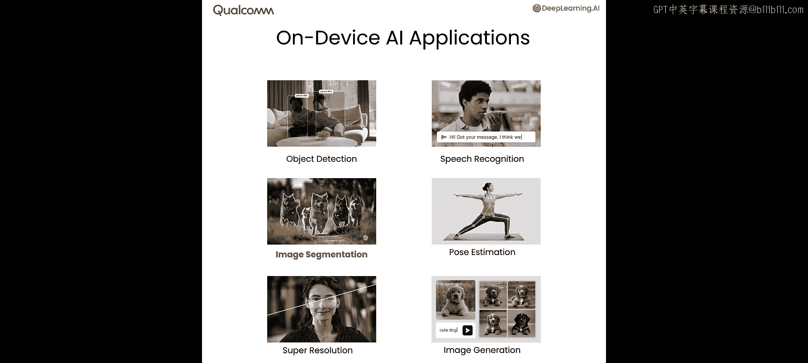

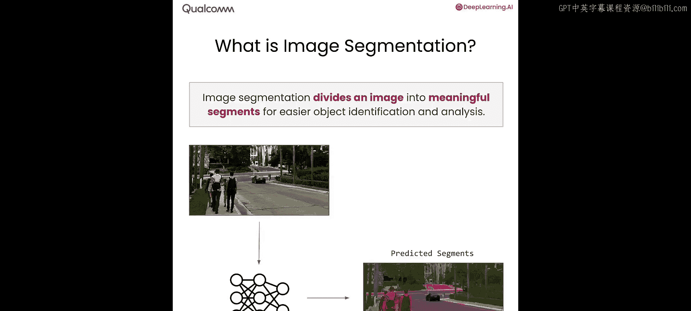

图像分割的任务是，给定一张图像，将其分解为所有有意义的片段，以便进行分析和更轻松的对象识别。

举个例子，假设你有一张街道的图像。图像分割模型接收这张图像，并提供图像中预测区域的各种不同片段。例如，粉色代表道路，绿色代表树木，浅绿色代表人行道，红色代表人。

## 图像分割的类型

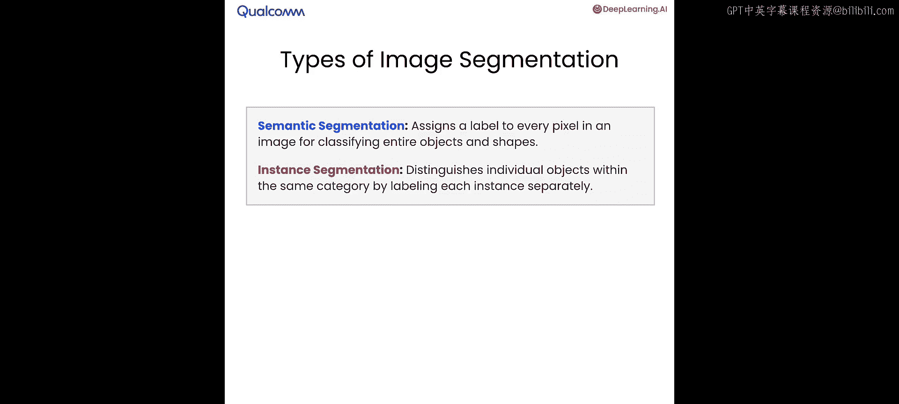

图像分割有多种类型，其中最流行的两种是语义分割和实例分割。

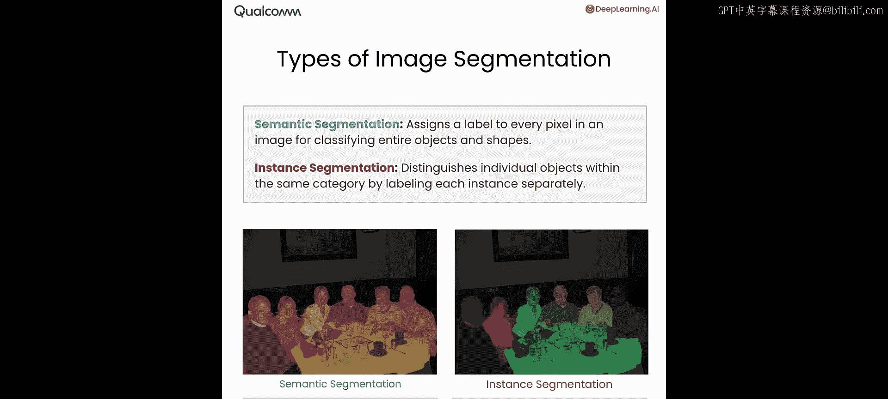

*   **语义分割**：如左侧蓝色示意图所示，每个像素都指向一个特定的类别。图中，黄色代表桌子，粉色代表人。
*   **实例分割**：如右侧示意图所示，每个像素不仅指向一个类别，还指向同一类别内的单个实例。图中，每个人都被标记为不同的颜色，表示他们是“人”这一类别中的独立实例。

## 图像分割的应用

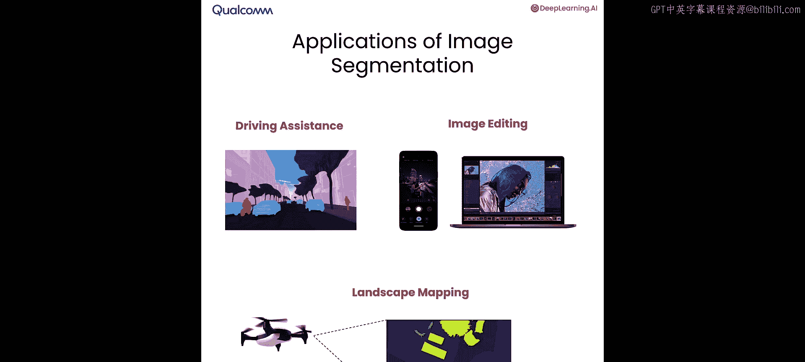

图像分割有许多实际应用。
*   它被部署在所有高级驾驶辅助系统中，用于分别标记道路、汽车和行人。
*   在图像编辑软件中极为流行，用于对头发或脸部应用滤镜，或模糊背景。
*   在视频会议软件中无处不在，用于在通话时模糊你的背景。
*   最后，它还用于无人机测绘地形，特别是在农业和工业应用中。

## 实时分割的挑战

在本节课中，你将部署一个实时分割模型。这意味着图像的处理和分割必须即时完成，并且要逐帧进行。

这段视频描绘了在街景摄像头上执行的实时分割。浅蓝色是汽车，灰色是道路，深绿色是树木，粉色是行人，蓝色是天空。所有这些都必须逐帧应用。

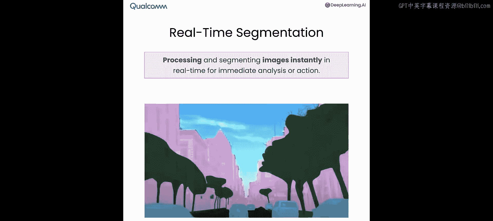

从系统角度来看，这极具挑战性。举个例子，假设你需要以每秒30帧的速度处理所有这些数据。每秒30帧意味着在下一帧到达之前，你只有大约33毫秒来处理整个帧。这意味着你的整个AI模型必须在30毫秒内运行完毕，以便在下一帧到达之前完成所有所需的分析。

## 流行的分割模型

有多种不同的模型用于语义分割，以下是四种最流行的模型。

以下是四种流行的语义分割模型：
1.  **ResNet**：使用残差连接来训练非常深的网络，在分割应用中相当流行。
2.  **高分辨率网络**：另一种流行的实时分割算法。该网络通过在网络中保持高分辨率表示来捕获更精细的细节。
3.  **特征聚合网络**：专注于从不同尺度聚合各种不同的特征，以获得尽可能好的预测细节。
4.  **双动态分辨率网络**：采用双路径架构来平衡效率和准确性。

所有这些网络都可以完全在设备本地运行。

## 聚焦FFNet网络

在本节课中，我们将重点介绍一个名为 **FFNet** 的网络，即快速特征网络。

该网络具有简单的编码器-解码器架构，带有类似ResNet的主干网络和一个小的多尺度头部。从准确性的角度来看，该网络的性能与之前介绍的HRNet或FANet等复杂的语义分割网络一样好，但它有一个巨大的优势：计算效率非常高，因此非常适合在设备上部署。

该网络的另一个优点是高度可配置。你可以根据环境需求和应用精度需求，拥有不同大小的编码器和解码器。

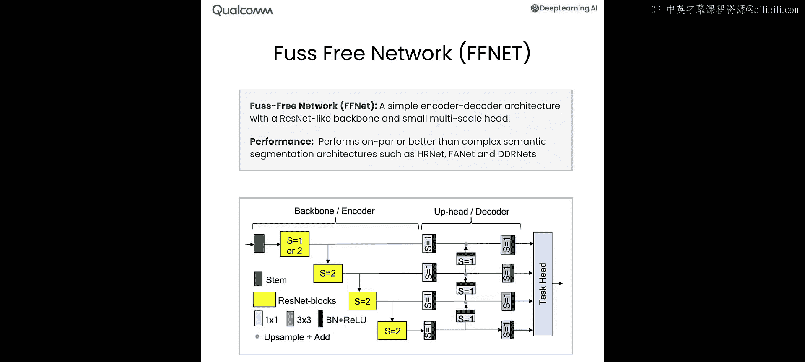

以下是本节课中你将探索的几种FFNet架构变体。

以下是FFNet架构的几种变体：
*   **FFNet-40S、54S、78S**：基于ResNet主干，在1024x2048的高分辨率上运行。模型大小约为55MB到100MB，参数在1300万到2700万之间，在设备上运行需要约62到96 GigaFLOPs的计算量。
*   **FFNet-78-LowRes、122-LowRes**：在512x1024的较低分辨率上运行。模型稍大，约100到130MB，参数约2600万到3200万。低分辨率显然需要更少的操作，因此所需的GigaFLOPs也更少。

## 在设备上部署模型

现在，让我们看看如何在设备上部署所有这些网络。

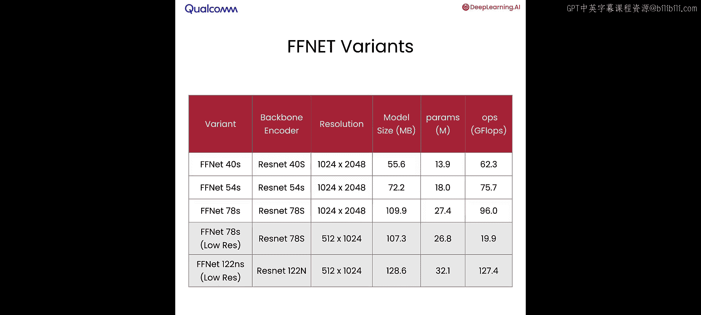

在这个Notebook中，你将在设备上部署一个实时分割模型。本Notebook的目标是让你对如何在设备上部署模型有一个高层次的概述。在下一课中，你将更详细地学习本Notebook中涉及的每个概念。

本Notebook部署的是FFNet模型。我已分享FFNet论文的链接供你参考。

现在，你将探索FFNet网络的各种不同变体，并使用 **Qcomm AI Hub Python包** 来实现，该包包含许多可以直接试用的PyTorch模型。

为了获取特定模型的计算摘要，你将使用 **torchinfo包**，它可以提供关于参数总数、模型大小以及计算复杂性的详细描述。

现在，让我们运行一些代码来提供模型的计算摘要。

```python
# 示例代码：使用torchinfo获取模型摘要
import torchinfo
# ... 加载FFNet预训练权重 ...
summary = torchinfo.summary(model, input_size=(1, 3, 1024, 2048))
print(summary)
```

这段代码获取了输入分辨率为1024x2048的模型的预训练权重，并使用torchinfo包为该特定输入分辨率提供模型摘要。摘要包含参数数量、计算复杂性以及网络大小。

如果我们向下滚动，可以看到参数总数约为1390万，全部可训练。该网络的总计算复杂度约为62 GigaFLOPs，该特定模型的输入大小约为25MB。这让你大致了解这个模型有多大、需要多少计算能力以及部署该模型所需的总参数数量。

我为你创建了一个练习，以重现讲座中展示的表格。这个练习允许你探索FFNet架构的不同变体以及每个变体相关的计算复杂性。这里突出显示的前三个变体在1024x2048的较高分辨率上运行，而接下来的两个变体在512x1024的低分辨率变体上运行。你可以获取每个FFNet变体的计算摘要，包括参数数量、计算复杂性和模型大小。

## 设置AI Hub进行设备端部署

下一步是为你设置AI Hub，以配置设备在环部署。

AI Hub作为一个Python包提供。接下来，我们将为设备在环部署设置Qcomm AI Hub。你可以将其安装为Python包并使用API令牌进行配置。

现在，你将在Notebook中运行FFNet-40S网络的简单演示。

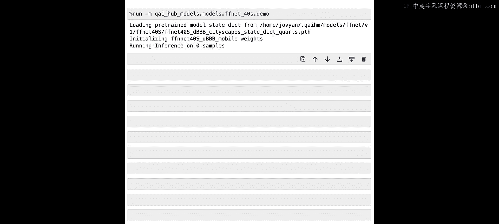

```python
# 示例代码：运行FFNet-40S推理
from ai_hub import load_model
model = load_model('ffnet-40s')
# ... 加载图像并运行推理 ...
predictions = model(image)
```

这行特定的代码从源直接下载FFNet-40S模型的预训练权重，并在简单图像上运行示例推理，提供该模型在该特定图像上的预测结果。

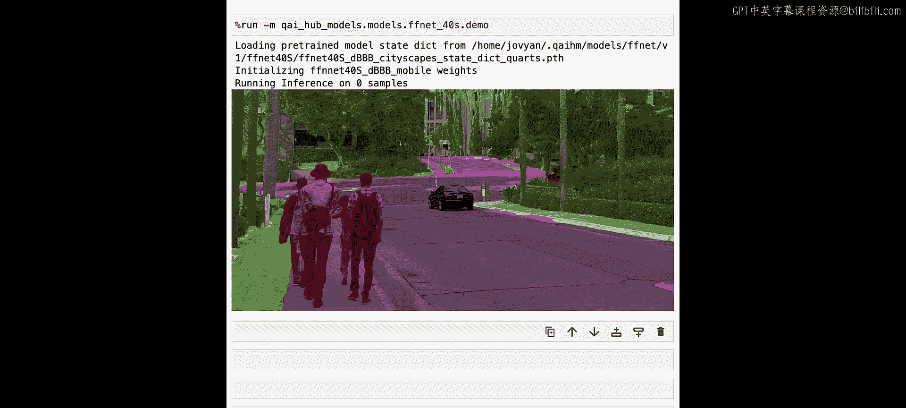

这段特定的代码在预先提供给网络的样本图像上运行推理，并提供带有注释的预测结果：红色代表人，绿色代表树，灰色代表道路，蓝色代表其他汽车。请注意，这个特定的演示完全在云环境的Notebook中运行。本节课的目标是让你能够获取这个特定的模型和示例，并在智能手机上运行它。

## 在真实智能手机上运行模型

现在，让我们在真实的智能手机上运行这个特定的模型。

为此，我们将使用 `FFNet_export` 函数并指定一个设备，例如三星Galaxy S23。

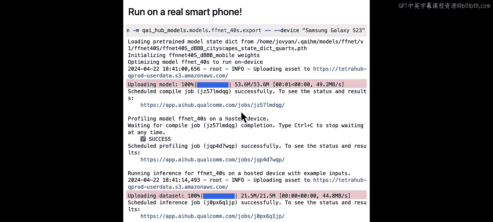

运行这段特定的代码行会完成幻灯片中展示的所有四个步骤：
1.  模型从PyTorch获取，并针对三星Galaxy S23进行转换和编译（通过这个特定的编译任务完成）。
2.  编译完成后，在云中配置一台真实的三星Galaxy S23物理设备。
3.  一旦这个真实设备配置好，就会运行性能分析，以了解这个特定模型在设备上运行需要多长时间。
4.  最后，性能分析完成后，我们在设备上对之前展示的相同样本运行推理，以便你了解在设备上运行的准确性如何。

这个过程大约需要2到5分钟，具体取决于服务器的负载。

## 性能与正确性验证

这个特定脚本的结果是一个非常简单但重点突出的性能摘要。

摘要显示，该模型在三星Galaxy S23上运行，耗时约22毫秒，总操作符数量约为92个，并且完全在神经处理单元上运行。你将在下一课中详细探讨这些概念中的每一个。

数值正确性也在这里显示。它展示了一个称为 **峰值信噪比** 的特定度量标准，用于比较在设备上运行的推理与在Notebook本地环境中运行的推理的数值正确性。通常，任何高于30的值都被认为是良好的。这个特定的PSNR是62，这意味着设备端推理的结果与云端几乎完全一致。

请注意，其中许多链接你可能无法访问，因此我们为你提供了一组简单的可探索链接，你可以探索FFNet的所有变体，其中包含详细视图，描述了性能、层数以及FFNet架构所有不同变体的内存消耗。

## 在物理设备上运行最终演示

在本Notebook的最后一步，你将在物理设备上运行图像分割模型。

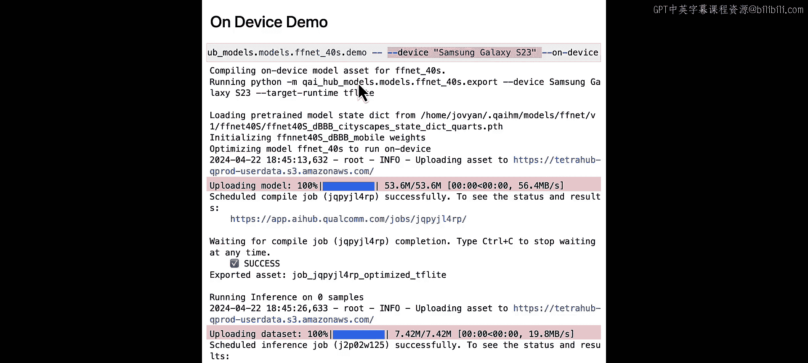

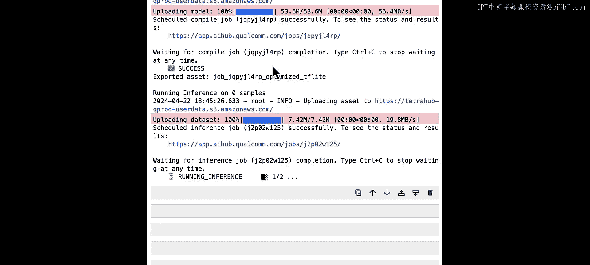

这将运行你之前在Notebook中看到的相同演示，但不是在本地Notebook环境中运行，而是在云中为你配置的三星Galaxy S23上运行。

请注意，这行特定的代码需要几分钟时间。在这几分钟内，PyTorch模型被发送到服务器并针对三星Galaxy S23进行编译，在云中为你配置一台三星Galaxy S23以便访问，图像随后通过为设备编译的模型传递，输出预测结果返回给你，然后你将看到来自三星Galaxy S23的结果显示输出。

好的，太棒了。你看到了结果。它看起来和我在Notebook中得到的结果完全一样。红色是人，蓝色是汽车，绿色是树木，灰色是道路。但这个特定的推理结果来自一台真实的三星Galaxy S23。

## 课程总结

在本节课中，我们一起学习了以下内容：
*   了解了FFNet的各种不同变体。
*   探索了每个变体的计算复杂性。
*   能够在Notebook本地环境中运行演示。
*   能够为三星Galaxy S23导出模型。
*   能够测量FFNet-40S变体的性能，大约为22毫秒。
*   注意到云端推理与设备端推理之间的PSNR约为62，这意味着它提供了与云端相同的结果。
*   最后，你看到了所有这些工作的端到端演示，你提供了一张图像并得到了返回的结果，它在视觉上与你在云端得到的结果完全相同。

在下一课中，我们将更详细地探讨这些概念，分解它们，理解每个领域背后发生的事情，以便你完全理解在设备上部署模型需要什么。

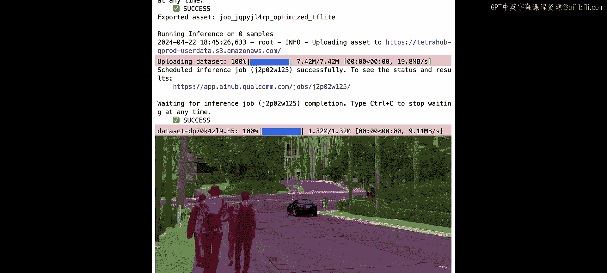

好的，我们下节课见。