# 004：L3 准备设备端部署 🚀

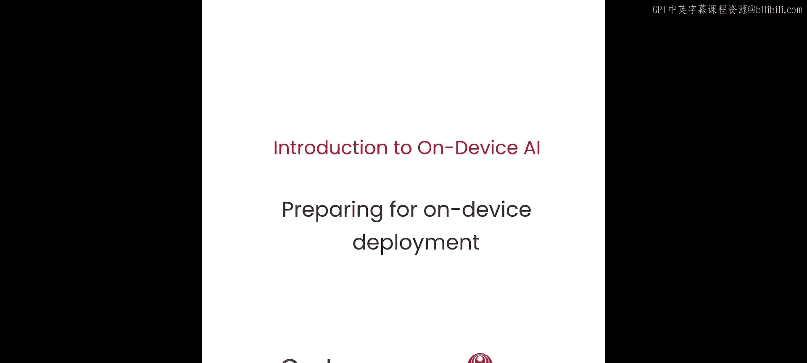


在本节课中，我们将学习设备端部署的四个核心概念。我们将了解如何将在云端训练的模型适配并部署到移动或嵌入式设备上，并确保其性能与准确性。

---

## 图捕获 📊

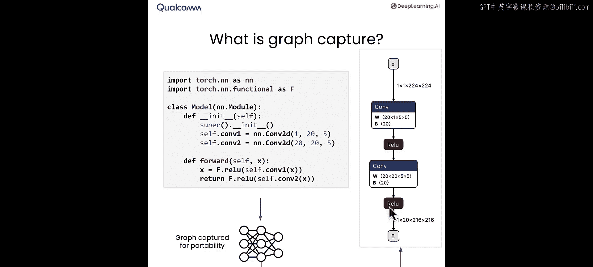

上一节我们介绍了设备端AI的基础，本节中我们来看看如何将模型的计算过程“打包”以便部署。这个过程称为**图捕获**。

图捕获是指将神经网络模型的计算过程，从代码表示转换为一个可移植的图表示。例如，一段包含两个卷积层（`conv1` 和 `conv2`）及其后ReLU激活函数的PyTorch代码，可以被捕获为一个计算图。这个图以输入 `x` 为起点，清晰地展示了数据流经卷积和激活函数的路径。

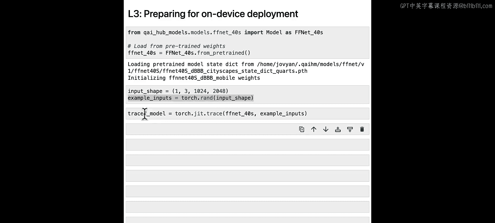

以下是图捕获的关键步骤：
1.  导入预训练模型（例如 `FFNet40S`）。
2.  定义模型所需的输入形状，例如一个3通道、尺寸为 `1024x2048` 的张量。
3.  生成随机输入数据用于追踪。
4.  使用 `torch.jit.trace` 函数执行追踪，该函数会记录模型对输入数据的完整计算过程。

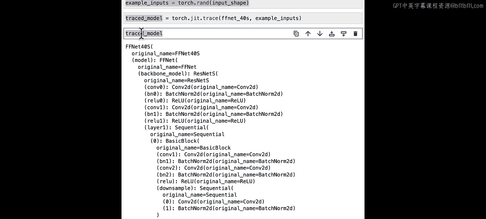

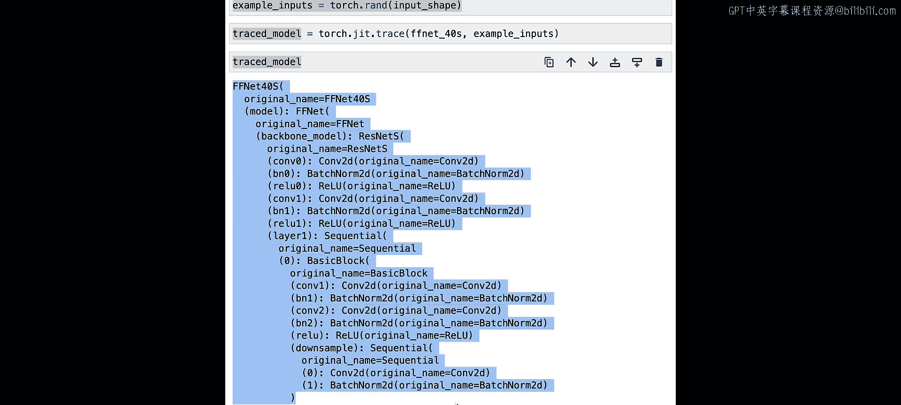

最终，你将获得一个**PyTorch追踪模型**，它封装了模型的所有计算，并且是独立于原始代码的、可移植的格式，便于后续部署。

---

## 设备端编译 ⚙️

现在，我们已经有了一个捕获了计算过程的图，下一步是将其编译成能在目标设备上高效运行的格式。

以下是编译模型的主要步骤：
1.  设置编译环境（例如Qualcomm AI Hub）。
2.  从可用设备列表中选择一个目标设备（如三星Galaxy S23）。
3.  使用 `submit_compile_job` API，提交追踪模型和输入规格。
4.  云端服务会针对该特定设备优化模型，并生成一个**目标模型**。

编译生成的模型文件（如 `.tflite`）与特定的运行时兼容。主流的设备端运行时包括：
*   **TensorFlow Lite**：适用于Android应用，高效且节能。
*   **ONNX Runtime**：适用于Windows应用。
*   **Qualcomm AI Engine**：适用于高通硬件上的嵌入式应用。

你可以通过在编译API中指定 `target_runtime` 选项来选择不同的运行时。

---

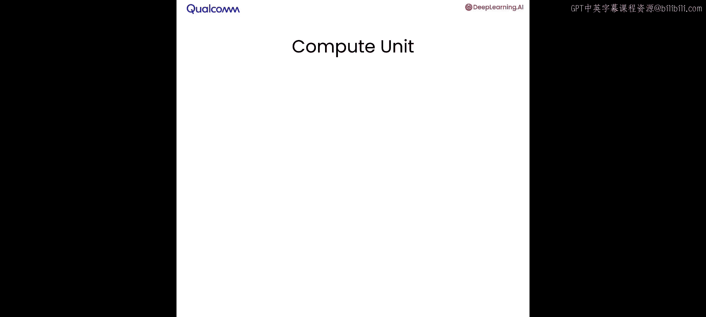

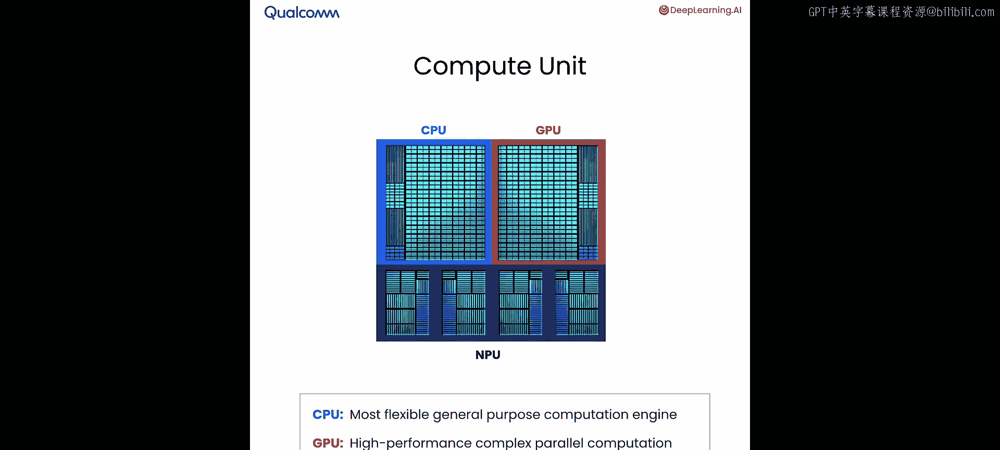

## 硬件加速与性能剖析 ⚡

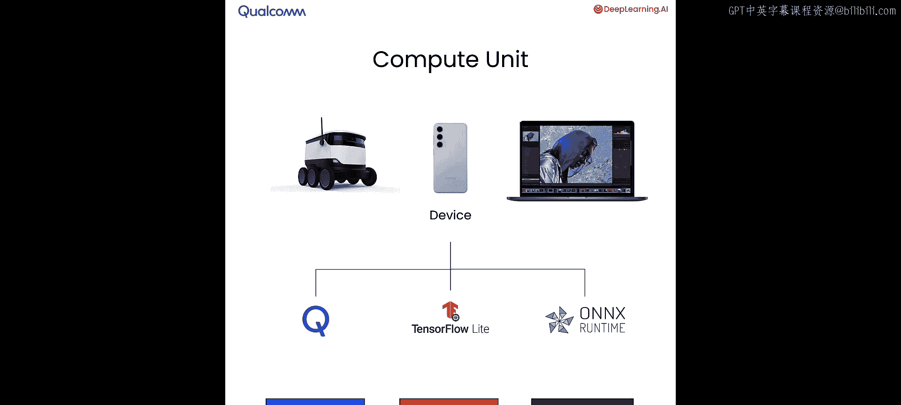

模型编译完成后，我们需要了解它在设备上的实际性能。现代设备通常拥有三种计算单元：
*   **CPU**：通用计算单元，灵活易编程。
*   **GPU**：擅长高性能并行计算。
*   **NPU（神经网络处理单元）**：为神经网络计算高度优化，能效极高（可比CPU高效10倍），但灵活性较低。

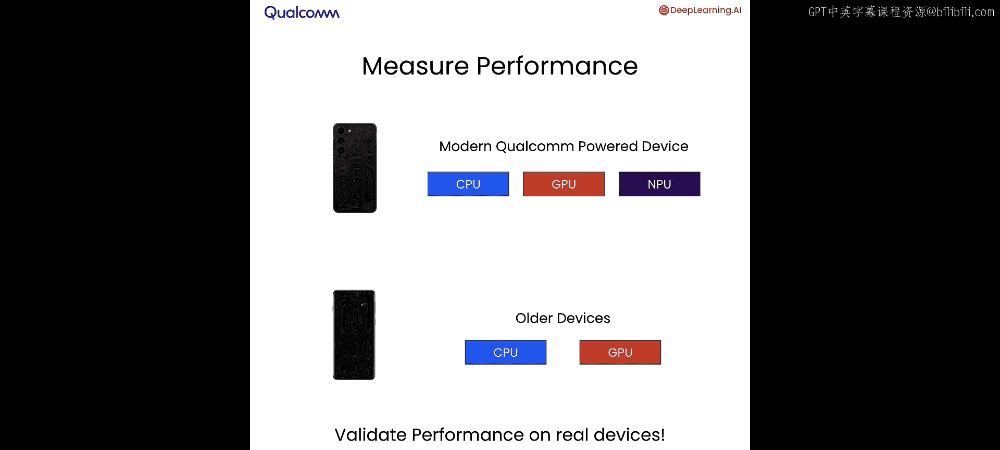

不同的运行时都有相应的后端，可以调用这些计算单元。作为开发者，你可以选择将计算任务分配给特定的单元。

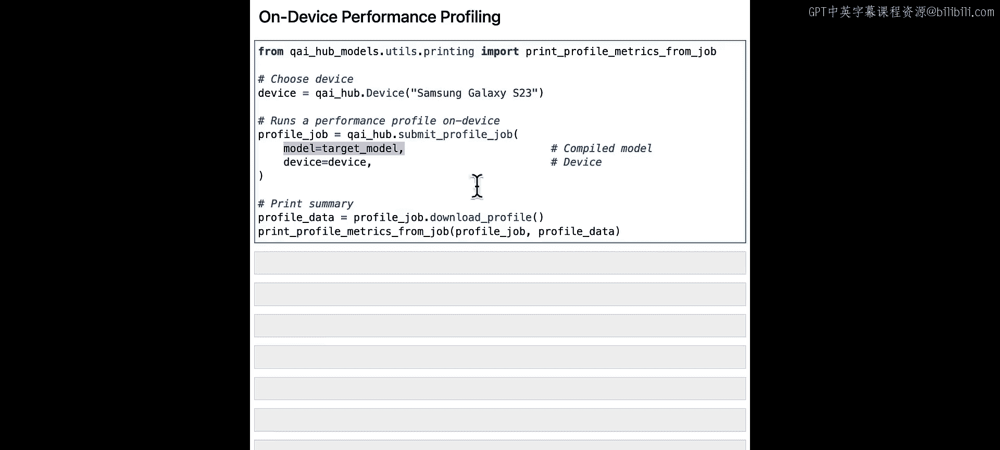

为了评估性能，我们需要进行**性能剖析**：
1.  使用 `submit_profile_job` API，将编译好的目标模型提交到选定的设备（如三星Galaxy S23）。
2.  云端会在真实设备上运行模型并收集性能数据。
3.  下载剖析结果，可以查看关键指标，例如模型在NPU上的推理时间（如27.9毫秒）和内存占用（3-5 MB）。

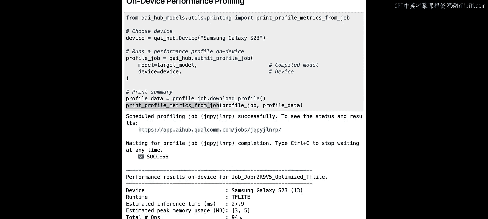

你还可以通过指定 `compute_unit` 选项（如 `CPU`、`GPU`、`NPU`），来对比模型在不同计算单元上的性能表现。

---

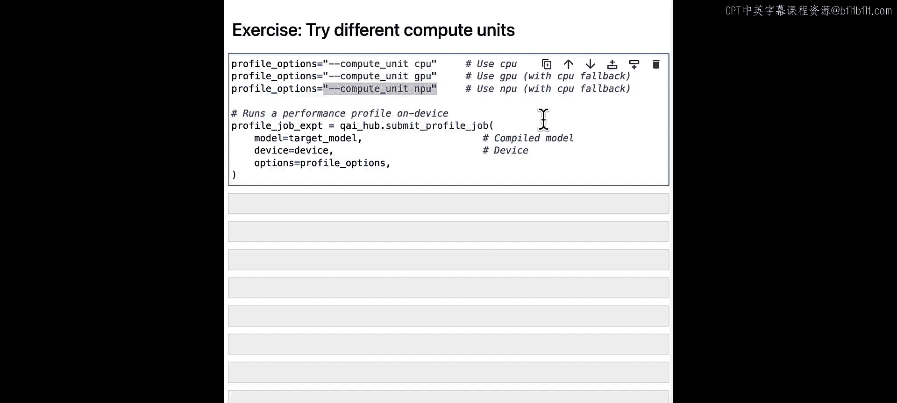

## 设备端数值正确性验证 ✅

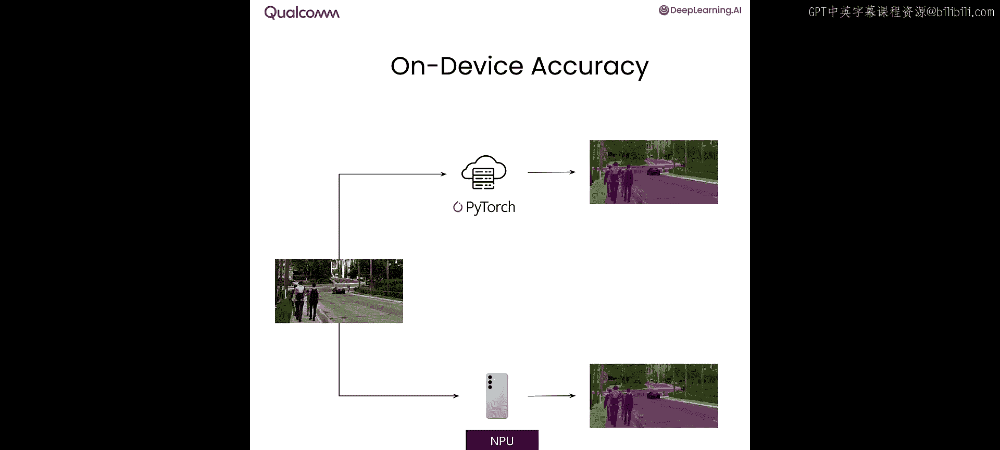

确保模型在设备上运行的结果与云端一致至关重要。以下是验证数值正确性的流程：

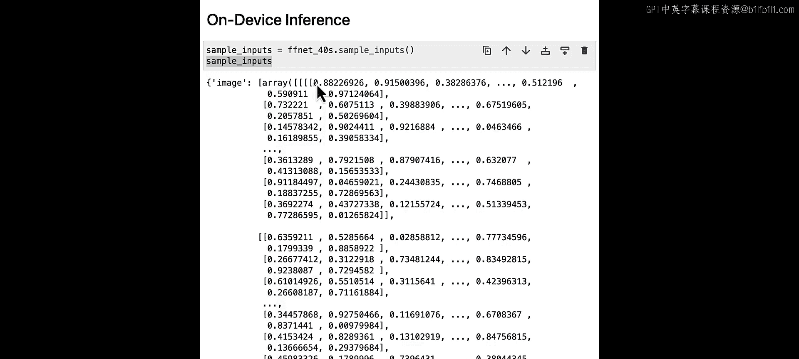

1.  **云端推理**：在笔记本环境中，使用PyTorch对样本输入进行推理，得到参考输出。
    ```python
    # 示例：在云端运行推理
    cloud_output = pytorch_model(sample_input)
    ```
2.  **设备端推理**：使用 `submit_infer_job` API，将相同的样本输入和编译好的目标模型发送到云端托管的真实设备（如三星Galaxy S23）上运行推理。
3.  **结果对比**：下载设备端的推理输出，与云端输出进行比较。通常使用**峰值信噪比（PSNR）** 来衡量两者差异。
    *   PSNR值大于30通常认为匹配良好。
    *   示例中PSNR约为60，表明设备端与云端结果高度一致，模型可以放心部署。

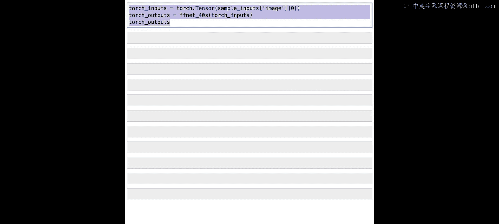

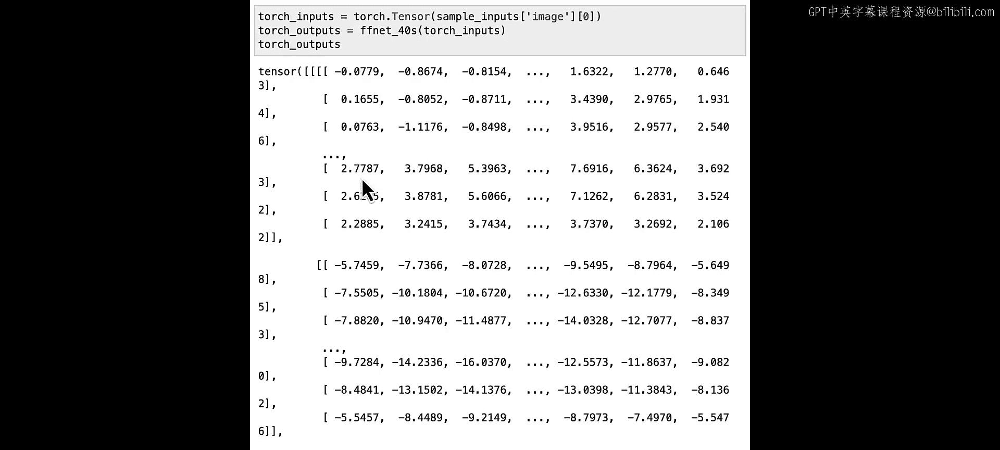

验证成功后，即可使用 `get_target_model` API 下载最终的可部署模型文件。

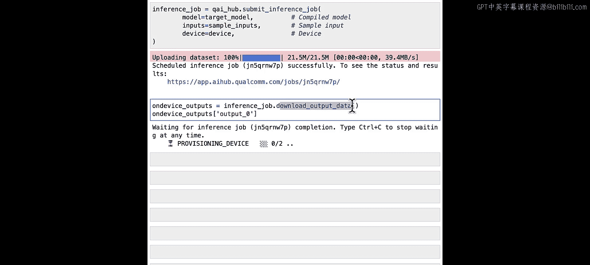

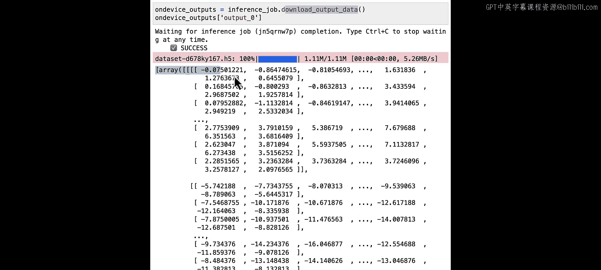

---

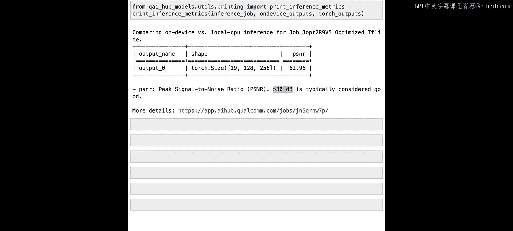

## 总结 🎯

本节课中我们一起学习了设备端模型部署的四个核心步骤：
1.  **图捕获**：使用 `torch.jit.trace` 将PyTorch模型转换为可移植的计算图。
2.  **设备端编译**：针对目标设备和运行时，将图编译成高效的部署格式。
3.  **性能剖析**：在真实设备上评估模型在不同计算单元（CPU/GPU/NPU）上的性能，确保满足约束。
4.  **数值验证**：通过对比云端与设备端的推理结果，确保模型计算的正确性。

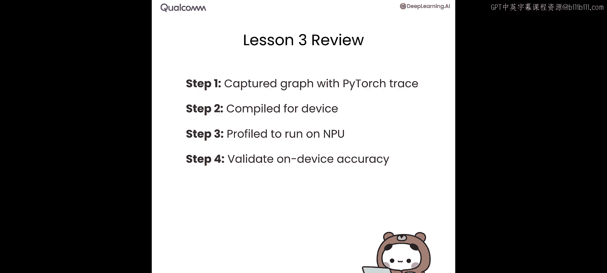

完成这些步骤后，你就得到了一个经过验证、性能达标、可在设备上运行的模型。在下一课中，我们将学习如何通过量化技术，让这个模型变得更小、更快。