# 005：模型量化 🧮

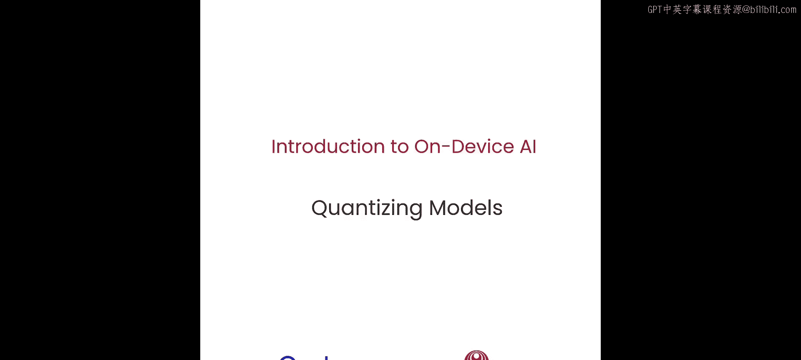

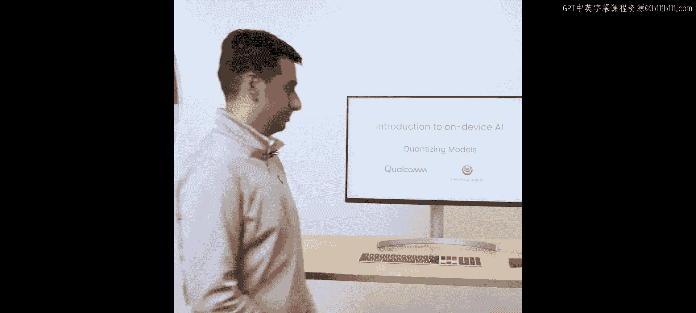

在本节课中，我们将要学习模型量化的概念与实践。量化是一种通过降低模型数值精度来提升计算速度、减小模型大小的关键技术。我们将了解其原理、优势，并通过一个实际案例演示如何对模型进行量化，最终实现模型大小和推理速度的显著提升。

## 什么是量化及其优势

上一节我们介绍了模型优化的基础，本节中我们来看看量化技术。量化是将模型从高精度（如32位浮点数）转换为低精度（如8位整数）表示的过程。

量化主要带来三大好处：
1.  **减小模型大小**：使模型能更好地存储在容量有限的设备上。
2.  **加快处理速度**：由于计算量减少，模型运行更快。
3.  **降低功耗**：这对电池供电的设备至关重要。

量化可以使模型**缩小4倍**，并**提速高达4倍**。

## 量化原理详解

让我们深入了解量化的具体原理。假设你有一个浮点张量，每个值占用32位（4字节）。量化可以将其转换为每个值仅占8位（1字节）的整数表示。

浮点数值与整数值之间的转换通过**缩放因子（scale）** 和**零点（zero point）** 两个参数实现。浮点范围通常远大于整数范围。

转换公式如下：
*   **量化（浮点 -> 整数）**: `quantized_value = round(float_value / scale) - zero_point`
*   **反量化（整数 -> 浮点）**: `float_value = (quantized_value + zero_point) * scale`

由于精度损失，转换过程会引入**量化误差**。量化过程的目标就是在转换时使这个误差最小化。

## 量化类型与方法

量化主要有两种类型：
*   **权重量化**：仅降低模型权重的精度，主要优化存储。
*   **激活量化**：对激活值也应用低精度，从而利用低精度计算加速整个推理过程。

根据精度选择，量化有不同的配置，例如：
*   **W8A8**: 权重和激活都量化为8位。
*   **W8A16**: 权重量化为8位，激活保持16位。
*   **W4A16**: 权重量化为4位，激活保持16位（常用于大语言模型）。

有两种常见的量化实施方式：
1.  **训练后量化**：模型训练完成后，使用校准数据（通常几百个样本）来确定最佳量化参数，以最小化精度损失。
2.  **量化感知训练**：在模型训练过程中就模拟量化效应，让模型学习适应低精度表示，通常能获得更精确的量化模型。

## 实践：在Notebook中进行量化

现在，让我们通过一个Notebook实例来看量化如何实际操作。你将学习如何准备校准数据集、准备模型进行量化、执行训练后量化，并验证模型的精度和设备端性能。

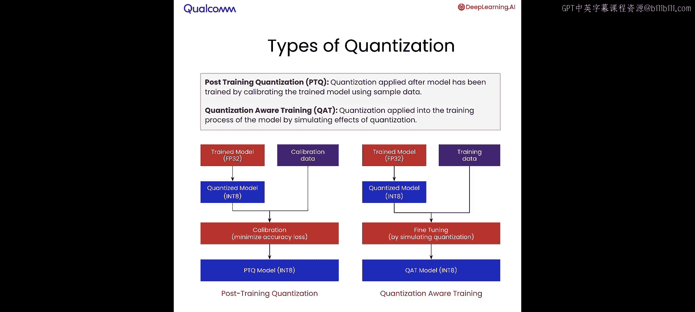

### 准备校准数据

首先，需要设置校准数据。我们将使用包含约100张RGB城市街景图像的数据集。模型的输入分辨率是 `3 x 1024 x 2048`（通道 x 高 x 宽）。下载数据集后，会留出一小部分用于测试。

### 建立预处理与后处理流程

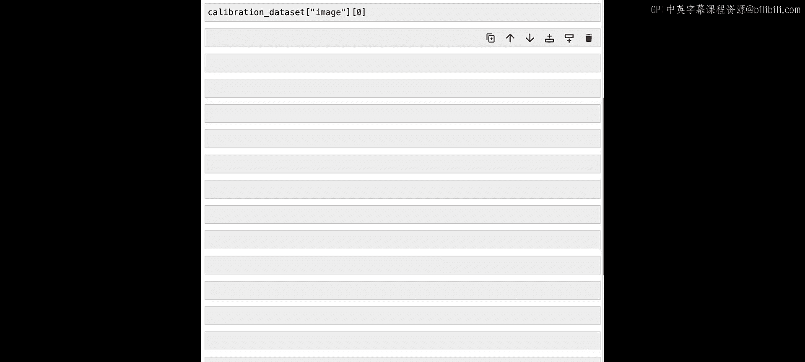

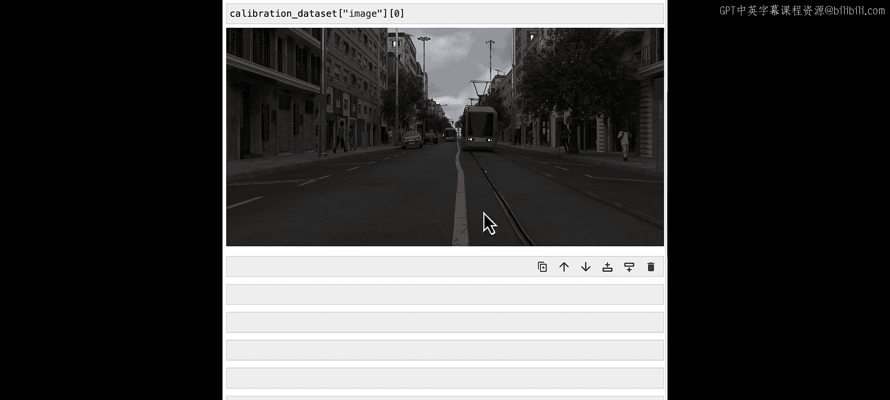

接下来，建立校准或推理流程。使用 `torchvision.transforms` 包中的 `ToTensor` API将图像转换为PyTorch张量，并将其维度调整为 `1 x 3 x 1024 x 2048` 的四维数组。

同时，需要定义后处理函数。该函数接收模型的输出张量，将其上采样到原始输出尺寸，并将预测结果叠加到原始图像上以便可视化。

### 加载并测试浮点模型

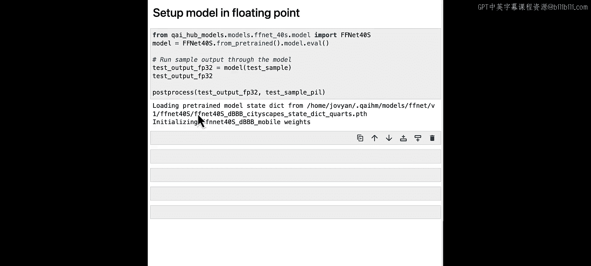

预处理和后处理设置好后，加载浮点精度模型。使用PyTorch的 `from_pretrained` API加载模型。然后，将测试样本输入模型，得到浮点32的输出结果，并应用定义好的后处理函数。在Notebook中，可以看到预测结果叠加在原图上的效果。

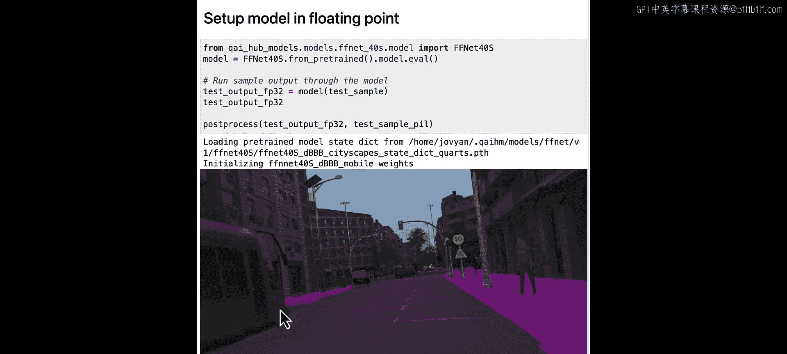

### 准备模型进行量化

为了量化模型，我们将使用名为 `AIMET` 的Python包。量化准备过程需要调用 `prepare_model` 函数。这个函数会标注模型中所有的浮点操作（包括权重和激活），并设置好对应的自动整数版本图，为接下来的校准过程做好准备。

### 执行训练后量化

我们编写一个简单的函数，将校准数据传递给模型，并学习训练后量化所需的所有校准参数。`compute_encodings` 函数是此计算的核心，它确保为图中的所有参数学习到正确的零点和缩放因子，从而获得最小的量化误差。

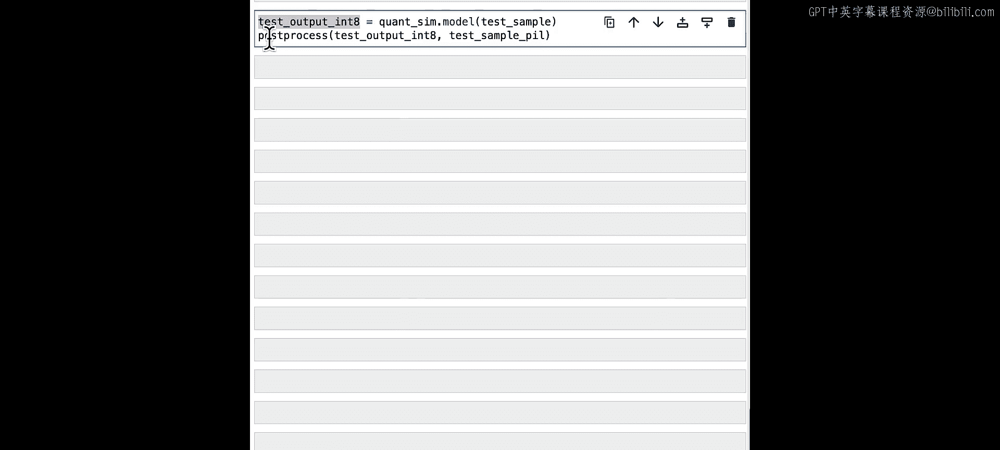

校准过程完成后，可以在PyTorch环境中将同一个测试样本输入完全校准和量化后的模型，得到同样是量化的输出结果。该结果会通过我们为浮点32版本编写的同一个后处理函数，并可以在Notebook中查看结果。

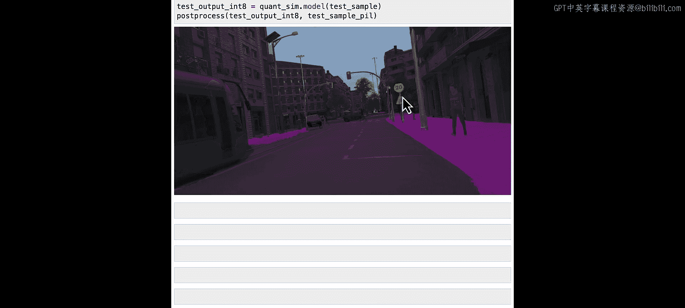

### 导出量化模型并在设备上验证

作为最后一步，将量化模型导出以供设备使用。使用与第二课中相同的 `quantized_export` 函数，将模型提交到服务器进行设备端优化。随后，设备会测量性能，并提供该模型性能的摘要。

此过程大约需要几分钟。从设备性能结果可以看到，该量化模型运行时间约为6.4毫秒，比原始浮点模型快了约4倍。它完全在神经处理单元上运行，内存消耗在1到10兆字节之间。峰值信噪比略低于浮点模型，约为33 dB（通常认为高于30 dB即为良好）。

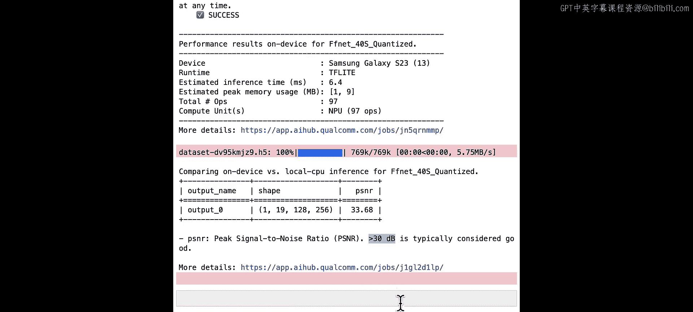

## 量化效果总结

本节课中我们一起学习了模型量化。量化的影响在模型大小和性能上都非常显著：
*   **模型大小**：从55 MB减小到13 MB。
*   **推理延迟**：从16.9毫秒提升到4.6毫秒，实现了约3.7倍的加速（测试基于三星Galaxy S24）。

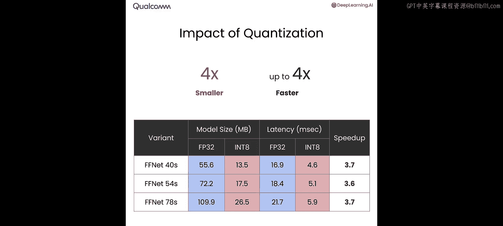

总结来说，你学会了如何将一个在云端以浮点精度训练的模型，量化为整数精度，从而得到一个**缩小近4倍、提速近4倍**的模型。在下一节课中，你将学习如何利用这个量化模型，构建并部署一个能够进行实时分割的端到端移动应用程序。