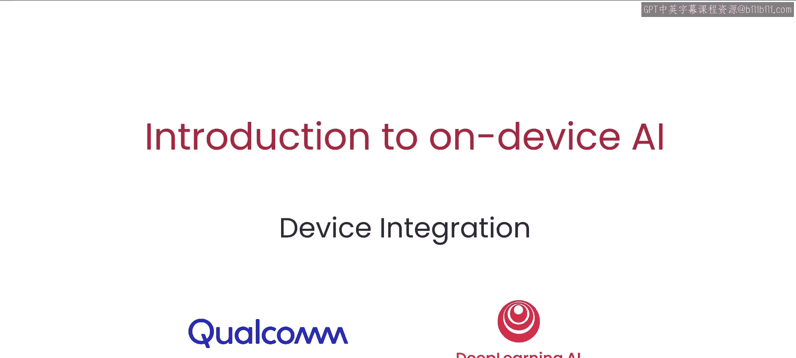
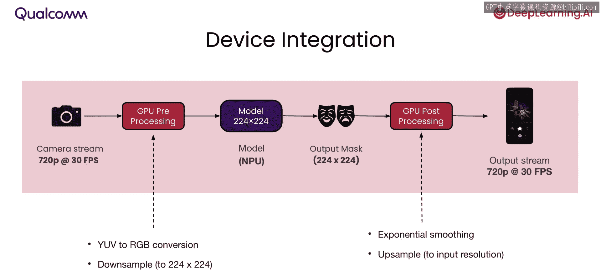
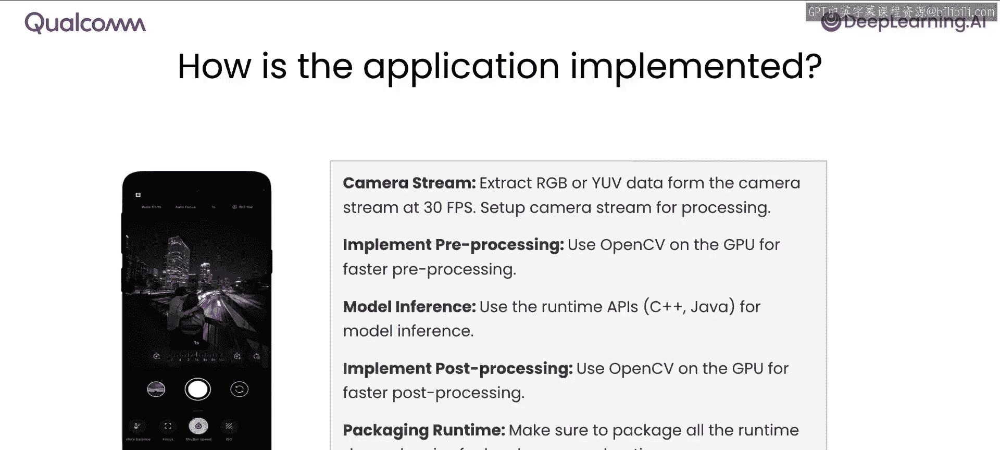
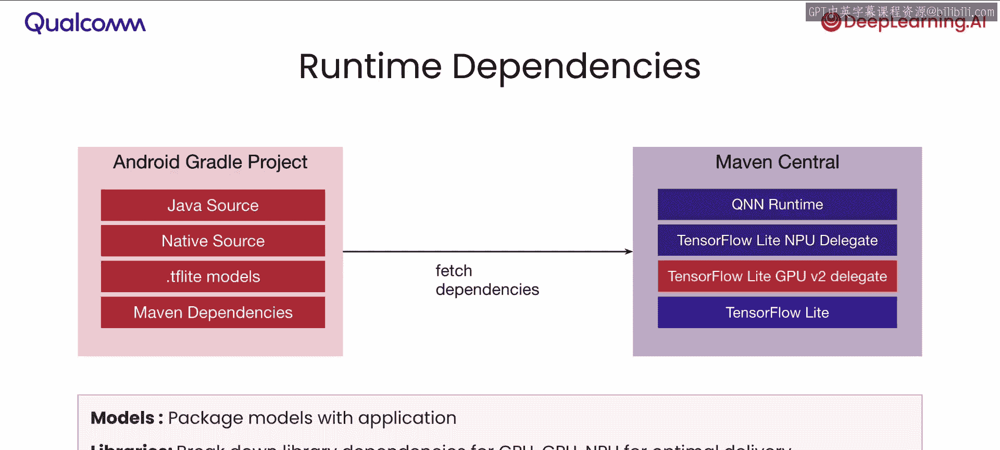
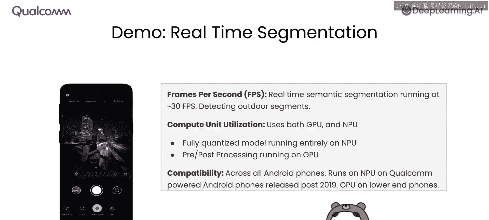
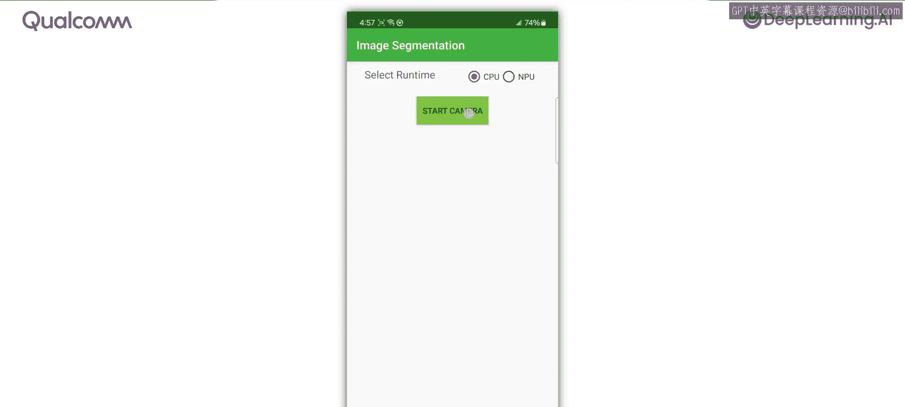
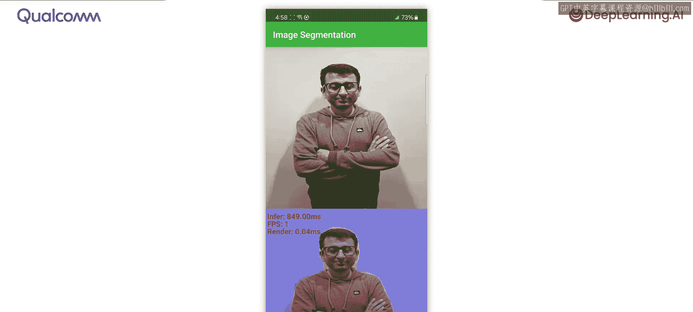
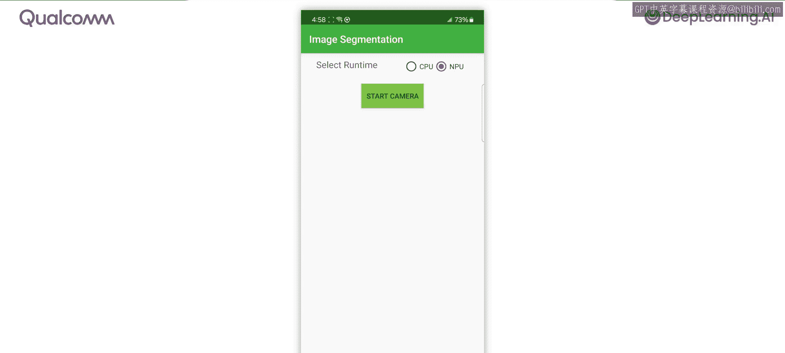
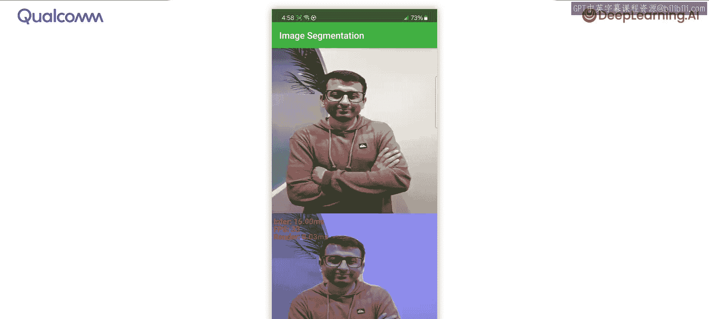
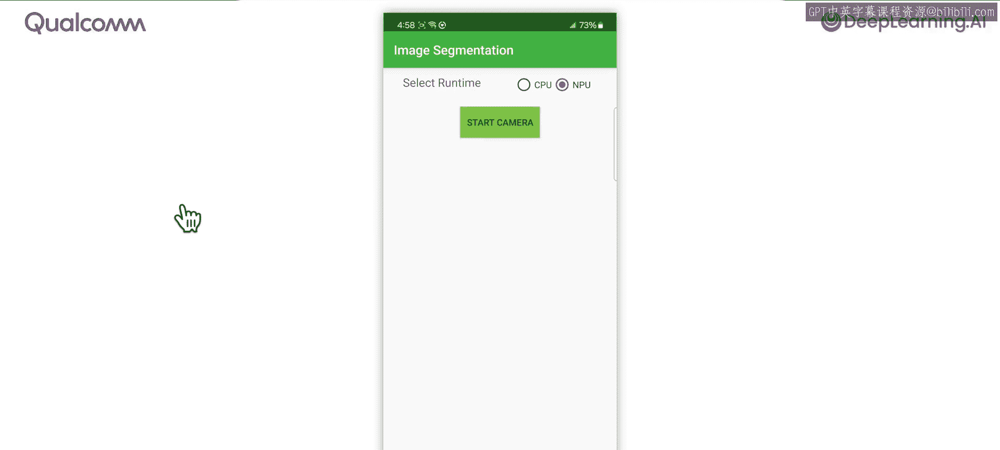

# 006：设备集成 🚀

在本节课中，我们将学习如何将AI模型集成到设备上的智能手机应用程序中。模型将直接从摄像头获取帧，并给出结果。你将能在智能手机上看到一个实时分割的演示，它以每秒30帧的速度运行。

现在，让我们看看如何将模型集成到设备端应用程序中。

## 处理流程概览 📊

在这个特定的应用中，集成需要你理解数据是如何从摄像头流一路转换到输出流的。

设备集成通常是将模型作为处理流水线一部分的过程。该流水线从摄像头流开始，它提供RGB格式或YUV格式的数据。

GPU预处理阶段将数据从YUV转换为RGB，因为模型需要RGB格式。如果模型是在特定分辨率下训练的，例如 **224x224** 分辨率，预处理通常还会进行下采样。下采样需要你将摄像头流的分辨率（例如720p）转换为模型的分辨率，即 **224x224**。

模型在神经处理单元上尽可能高效地运行。在分割应用中，你会得到一个输出掩码，其分辨率通常与模型相同，因此在本例中，输出掩码是 **224x224**。

从模型获得输出掩码后，你将执行基于GPU的后处理。这通常包括平滑、上采样到输出分辨率、阈值处理以及模糊处理，以便将输出掩码很好地融合到图像之上。最终结果是预测结果叠加在摄像头流之上的输出流。

## 应用实现的关键部分 ⚙️

以下是这个应用程序实现的五个主要部分。

第一是摄像头流，你需要从中提取帧（例如每秒30帧），并理解摄像头流提供的数据类型，通常是RGB数据或YUV数据。

第二是实现预处理。这使用OpenCV在GPU上完成，以实现更快的处理速度。使用GPU以获得最佳性能至关重要。

第三是模型推理，在设备上使用运行时API（通常是基于C++或Java的API）完成。应确保模型在神经处理单元上运行以获得最佳性能。

第四是实现后处理，它接收模型的输出，并使用GPU上的OpenCV进行快速后处理，以便将输出叠加到显示器上。

最重要的一点是运行时的打包。应确保应用程序打包所有运行时依赖项，以最大化硬件加速。

## 运行时依赖管理 📦

为了让你了解运行时依赖是如何管理的，一个典型的Android项目包含Java源代码、原生源代码以及源代码的各种依赖项。

包含AI模型的应用程序通常需要将模型打包为应用程序的一部分。此外，运行时也需要与你的应用程序一起打包，这些库也是单独捆绑的。例如，有仅包含CPU实现的TensorFlow Lite运行时包；有GPU委托，这是一个额外的依赖项，以便在旧设备上使用GPU进行处理；还有基于NPU的委托，这是为了让你能够利用NPU而提供的专用库。

你可以选择将模型与应用程序一起打包，或者如果模型较大，可以通过无线方式下载。同样，库也可以随应用程序一起部署，或通过无线方式捆绑，以减少应用程序的大小。这些都是为了能为应用程序用户提供最佳用户体验的重要考虑因素。

## 实际演示 🎬

现在，让我们在一个真实演示中看看这个特定应用的实际运行效果。在这个演示中，你将看到我们训练并量化过的每秒30帧实时分割模型。我们将展示NPU的计算单元利用率，并比较NPU和CPU的差异。此应用程序兼容所有Android手机。它在2019年后发布的高通设备上运行于NPU，在其他所有手机上运行于GPU。

让我们看看实际效果。启动这个实时分割演示。

我将首先在CPU上运行，让你感受一下CPU运行此模型的性能。点击“开始摄像头”按钮。

你可以看到Ismail的实时分割效果。深蓝色是背景，红色是Ismail。你只能得到大约每秒1帧的速度。在CPU上运行模型大约需要800毫秒，速度非常慢。

现在，我将切换到使用神经处理单元。

再次按下“开始摄像头”按钮。如你所见，响应变得迅速得多。当Ismail移动时，可以以每秒30帧的速度运行，跟踪也更加准确。这是在设备神经处理器上运行的实时分割。

## 总结 📝

这非常令人兴奋。你看到了实时分割在神经处理单元上以每秒30帧的速度高效运行，能够准确地检测人物。

在本节课中，你学习了如何部署为设备量化并训练好的实时分割模型。你学习了如何在涉及预处理和后处理的摄像头流水线中部署此模型。最后，你看到了这个特定模型的实际演示。