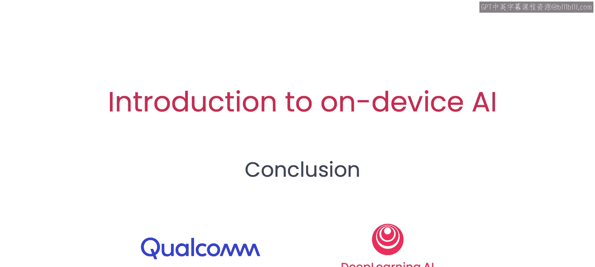

# 007：总结

在本课程中，我们学习了设备端人工智能的重要性与普遍性，并掌握了将云端训练的模型部署到设备端的基本流程。

## 课程回顾

上一节我们构建了一个完整的智能手机端实时应用。现在，让我们回顾一下整个课程的核心内容。

以下是本课程涵盖的主要知识点：

*   **模型部署**：学习了如何将云端训练的模型进行适配与准备，以便在设备端部署。
*   **代码实践**：仅用几行代码就在设备上成功运行了你的第一个模型。
*   **模型量化**：学习了如何通过**量化**技术来提升模型效率，最高可达**4倍**的性能提升。
*   **应用构建**：看到了如何构建一个在智能手机上实时运行的端到端应用程序。

## 总结

本节课中，我们一起学习了设备端人工智能从模型准备、量化优化到最终应用构建的全过程。恭喜你完成本课程的学习，期待看到你运用这些知识构建出自己的作品。