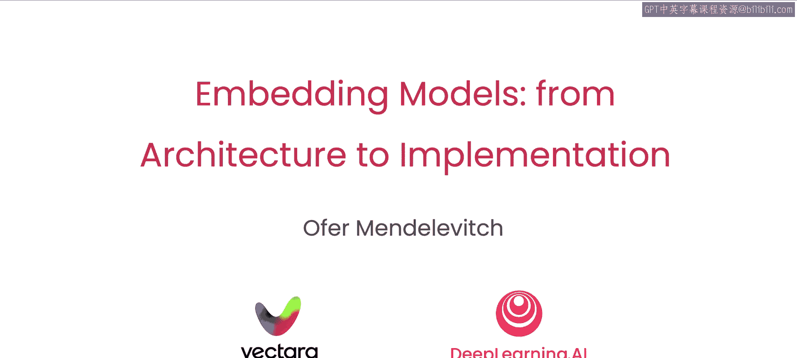

# 001：课程介绍 🎬

在本节课中，我们将要学习嵌入模型的基本概念、历史发展及其在检索系统中的应用。嵌入模型能够生成代表文本含义的向量，这对于构建基于语义的检索系统至关重要。我们将从宏观应用入手，逐步深入到模型的技术架构和实现细节。

嵌入模型通过生成**嵌入向量**，使得构建基于语义或含义的检索系统成为可能。本课程将描述它们的历史、详细的技术架构和具体实现。这是一门技术课程，因此将侧重于模型的构建模块，而非其应用场景。

你可能听说过嵌入向量在生成式AI应用中的使用。这些向量具有捕捉单词或短语含义的惊人能力。你可能使用过嵌入模型来创建这些向量，但你是否想过这些模型究竟是如何工作的呢？

为了深入探讨这个问题，我们很高兴地介绍Amin Ahmad，他是Vectara的联合创始人，以及Op Mendlovich，他是公司的开发者关系负责人。在Vectara，我们构建了自己的嵌入模型来支持不同的RAG系统。因此，我们必须深入研究如何选择、构建和训练它们。在本课程中，我们将与您分享一些关键的技术细节。

创建一个能够生成代表单词含义的向量的模型是一个具有挑战性的问题。你会希望利用大量现有文本作为训练数据，但具体该如何操作呢？

一个想法是利用目标词周围的词语作为线索。以单词“树”为例。

一个文本训练句子可能会说“树上的叶子是绿色的”，而另一个句子可能会说“树上的树枝正在掉落”。因此，出现在“树”这个词附近的词语可以告诉你一些关于“树”的含义的信息。

如果你有数百万个这样的句子，那么你可能会对“树”这个词的含义有一个不错的理解，或者至少获得一些感觉。

这种方法由一个名为**Word2Vec**的嵌入模型推广开来，该模型由Thomas Mikolov、Greg Corrado和Jeff Dean（我在谷歌的前同事）提出。Word2Vec是一个在自然语言上训练的模型，它根据目标词两侧的几个词来预测目标词。

不久之后，斯坦福大学的Jeffrey Pennington、Richard Socher和Christopher Manning提出的一种名为**GloVe**的方法，通过简化学习嵌入所需的数学计算，进一步改进了Word2Vec。它通过扩大单词的上下文窗口来产生更准确的嵌入。

此前，处理更长的上下文窗口需要使用像LSTM这样的循环神经网络。2017年**Transformer**架构的引入改变了这一点，它允许前馈神经网络（比循环网络训练效率高得多）有效地处理序列数据。

次年发布的**BERT**模型，使用深度Transformer网络，在一个简单的“填空”任务上进行训练，从而获得了对语言的深刻理解。这开启了NLP的现代时代，并为后续的GPT等系统奠定了基础。

很快，研究也超越了单词层面，扩展到更长的文本块，如短语或句子。在一个检索系统中，你可能希望为一个查询句子生成一个嵌入向量，并将其与响应句子的向量进行比较。事实证明，你可以对这些强大的词嵌入模型进行微调，以评估句子级别的语义。在本课程中，我们将向你展示具体如何操作。

以下是本课程的主要内容结构：

*   **嵌入模型在检索系统中的应用**：首先，你将学习嵌入模型在何处以及如何被使用。
*   **BERT模型详解**：然后，你将学习关于BERT的知识。这是一个**双向Transformer**的示例。BERT被应用于许多场景，但在这里我们将专注于它在检索中的使用。
*   **对比学习与双编码器模型**：接着，你将学习如何构建和使用**对比损失**来训练一个非常适合RAG应用的双编码器模型。该模型包含一个为查询训练的编码器和一个为响应训练的独立编码器。
*   **实践演示**：你将看到所有这些内容在实际中的应用。

许多人共同努力创建了这门课程。我们要感谢来自Vectara的Vivek Srikumar，以及来自DeepLearning.AI的Emma Gengler和Joel Ludwig，他们也为本课程做出了贡献。

第一课将从检索系统中嵌入模型的概述开始。

听起来很棒，让我们进入下一个视频，正式开始学习吧。

本节课中，我们一起学习了嵌入模型的基本介绍、其发展历史以及本课程的核心学习路径。我们了解到，嵌入模型通过生成语义向量，是构建智能检索系统的基石。从Word2Vec、GloVe到Transformer和BERT，技术的演进使得模型能够更精准地捕捉文本含义。在接下来的课程中，我们将深入这些技术的内部，学习如何构建和训练用于检索的嵌入模型。