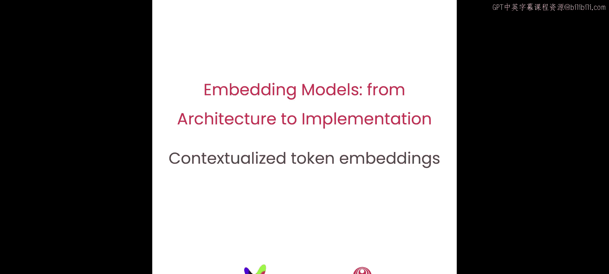
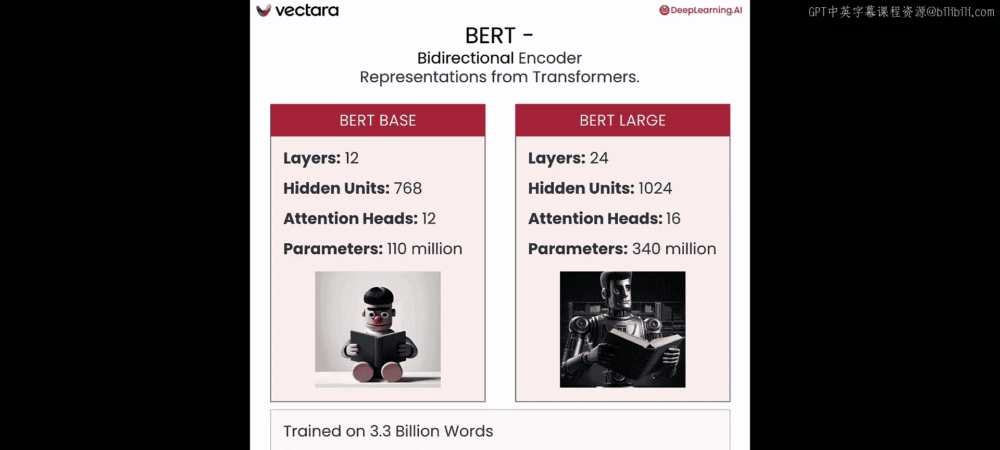
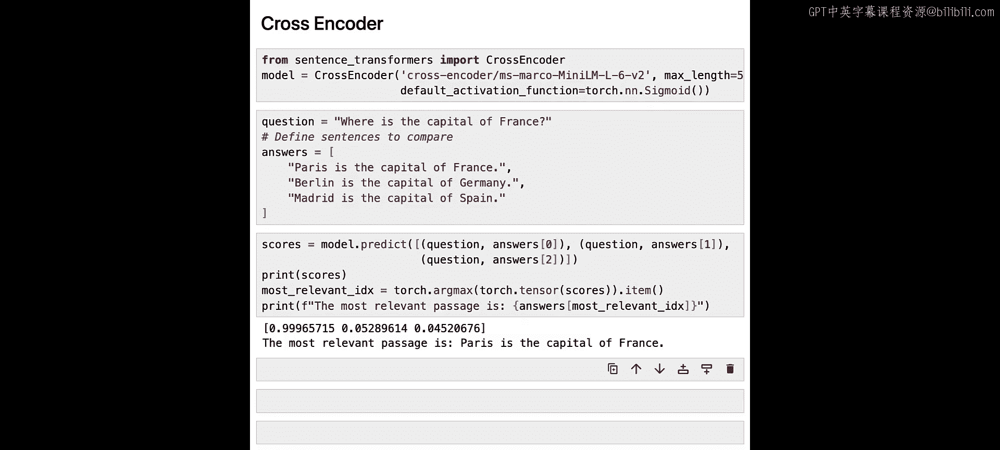

# 003：3.L2 - 上下文感知的词嵌入 🧠



在本节课中，我们将学习上下文感知的词嵌入的重要性，以及Transformer模型，特别是BERT，如何开创了学习上下文感知词嵌入的能力。这些嵌入被广泛应用于句子嵌入模型中。


---

在上一节中，我们学习了词向量嵌入。例如，单词“Yoda”及其在使用Word2Vec或GloVe等词嵌入模型下的嵌入向量。这些嵌入能够捕捉每个词的语义含义，可用于计算词与词之间的相似度。

但词嵌入模型存在一个问题：它们无法理解上下文。

请看以下两个句子，它们在不同的语境中使用了单词“bat”。像Word2Vec这样的词嵌入模型无法根据上下文区分这些词的含义。使用这些模型，你会得到完全相同的向量嵌入。

所以，核心问题是**上下文感知的词嵌入**。

2017年，一篇名为《Attention is All You Need》的论文将Transformer架构引入了自然语言处理领域。这一突破不仅催生了大型语言模型，也解决了上下文感知词嵌入的问题。

---

Transformer架构最初是为翻译任务设计的，因此包含两个组件：一个编码器和一个解码器。

*   **编码器**的输入是一个词或标记的序列，输出是一个连续的表示序列。
*   **解码器**的输出同样是词或标记。

翻译任务的工作流程如下：编码器接收一种语言的短语，并生成代表输入短语含义的输出向量。为了生成这些向量，编码器可以关注给定标记左侧和右侧的所有标记。

相比之下，解码器一次处理一个标记，并考虑迄今为止已预测的标记以及编码器的输出。解码器预测第一个词“This”，然后将其反馈回输入。接着，解码器考虑编码器输入和之前生成的标记，预测“man”，以此类推，逐个标记进行。

总结一下，编码器会关注其正在生成的输出标记的左右两侧的标记。这导致编码器的输出向量正是我们寻找的**上下文感知向量**。而解码器只关注左侧的输入。

---

但带有注意力机制的Transformer被用于更多任务。最著名的实现是像GPT-2、GPT-3和GPT-4这样的大型语言模型，它们使用了**仅解码器**的架构。当然，还有**BERT**，这是一个**仅编码器**的Transformer模型，在句子嵌入模型中作为核心组件被广泛使用。



让我们进一步了解BERT。它有两种规模：
*   **BERT-base**：12个Transformer层，1.1亿参数。
*   **BERT-large**：24个Transformer层，3.4亿参数。

BERT在33亿单词上进行了预训练，并且通常会在特定任务上进行额外的微调步骤。

---

BERT模型通过两个任务进行预训练。

**第一个任务称为掩码语言建模**。示例如下：输入句子以特殊标记`[CLS]`开始，以分隔符标记`[SEP]`结束。输入中15%的词被掩码，模型被训练来预测这些被掩码的词。这个任务至关重要，因为模型正是在这里学会了根据周围的词来生成上下文感知的向量。

**第二个任务是下一句预测**。在这个任务中，模型预测一个句子是否可能跟在另一个句子后面。例如，如果句子A是“The men went to the store”，句子B是“He bought a gallon of milk”，那么预测输出是“True”。反之，如果句子B是“Penguins are flightless birds”，那么预测就是“False”。这个任务训练模型理解两个句子之间的关系。

---

预训练之后，你可以将迁移学习的思想应用于BERT，并通过微调使其适应特定任务，例如分类、命名实体识别或问答。本课程中我们特别感兴趣的一个任务是**交叉编码器**。具体来说，这是一种分类器，其输入由两个句子组成，中间用特殊的`[SEP]`标记分隔。然后，分类器被要求判断这两个句子之间的语义相似度。

---

现在，让我们在代码中看看所有这些概念。

首先，导入必要的库，包括来自`transformers`库的BERT分词器和BERT模型。

```python
import warnings
warnings.filterwarnings('ignore')

from transformers import BertTokenizer, BertModel
import torch
import numpy as np
from sklearn.decomposition import PCA
import matplotlib.pyplot as plt
```

接下来，加载GloVe词嵌入。我们查看单词“king”的嵌入向量，它是一个100维的向量。

```python
# 加载GloVe词向量（此处为示意，实际需下载文件）
# glove_embeddings = load_glove('path/to/glove.6B.100d.txt')
# king_vector = glove_embeddings['king']
# print(f"King vector shape: {king_vector.shape}")
# print(king_vector[:20])  # 打印前20个值
```

为了可视化，我们选取一组词，将其嵌入向量放入数组，并使用PCA降维到2维以便绘图。语义相近的词在图中会彼此靠近。

词向量的一个有趣特性是你可以对它们进行代数运算。例如，`king - man + woman`的结果向量最接近`queen`的向量。你可以自己尝试，比如计算`Paris - France + Spain`，看看结果是什么。

---

现在，让我们将词嵌入与BERT的上下文感知嵌入进行比较。

首先加载BERT的分词器和模型，并创建一个函数来获取给定句子和词的嵌入。

```python
tokenizer = BertTokenizer.from_pretrained('bert-base-uncased')
model = BertModel.from_pretrained('bert-base-uncased')

def get_bert_embedding(sentence, target_word):
    inputs = tokenizer(sentence, return_tensors='pt')
    outputs = model(**inputs)
    # 找到目标词在分词后序列中的位置（简化处理，实际需处理子词）
    # ... 此处省略具体索引查找逻辑 ...
    # embedding = outputs.last_hidden_state[0, word_index]
    return embedding
```

我们看两个例句：
1.  “The bat flew out of the cave at night.”
2.  “He swung the bat and hit the home run.”

我们关注单词“bat”。分别计算它在两个句子上下文中的BERT嵌入，同时也获取GloVe中“bat”的静态词嵌入。

运行后你会发现，**“bat”在句子1上下文中的嵌入与在句子2上下文中的嵌入看起来非常不同**。而GloVe的嵌入则是非上下文的、相同的。计算余弦相似度会发现，两个BERT上下文嵌入的相似度可能只有0.45左右，而GloVe嵌入与自身的相似度当然是1。

---

我们讨论了BERT如何用作交叉编码器。现在来看一个具体的例子，一个在MS MARCO问答对数据集上微调过的交叉编码器，用于段落检索任务。

```python
from sentence_transformers import CrossEncoder
model = CrossEncoder('cross-encoder/ms-marco-MiniLM-L-6-v2')

question = "What is the capital of France?"
answer_candidates = [
    "Berlin is the capital of Germany.",
    "Paris is the capital of France.",
    "London is the capital of England."
]

scores = model.predict([(question, candidate) for candidate in answer_candidates])
print(f"Scores: {scores}")
best_answer_idx = np.argmax(scores)
print(f"Best answer: {answer_candidates[best_answer_idx]}")
```

运行模型后，我们看到最佳答案是“Paris is the capital of France”。鼓励你尝试其他问题和答案选项，看看训练良好的交叉编码器如何真正理解问题和答案的语义。

---



在本节课中，我们了解到像Word2Vec和GloVe这样的词嵌入模型无法捕捉句子中词的上下文，而BERT嵌入能够捕捉这种上下文。但是，上下文感知的词嵌入还不是句子嵌入。在下一节课中，你将学习如何从上下文感知的词嵌入过渡到完整的句子嵌入模型。