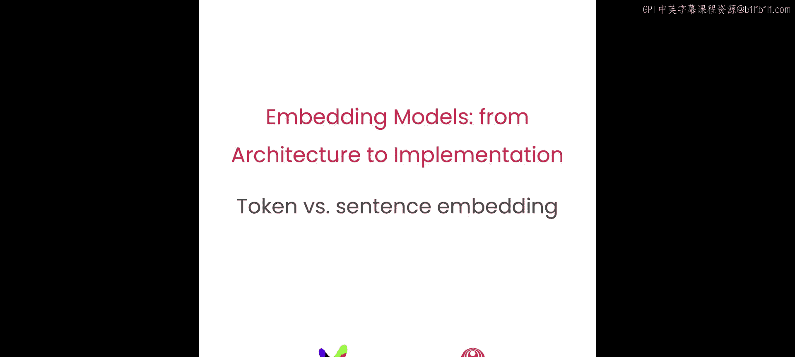
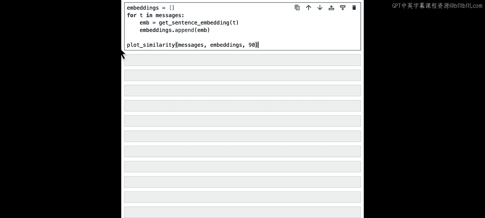
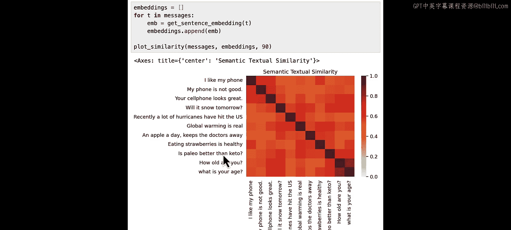
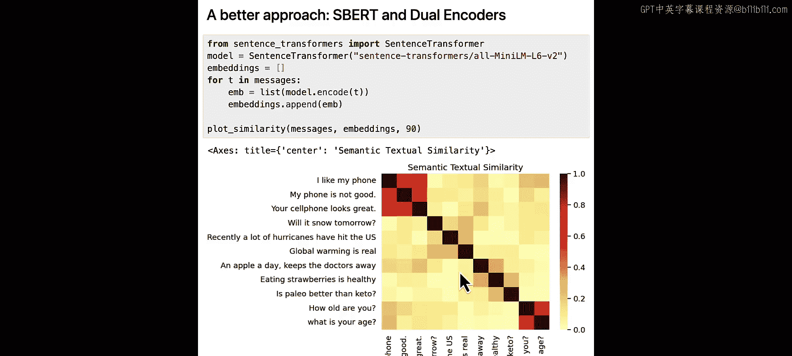
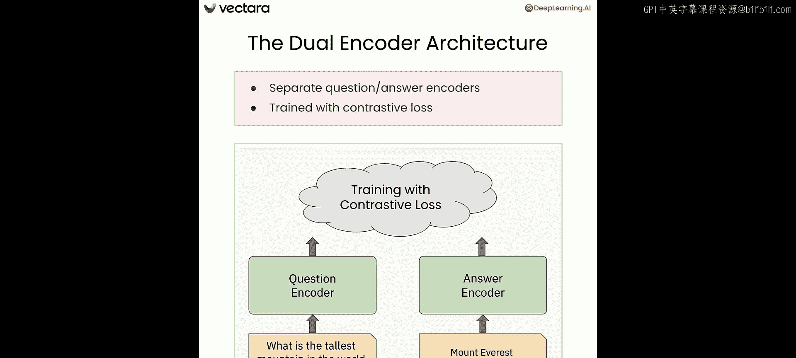

# 004：4.L3 词元嵌入与句子嵌入




在本节课中，我们将学习句子嵌入。我们将了解早期创建句子嵌入的朴素尝试为何失败，以及是什么促成了使用双编码器架构来成功构建句子嵌入。

## 概述

到目前为止，我们一直将“词”和“词元”互换使用。实际上，自然语言处理系统处理的是词元。一个词元可以是一个词，但并不总是如此。例如，句子“we love training the learning networks”可以被分词为完整的英文单词，并为每个单词分配一个整数值，如23或112等。

子词分词意味着一个词元并不总是一个完整的单词，它可以是一个子词或任何字符序列。在分词时，你需要定义一个可能的单词或子词词汇表，并根据这个词汇表将文本分解。结果是每个句子都由一个整数值序列表示。

大型语言模型和嵌入模型中常用的分词技术通常是子词分词器，如BPE（字节对编码）、WordPiece，或最近流行的变体SentencePiece。

## 词元嵌入的工作原理

让我们看看词元嵌入在BERT中是如何工作的。BERT的词汇表大约有30，000个词元，嵌入维度为768。分词器将输入句子前加上一个特殊的起始词元`[CLS]`，然后将所有词元转换为词元嵌入。

你可以将这一层嵌入视为固定的词元嵌入，它只关注单词本身。BERT中每个编码器层的输出也为输入序列中的每个词元提供了嵌入，但这些嵌入现在整合了句子其余部分的信息。因此，我们称它们为**上下文化嵌入**。随着我们从一层到另一层，这些表示在整合整个句子的上下文方面变得越来越好。

## 早期句子嵌入的朴素尝试

在使用Word2Vec或GloVe等词嵌入取得成功后，研究人员探索的下一个问题是：我们能否为句子创建嵌入向量，使得嵌入空间中的余弦相似度或点积相似度能够表示句子之间的语义相似性？

最初的尝试是朴素的。有些人尝试取Transformer模型最后一层所有词元的输出嵌入，并对它们进行平均。这也被称为**平均池化**。另一些人则尝试直接使用`[CLS]`词元的嵌入作为句子的代表。这些方法都失败了。

让我们在实践中看看这一点。

## 实践：平均池化的失败

首先，我们导入必要的库，如PyTorch、SciPy、Seaborn，以及我们的BERT模型和分词器。

```python
import torch
import scipy
import seaborn as sns
from transformers import AutoTokenizer, AutoModel
```

我们使用`bert-base-uncased`模型，并加载其分词器和模型。然后，我们定义一个辅助函数来执行句子嵌入的平均池化操作。该函数接收一个句子，将其编码为词元，创建注意力掩码，通过BERT模型运行，获取输出嵌入，然后对最后一层的隐藏状态进行平均池化，得到最终输出。

```python
def mean_pooling(model_output, attention_mask):
    token_embeddings = model_output[0]
    input_mask_expanded = attention_mask.unsqueeze(-1).expand(token_embeddings.size()).float()
    return torch.sum(token_embeddings * input_mask_expanded, 1) / torch.clamp(input_mask_expanded.sum(1), min=1e-9)
```

我们还需要一个辅助函数来计算矩阵的余弦相似度，以及一个函数来绘制相似度热力图。

```python
import numpy as np
def cosine_similarity_matrix(matrix):
    norm = np.linalg.norm(matrix, axis=1, keepdims=True)
    normalized_matrix = matrix / norm
    return np.dot(normalized_matrix, normalized_matrix.T)

def plot_similarity(labels, features):
    corr = cosine_similarity_matrix(features)
    sns.set(font_scale=1.2)
    g = sns.heatmap(corr, xticklabels=labels, yticklabels=labels, vmin=0, vmax=1, cmap="YlOrRd")
    g.set_xticklabels(labels, rotation=90)
    g.set_title("Semantic Textual Similarity")
```

现在，我们尝试一些句子。我们有一些关于智能手机和天气等的句子。

```python
messages = [
    "I love my new smartphone.",
    "The weather is nice today.",
    "This phone has a great camera.",
    "It's raining outside.",
    "The battery life of this device is amazing.",
    "I need to buy an umbrella."
]
```





我们对每个句子计算其平均池化嵌入，然后绘制相似度热力图。

```python
# 计算每个句子的平均池化嵌入
embeddings = []
for msg in messages:
    encoded_input = tokenizer(msg, return_tensors='pt', padding=True, truncation=True)
    with torch.no_grad():
        model_output = model(**encoded_input)
    sentence_embedding = mean_pooling(model_output, encoded_input['attention_mask'])
    embeddings.append(sentence_embedding.squeeze().numpy())
embeddings = np.array(embeddings)

# 绘制热力图
plot_similarity(messages, embeddings)
```

从热力图中可以看到，大部分区域是红色和橙色，表示非常高的相似度，但这并不合理，因为这些句子并没有相同的语义含义。这表明平均池化方法无效。

## 在标准数据集上验证

我们还可以在STS基准数据集上进行测试。该数据集包含许多句子对（sentence1和sentence2），以及一个表示它们相似度的真实分数。

```python
import pandas as pd
# 假设我们加载了STS数据集的一个子集
sts_data = pd.read_csv('sts_sample.csv')  # 示例，实际需加载真实数据
# 计算BERT平均池化分数
sts_scores_mean_pool = []
for idx, row in sts_data.head(50).iterrows(): # 使用50个例子加速
    # 计算sentence1和sentence2的嵌入并求余弦相似度
    # ... (代码类似上面)
    sts_scores_mean_pool.append(cosine_sim)
```

打印这些分数，你会发现BERT平均池化给出的分数普遍很高，表明它认为所有句子对都非常相似。计算这些分数与真实分数之间的皮尔逊相关性，会发现相关性非常低，进一步证实了这种方法不可行。

## 使用预训练句子嵌入模型

既然平均池化无效，我们可以尝试一个预训练的句子嵌入模型，看看经过训练的模型效果如何。这里我们使用`all-MiniLM-L6-v2`模型。



```python
from sentence_transformers import SentenceTransformer
minilm_model = SentenceTransformer('all-MiniLM-L6-v2')
# 计算相同消息的嵌入
minilm_embeddings = minilm_model.encode(messages)
# 绘制热力图
plot_similarity(messages, minilm_embeddings)
```

这次的热力图看起来好多了。相似度更加准确，反映了许多句子彼此并不相似的事实。

在STS数据集上运行相同的方法，创建第三列`minilm_score`。你会发现`minilm_score`与真实分数`ground_truth_score`非常接近，而平均池化分数`mean_pool_score`仍然认为所有句子对高度相似。计算皮尔逊相关性，`minilm_score`与真实分数的相关性要高得多。

我鼓励你尝试STS数据集中的其他例子，亲自看看句子相似度对于不同句子对是如何工作的。

## 句子嵌入研究的进展

句子嵌入研究的真正进展最初是在2018年左右，随着谷歌基于原始Transformer架构的**通用句子编码器**的引入而实现的。事实上，我们的创始人Andrew Ng曾是通用句子编码器原始团队的一员。

**SBERT**是第一个在包含句子对的数据上进行训练的模型。2018年SBERT的工作迅速在随后几年引发了更多创新，出现了如DPR、Sentence-T5、E5、ColBERT等许多其他设计。

## 构建句子编码器的重要考量

现在，让我解释构建句子编码器时一个微妙但重要的考量。有两个可能的目标：
1.  **纯粹的句子相似度**。例如，如果你想使用嵌入来查找相似的项目。
2.  **将相关句子作为问题的答案进行排序**。例如，在检索增强生成中。

这两个目标并不相同。让我们看一个例子数据集，其中有四个文本块，标记为A1到A4。我们的问题是：“What is the tallest mountain in the world?”。
*   如果使用纯粹的相似度，显然A1与问题完全相同，相似度最高（等于1），因此A1会被排在最前面。但这并不是我们想要的。
*   我们想要的是答案“A2: Mount Everest is the tallest.”被选中。

这导致了**双编码器**或**双塔架构**的出现。我们有两个独立的编码器：问题编码器和答案编码器。模型使用**对比损失**进行训练，以学习将相关的问题-答案对拉近，将不相关的推远。

## 总结

在本节课中，我们亲眼看到了BERT嵌入的平均池化为何不适用于句子嵌入，以及像MiniLM-L6这样的预训练句子嵌入模型如何做得更好。你可能好奇如何构建这些双编码器模型。这正是你将在下一课中学到的内容。我们下节课见。



