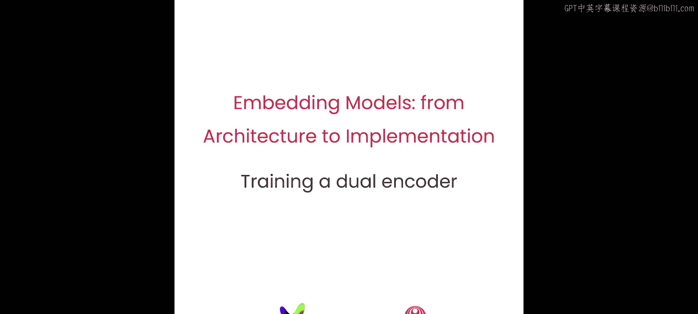
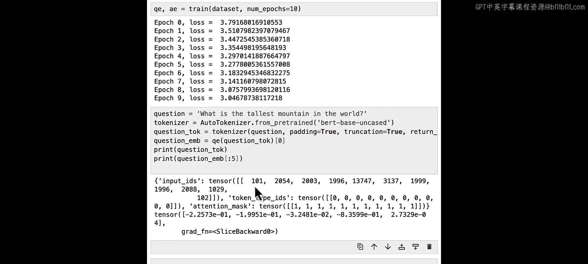
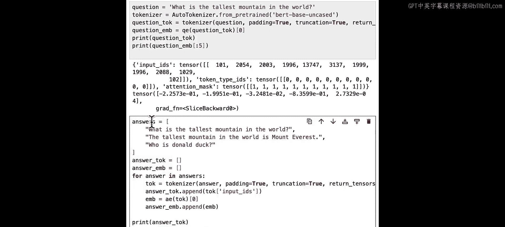
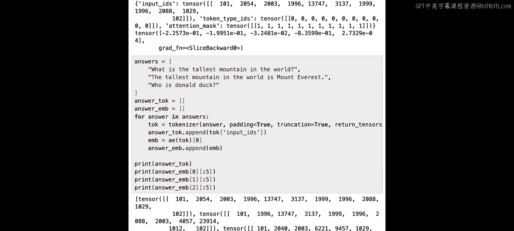
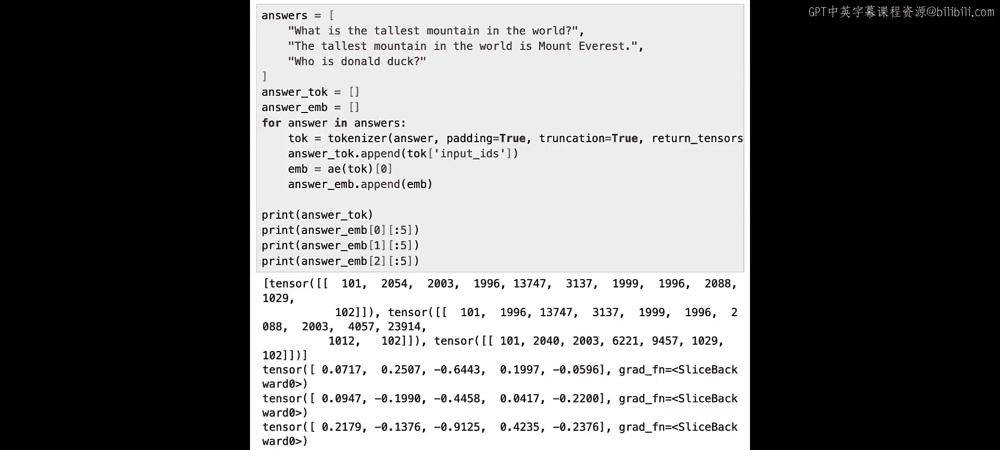

# 005：5.L4 训练一个双编码器 🏋️‍♂️



在本节课中，我们将深入理解双编码器的内部工作原理。你将学习如何使用 PyTorch 构建一个双编码器，并利用问答对数据集来训练它。


---


## 理解双编码器架构

上一节我们介绍了双编码器的基本概念，本节中我们来看看其训练架构的具体细节。

我们将训练两个独立的 BERT 模型，一个用于处理问题，另一个用于处理答案。在训练过程中，我们使用每个 BERT 模型最后一层的 **CLS 嵌入向量** 作为分别代表问题或答案的向量嵌入。

它们之间的点积相似度代表了语义匹配程度。**高相似度值** 意味着答案在语义上与问题相关，而 **低相似度值** 则意味着不相关。

---

## 对比损失函数

双编码器架构利用了 **对比损失**。对比损失的核心思想是确保相似（正样本）数据点的嵌入在嵌入空间中更接近，而不相似（负样本）数据点的表示则相距更远。

损失函数鼓励模型最大化正样本对嵌入之间的相似度，并最小化负样本对之间的相似度。在我们的上下文中，一个正样本对包含一个问题及其正确答案的嵌入，而一个负样本对则被设置为一个问题与批次中任何其他被视为错误的答案。

让我们看一个例子。这里我们有四对问答，以及计算出的每个问题与每个答案之间的相似度矩阵。

对于 Q1，我们希望模型预测 A1 为最可能的答案；对于 Q2，我们希望模型预测 A2，依此类推。因此，基于这个 4x4 矩阵计算出的单个损失会随着对角线上的 softmax 值越来越接近 1，而其他值越来越接近 0 而变小。

---

## 在 PyTorch 中实现对比损失

为了在 PyTorch 中实现这一点，我们使用了一个涉及交叉熵损失函数的小技巧，这在实际应用中效果很好。

在代码中，我们将交叉熵损失函数的 `target` 参数设置为 `[0, 1, ..., n-1]`，其中 `n` 是批次大小。这告诉交叉熵损失函数，对于每一行（即每个问题），正确的类别（即答案）是与其关联的对角线上的那个。换句话说，A1 是 Q1 的正确类别，A2 是 Q2 的正确类别，依此类推。

通过这种方式，我们使用交叉熵损失来匹配对比损失的目标。损失函数中 softmax 的使用鼓励了问题 i 和答案 i 之间的相似度 `S_i` 的指数变大（即正确对具有高相似度），而 `i` 和 `j` 不相同时的 `S_j` 的指数变小，这正是对比学习所期望的。

让我们看看代码实现。首先，我们像往常一样忽略警告，并导入一些库。

```python
import warnings
warnings.filterwarnings('ignore')
from transformers import BertTokenizer, BertModel
import pandas as pd
import torch
import torch.nn as nn
```

为了更直观地理解如何使用交叉熵损失技巧计算对比损失，我们现在定义一个 4x4 的数据框，类似于幻灯片中展示的。

```python
# 示例相似度矩阵
similarity_matrix = torch.tensor([[0.9, 0.1, 0.2, 0.3],
                                   [0.1, 0.8, 0.1, 0.2],
                                   [0.2, 0.1, 0.7, 0.1],
                                   [0.3, 0.2, 0.1, 0.6]])
```

这是我们的对比损失函数，它使用交叉熵损失根据数据计算实际损失。

```python
def contrastive_loss(similarity_matrix):
    batch_size = similarity_matrix.size(0)
    # 目标标签：对角线索引 [0, 1, 2, ..., batch_size-1]
    targets = torch.arange(batch_size)
    loss_fn = nn.CrossEntropyLoss()
    loss = loss_fn(similarity_matrix, targets)
    return loss
```

交叉熵损失会对每一行应用 softmax 操作，这迫使每一行的指数和接近 1。让我们看一个例子。

```python
# 计算 softmax
softmax_vals = torch.softmax(similarity_matrix, dim=1)
print("Softmax 值:\n", softmax_vals)
print("每行和:", torch.sum(softmax_vals, dim=1))
```

现在，我们运行一个小实验。我们取这个 4x4 矩阵，进行四轮简单操作：每次将对角线值增加 0.5，并将其他非对角线值减少 0.02。

```python
modified_matrix = similarity_matrix.clone()
for i in range(4):
    for j in range(4):
        if i == j:
            modified_matrix[i, j] += 0.5
        else:
            modified_matrix[i, j] -= 0.02
    loss = contrastive_loss(modified_matrix)
    print(f"第 {i+1} 轮后损失: {loss.item():.4f}")
```

你会发现，随着迭代的进行，对角线值不断增长，非对角线值不断降低，通过交叉熵计算的对比损失也在不断减少。这正是我们希望对比损失具有的行为：它迫使对角线值越来越接近更高的值，而非对角线值越来越接近零。

---

## 构建编码器

现在我们已经了解了对比损失如何与交叉熵配合工作，接下来看看编码器的构建。

编码器包含多个不同的子组件。在这个例子中，我们使用批次大小为 32，嵌入大小为 512，输出嵌入大小为 128。代码量不大，但包含了许多重要细节。

以下是编码器的关键步骤：

1.  **嵌入层**：`nn.Embedding` 模型接收单个标记（整数），并将它们映射为标记嵌入。输入形状为 `[32, 序列长度]`，输出为 `[32, 序列长度, 512]`，因为每个标记由一个 512 维的嵌入向量表示。
2.  **Transformer 编码器层**：我们使用 `nn.TransformerEncoderLayer`，这里为了简化，只用了 8 个注意力头和 3 层，而不是 BERT 模型中的 12 层，但结构是相同的。输出是序列中每个向量的上下文化嵌入向量，形状为 `[32, 序列长度, 512]`。
3.  **CLS 标记**：在 BERT 中，CLS 标记是一个特殊标记，它学习了整个句子的粗略嵌入。我们的编码器使用 CLS 标记的嵌入作为下一步的输入。
4.  **投影层**：最后，我们通过一个额外的线性投影层，将学习到的 CLS 标记嵌入投影到可能更小的输出嵌入维度（这里是 128）。这并非绝对必要，但允许我们减少编码器输出的总体嵌入大小，从而节省内存。最终输出形状为 `[32, 128]`，这就是我们最终的上下文化嵌入。

```python
class DualEncoder(nn.Module):
    def __init__(self, vocab_size, embed_size=512, output_embed_size=128, num_heads=8, num_layers=3):
        super(DualEncoder, self).__init__()
        self.embedding = nn.Embedding(vocab_size, embed_size)
        encoder_layer = nn.TransformerEncoderLayer(d_model=embed_size, nhead=num_heads)
        self.transformer_encoder = nn.TransformerEncoder(encoder_layer, num_layers=num_layers)
        self.projection = nn.Linear(embed_size, output_embed_size)

    def forward(self, input_ids):
        # input_ids 形状: [batch_size, seq_len]
        embeddings = self.embedding(input_ids)  # 形状: [batch_size, seq_len, embed_size]
        # Transformer 期望输入形状为 [seq_len, batch_size, embed_size]
        embeddings = embeddings.transpose(0, 1)
        contextual_embeddings = self.transformer_encoder(embeddings)  # 形状: [seq_len, batch_size, embed_size]
        # 取 CLS 标记（假设是第一个标记）的嵌入
        cls_embedding = contextual_embeddings[0]  # 形状: [batch_size, embed_size]
        output_embedding = self.projection(cls_embedding)  # 形状: [batch_size, output_embed_size]
        return output_embedding
```

---

## 训练循环

现在我们有了编码器，让我们看看训练是如何工作的。首先，我们构建一个函数来执行训练循环。

以下是训练参数的定义：

```python
embed_size = 512
output_embed_size = 128
max_seq_len = 64
batch_size = 32
```

接下来，定义问题和答案编码器：

```python
tokenizer = BertTokenizer.from_pretrained('bert-base-uncased')
vocab_size = tokenizer.vocab_size

question_encoder = DualEncoder(vocab_size, embed_size, output_embed_size)
answer_encoder = DualEncoder(vocab_size, embed_size, output_embed_size)
```

加载数据集和数据加载器，定义优化器和损失函数：

```python
# 假设有一个自定义的 Dataset 类 `MyDataset`
from torch.utils.data import DataLoader

# dataset = MyDataset(...) # 你的数据集
# dataloader = DataLoader(dataset, batch_size=batch_size, shuffle=True)

optimizer = torch.optim.Adam(list(question_encoder.parameters()) + list(answer_encoder.parameters()), lr=1e-5)
loss_fn = nn.CrossEntropyLoss()
```

现在，如何构建训练循环：

1.  首先，遍历数据加载器，以 32 个为一组获取批次数据。
2.  将问题和答案批次分开，并对每个问题和每个答案进行标记化。
3.  使用标记化的输出，通过上面定义的问题编码器或答案编码器计算问题嵌入和答案嵌入。
4.  计算相似度得分，这里有一个很酷的 PyTorch 单行代码：`相似度 = 问题嵌入 @ 答案嵌入.T`。
5.  使用交叉熵技巧计算对比损失。同样，目标需要是 `[0, 1, 2, ..., 31]`（对于批次大小 32）。
6.  将本次迭代的损失添加到运行损失中，用于跟踪损失随时间的变化。
7.  最后，在训练循环中必须执行优化器步骤和反向传播，以使学习真正生效。

```python
def train_one_epoch(question_encoder, answer_encoder, dataloader, optimizer, loss_fn, device):
    question_encoder.train()
    answer_encoder.train()
    total_loss = 0

    for batch in dataloader:
        questions, answers = batch # 假设批次返回 (questions, answers)
        # 标记化（此处简化，实际需使用tokenizer）
        # q_inputs = tokenizer(questions, ...)
        # a_inputs = tokenizer(answers, ...)
        # 假设 q_input_ids, a_input_ids 是标记化后的张量
        q_input_ids = ... # 形状 [batch_size, seq_len]
        a_input_ids = ... # 形状 [batch_size, seq_len]

        q_embeddings = question_encoder(q_input_ids.to(device)) # 形状 [batch_size, output_embed_size]
        a_embeddings = answer_encoder(a_input_ids.to(device))   # 形状 [batch_size, output_embed_size]

        # 计算相似度矩阵
        similarity_scores = q_embeddings @ a_embeddings.T # 形状 [batch_size, batch_size]

        # 计算对比损失
        batch_size = q_embeddings.size(0)
        targets = torch.arange(batch_size).to(device) # [0, 1, 2, ..., batch_size-1]
        loss = loss_fn(similarity_scores, targets)

        optimizer.zero_grad()
        loss.backward()
        optimizer.step()

        total_loss += loss.item()

    avg_loss = total_loss / len(dataloader)
    return avg_loss
```

---

## 多轮次训练

你看到了训练循环如何工作，但这只是对数据集的一次遍历。在深度学习网络中，我们需要运行多次遍历（轮次）。

让我们稍微修改一下这个函数，在外部添加一个循环，运行指定数量的轮次。

```python
def train(question_encoder, answer_encoder, dataloader, optimizer, loss_fn, device, num_epochs):
    for epoch in range(num_epochs):
        avg_loss = train_one_epoch(question_encoder, answer_encoder, dataloader, optimizer, loss_fn, device)
        print(f'Epoch [{epoch+1}/{num_epochs}], Loss: {avg_loss:.4f}')
    return question_encoder, answer_encoder
```

---

## 开始训练

我们将使用一个包含一些问答样本的数据集。假设有一个名为 `MyDataset` 的外部类，它本质上将数据加载到 Pandas 数据框中并使其可用。

```python
# 加载数据
# dataset = MyDataset('your_data_path')
# dataloader = DataLoader(dataset, batch_size=32, shuffle=True)

device = torch.device('cuda' if torch.cuda.is_available() else 'cpu')
question_encoder.to(device)
answer_encoder.to(device)

num_epochs = 10
trained_q_encoder, trained_a_encoder = train(question_encoder, answer_encoder, dataloader, optimizer, loss_fn, device, num_epochs)
```

训练是一个漫长的过程，可能需要一段时间。我们会看到每轮训练后打印出的损失值。

训练完成后，损失值可能不会太低。请记住，我们只训练了 10 个轮次，使用了 300 个示例，这非常少，而且模型本身也很小。这只是为了向你展示一个可以操作的例子。如果你有更强大的机器，可以使用更大的参数集和更多的轮次来运行，以获得更好的结果，我鼓励你这样做。

---

## 模型推理示例

尽管如此，为了练习，让我们看看我们得到了什么。你可以取一个问题，例如“世界上最高的山是什么”，对其进行标记化，并使用刚刚训练好的模型（从训练输出中获得）对这个标记进行处理。





```python
question = "What is the tallest mountain in the world?"
q_inputs = tokenizer(question, return_tensors='pt', padding=True, truncation=True, max_length=max_seq_len)
q_embedding = trained_q_encoder(q_inputs['input_ids'].to(device))

print("问题嵌入（部分）:", q_embedding[0, :5]) # 打印前5个值
```

同样，创建一些潜在的答案并进行类似的运行。

```python
answers = ["Mount Everest is the tallest mountain.",
           "The capital of France is Paris.",
           "Python is a programming language."]
# ... 对每个答案进行编码，得到 a_embeddings
```

第一个答案与我们的问题相同（“世界上最高的山是什么”），你会看到标记看起来完全相同，这正是我们所期望的。然而，这里的嵌入使用的是答案编码器，你可以看到这里的嵌入值与上面相同问题的嵌入值并不相同。这正是因为问题编码器和答案编码器不是同一个编码器，它们有不同的权重，并且按照我们讨论的形式被训练成不同的模型。



如果你计算这两个嵌入之间的相似度（点积），你会发现问题与其相同答案的匹配度最高，点积值最大。考虑到模型只训练了 10 个轮次，规模很小，并且没有大量数据用于训练，这个结果是合理的。

---

## 总结

本节课中我们一起学习了以下内容：

1.  我们看到了如何使用 PyTorch 模块构建编码器。
2.  我们逐步了解了训练循环的工作原理。
3.  这是一个小规模模型的示例，仅用一个小数据集训练了 10 个轮次。



在下一课中，你将看到一个完全训练好的问答模型，以及它如何很好地为 RAG 提供检索的全部优势。